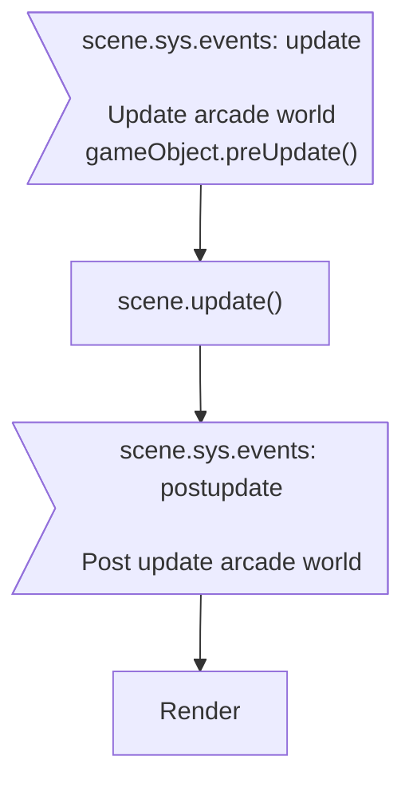

## Introduction

*World* of Arcade physics engine in phaser.

- Author: Richard Davey

## Usage

### Configuration

```javascript
var config = {
    // ...
    physics: {
        default: 'arcade',
        arcade: {
        //    x: 0,
        //    y: 0,
        //    width: scene.sys.scale.width,
        //    height: scene.sys.scale.height,
        //    gravity: {
        //        x: 0,
        //        y: 0
        //    },
        //    checkCollision: {
        //        up: true,
        //        down: true,
        //        left: true,
        //        right: true
        //    },
        //    fps: 60,
        //    timeScale: 1,     // 2.0 = half speed, 0.5 = double speed
        //    overlapBias: 4,
        //    tileBias: 16,
        //    forceX: false,
        //    isPaused: false,
        //    debug: false,
        //    debugShowBody: true,
        //    debugShowStaticBody: true,
        //    debugShowVelocity: true,
        //    debugBodyColor: 0xff00ff,
        //    debugStaticBodyColor: 0x0000ff,
        //    debugVelocityColor: 0x00ff00,
        //    maxEntries: 16,
        //    useTree: true   // set false if amount of dynamic bodies > 5000
        }
    }
    // ...
};
var game = new Phaser.Game(config);
```

### Control

#### Pause

```javascript
scene.physics.pause();
```

#### Resume

```javascript
scene.physics.resume();
```

#### Duration per frame

- Time scale
    ```javascript
    scene.physics.world.timeScale = timeScale;
    ```
    - 1.0 = normal speed
    - 2.0 = half speed
    - 0.5 = double speed
- FPS
    ```javascript
    scene.physics.world.setFPS(framerate);
    ```

#### Step

Advances the simulation by one step.

```javascript
scene.physics.world.step(delta);
```

### Collision

#### Set bound

See bound in [body object](arcade-body.md#collision-bound), or [game object](arcade-gameobject.md#collision-bound).

#### Collider & callback

- Add collider
    - Push out
        ```javascript
        scene.physics.add.collider(objectsA, objectsB);
        ```
    - Performs a collision check and separation between the two physics enabled objects given.
        ```javascript
        var collider = scene.physics.add.collider(objectsA, objectsB, collideCallback);
        // var collider = scene.physics.add.collider(objectsA, objectsB, collideCallback, processCallback, callbackContext);
        ```
    - If you don't require separation then use `overlap` instead.
        ```javascript
        var collider = scene.physics.add.overlap(objectsA, objectsB, collideCallback);
        // var collider = scene.physics.add.overlap(objectsA, objectsB, collideCallback, processCallback, callbackContext);
        ```
    - Parameters
        - `objectsA`, `objectsB` :
            - A game object
            - An array contains Game objects (Add or remove game objects)
            - Physics group/Group (Add or remove game objects)
            - An array contains Physics group/Group
        - `collideCallback` :
            ```javascript
            var collideCallback = function(gameObject1, gameObject2) {
                // ...
            }
            ```
        - `processCallback` : Fired when gameObject1 intersects gameObject2, optional.
            ```javascript
            var processCallback = function(gameObject1, gameObject2) {
                return true;  // return false will discard remaining collision checking
            }
            ```
- Remove collider
    ```javascript
    scene.physics.world.removeCollider(collider);
    ```
- Deactivate collider
    ```javascript
    collider.active = false;  // Set true to activate again
    ```
- Name of collider (unused by engine)
    ```javascript
    collider.name = name;
    ```

#### Testing wo collider

- Test overlapping
    ```javascript
    var isOverlapping = scene.physics.world.overlap(object1, object2);
    ```
    or
    ```javascript
    var isOverlapping = scene.physics.world.overlap(object1, object2, collideCallback);
    // var isOverlapping = scene.physics.world.overlap(object1, object2, collideCallback, processCallback, callbackContext);
    ```
- Test colliding, also push out
    ```javascript
    var isCollided = scene.physics.world.collide(object1, object2);
    ```
    or
    ```javascript
    var isCollided = scene.physics.world.collide(object1, object2, collideCallback);
    // var isCollided = scene.physics.world.collide(object1, object2, collideCallback, processCallback, callbackContext);
    ```

### World bounds

#### Enable

- [Body](arcade-body.md) : Set `body.setCollideWorldBounds()` to enable worldBounds property.
- World :
    - Set bounds [rectangle](geom-rectangle.md) and enable bounds
        ```javascript
        scene.physics.world.setBounds(x, y, width, height);
        // scene.physics.world.setBounds(x, y, width, height, checkLeft, checkRight, checkUp, checkDown);
        ```
    - Set bounds [rectangle](geom-rectangle.md)
        ```javascript
        scene.physics.world.bounds.setTo(x, y, width, height);
        ```
        or
        ```javascript
        scene.physics.world.bounds.x = x;
        scene.physics.world.bounds.y = y;
        scene.physics.world.bounds.width = width;
        scene.physics.world.bounds.height = height;
        ```
    - Enable bounds
        ```javascript
        scene.physics.world.setBoundsCollision();
        // scene.physics.world.setBoundsCollision(left, right, up, down);
        ```
        or
        ```javascript
        scene.physics.world.checkCollision.left = left;
        scene.physics.world.checkCollision.right = right;
        scene.physics.world.checkCollision.up = up;
        scene.physics.world.checkCollision.down = down;
        ```
    - Get bounds [rectangle](geom-rectangle.md)
        ```javascript
        var top = scene.physics.world.bounds.top;
        var bottom = scene.physics.world.bounds.bottom;
        var left = scene.physics.world.bounds.left;
        var right = scene.physics.world.bounds.right;
        ```

#### Events

- World bounds
    ```javascript
    var callback = function(body, blockedUp, blockedDown, blockedLeft, blockedRight) { /* ... */ };
    scene.physics.world.on('worldbounds', callback);
    ```

### Wrap

```javascript
scene.physics.world.wrap(gameObject, padding);
```

- gameObject:
    - game object
    - group
    - array of game objects

### Move to

- Move to position with a steady velocity
    ```javascript
    scene.physics.moveTo(gameObject, x, y, speed, maxTime);
    ```
- Move to object with a steady velocity
    ```javascript
    scene.physics.moveToObject(gameObject, destination, speed, maxTime);
    ```

### Accelerate to

- Accelerate to position
    ```javascript
    scene.physics.accelerateTo(gameObject, x, y, acceleration, xSpeedMax, ySpeedMax);
    ```
- Accelerate to object
    ```javascript
    scene.physics.accelerateToObject(gameObject, destination, acceleration, xSpeedMax, ySpeedMax);
    ```

### Gravity

- Set
    ```javascript
    scene.physics.world.gravity.x = gx;
    scene.physics.world.gravity.y = gy;
    ```
- Get
    ```javascript
    var gx = scene.physics.world.gravity.x;
    var gy = scene.physics.world.gravity.y;
    ```

Total Gravity = world.gravity + body.gravity

### Bodies

#### Closest/furthest

- Closest
    ```javascript
    var body = scene.physics.closest(point);  // point: {x,y}
    ```
- Furthest
    ```javascript
    var body = scene.physics.furthest(point);  // point: {x,y}
    ```

### Debug

#### Draw body & velocity

- Bounds of dynamic Body
    - Enable drawing body
        ```javascript
        scene.physics.world.defaults.debugShowBody = true;
        ```
    - Color
        ```javascript
        scene.physics.world.defaults.bodyDebugColor = 0xff00ff;
        ```
- Bounds of static Body
    - Enable drawing body
        ```javascript
        scene.physics.world.defaults.debugShowStaticBody = true;
        ```
    - Color
        ```javascript
        scene.physics.world.defaults.staticBodyDebugColor = 0x0000ff;
        ```
- Direction and magnitude of velocity
    - Enable drawing body
        ```javascript
        scene.physics.world.defaults.debugShowVelocity = true;
        ```
    - Color
        ```javascript
        scene.physics.world.defaults.velocityDebugColor = 0x00ff00;
        ```

#### Graphics

Draw debug body & velocity on a [Graphics object](graphics.md).

```javascript
var graphics = scene.physics.world.debugGraphic;
```

- Set visible
    ```javascript
    scene.physics.world.debugGraphic.setVisible();
    ```
- Set invisible
    ```javascript
    scene.physics.world.debugGraphic.setVisible(false);
    ```

### Update loop

1. scene.sys.events: update
    1. Update position & angle of each body
    1. Process each collider
    1. Update final position of each body
    1. Emit `worldstep` event
1. scene.sys.events: postupdate
    1. Draw debug graphics

