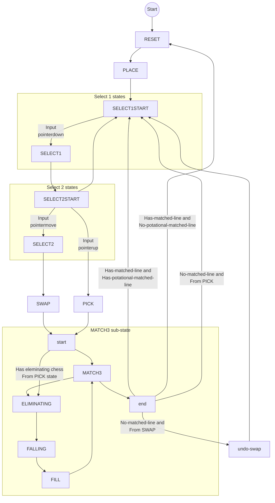

## Introduction

Match3-like gameplay template.

- Author: Rex
- Template

## Live demos

- [Pick item](https://codepen.io/rexrainbow/pen/VYvVwoj)
- [Events](https://codepen.io/rexrainbow/pen/wEVYoY)
- [Custom input](https://codepen.io/rexrainbow/pen/XWWyELV)
- [Mask](https://codepen.io/rexrainbow/pen/rNdYYGB)

## Usage

[Sample code](https://github.com/rexrainbow/phaser3-rex-notes/tree/master/examples/board-bejeweled)

### Install plugin

#### Load minify file

- Load rexBoard plugin (minify file) in preload stage
    ```javascript
    scene.load.scenePlugin('rexboardplugin', 'https://raw.githubusercontent.com/rexrainbow/phaser3-rex-notes/master/dist/rexboardplugin.min.js', 'rexBoard', 'rexBoard');
    scene.load.script('rexbejeweled', 'https://raw.githubusercontent.com/rexrainbow/phaser3-rex-notes/master/dist/rexbejeweled.min.js');
    ```
- Add bejeweled object
    ```javascript
    var bejeweled = new rexbejeweled(scene, config);
    ```

#### Import template

- Install rex plugins from npm
    ```
    npm i phaser3-rex-plugins
    ```
- Install rexBoard plugin in [configuration of game](game.md#configuration)
    ```javascript
    import BoardPlugin from 'phaser3-rex-plugins/plugins/board-plugin.js';
    import Bejeweled from 'phaser3-rex-plugins/templates/bejeweled/Bejeweled.js';

    var config = {
        // ...
        plugins: {
            scene: [{
                key: 'rexBoard',
                plugin: BoardPlugin,
                mapping: 'rexBoard'
            },
            // ...
            ]
        }
        // ...
    };
    var game = new Phaser.Game(config);
    ```
- Add bejeweled object
    ```javascript
    var bejeweled = new Bejeweled(scene, config);
    ```

### Create bejeweled object

```javascript
var bejeweled = new Bejeweled(scene, {
    // rexBoard: 'rexBoard',

    board: {
        x: 0,
        y: 0,
        cellWidth: 60,
        cellHeight: 60,
        width: 10,
        height: 10,
    },
    match: {
        // wildcard: undefined
        // dirMask: undefined
    },
    chess: {
        // pick random symbol from array, or a callback to return symbol
        symbols: [0, 1, 2, 3, 4, 5],
        // symbols: function(board, tileX, tileY, excluded) { return symbol; }

        // User-defined chess game object
        create: function (board) {
            // Create Game object (Shape, Image, or Sprite)
            var scene = board.scene;
            var gameObject = scene.add.sprite(0, 0, textureKey, frame);
            // Initial 'symbol' value
            gameObject.setData('symbol', undefined);
            // Add data changed event of 'symbol` key
            gameObject.data.events.on('changedata_symbol', function (gameObject, value, previousValue) {
                // Change the appearance of game object via new symbol value
                gameObject.setFrame(newFrame);
            });
            return gameObject;
        },

        // scope for callbacks
        scope: undefined,

        // moveTo behavior
        moveTo: {
            speed: 400
        },
        // tileZ: 1,
    },
    // initSymbols: [[...], [...]],
    // mask: true,

    placeAction: undefined,
    select1Action: undefined,
    select2Action: undefined,
    swapAction: undefined,
    undoSwapAction: undefined,
    eliminatingAction: undefined,
    fallingAction: undefined,

    // input: true
})
```

Configurations

- `rexBoard` : Key of 'rexBoard' plugin. Default is `'rexBoard'`.
- Board properties
    - `board.x`, `board.y` : Top-left position of visible area.
    - `board.cellWidth`, `board.cellHeight` : The width/height of the cell, in pixels.
    - `board.width`, `board.height` : Visible area, in tiles.
        - Total board size is `board.width x (board.height*2)`, the upper `board.width x board.height` area is for prepared chess.
- Chess properties
    - `chess.symbols` : An array of possible symbols, or a callback to return a symbol. See [Generate symbol](#generate-symbol)
    - `chess.create`, `chess.scope` : Callback of [creating chess object](#create-chess-object).
    - `chess.moveTo.speed` : Constant moving speed of chess, in pixel per-second.
- `initSymbols` : Fill visible area with this 2d symbol array.
- Custom actions
    - `placeAction` : [Custom place chess Action](#place-chess-action)
    - `select1Action` : [Custom select first chess Action](#custom-select-first-chess-action)
    - `select2Action` : [Custom select second chess Action](#custom-select-second-chess-action)
    - `swapAction` : [Custon swap action](#custom-swap-action)
    - `undoSwapAction` : [Custon undo-swap action](#custom-undo-swap-action)
    - `eliminatingAction` : [Custon eliminating action](#custom-eliminating-action)
    - `fallingAction` : [Custon falling action](#custom-falling-action)
- Touch input
    - `input` : Set `true` to register default touch input logic.
- `mask` :
    - `true` : Mask of visible area. Default behavior.
        1. Create an internal layer
        2. Mask this internal layer
    - `false` : No mask.


#### Board height

Board is separated into two parts: upper and bottom

- Bottom : **Visible N rows**, to swap chess and run matching.
- Upper : **Invisible N rows**, chess in these rows will move down, to fill bottom rows.

For example, if amount of visible rows is `10`, `board.height` is set to `10`, and total board height is `board.height * 2`

#### Generate symbol

Symbols are declared in property `chess.symbols` in a symbol array like `[0, 1, 2, 3, 4, 5]`, or a callback to return a symbol. The callback also use `chess.scope` as the scope.

```javascript
function(board, tileX, tileY, excluded) {
    return symbol
}
```

- `excluded` : `undefined` or a symbol array. Don't return these symbols.

#### Create chess object

Return a game object from a callback.

```javascript
function(board) {
    // Create Game object (Image, Sprite, or Shape)
    var scene = board.scene;
    var gameObject = scene.add.sprite(0, 0, textureKey, frame);
    // Initial 'symbol' value
    gameObject.setData('symbol', undefined);
    // Add data changed event of 'symbol` key
    gameObject.data.events.on('changedata_symbol', function (gameObject, value, previousValue) {
        // Change the appearance of game object via new symbol value
        gameObject.setFrame(newFrame);
    });
    return gameObject;
}
```

Each chess has a `symbol` value stored in `'symbol'` key in private data. Add data changed event of `'symbol'` key to change the appearance of game object via new symbol value.

### States



#### Place chess Action

Fire `'place'` event after filling chess, then run place action. 

```javascript
bejeweled.on('place', function(board, bejeweled) {

}, scope);
```

Default place action:

```javascript
function (chessArray, board, bejeweled) {
    const duration = 500; //ms
    for (var i = 0, cnt = chessArray.length; i < cnt; i++) {
        var fade = PopUp(chessArray[i], duration);
        bejeweled.waitEvent(fade, 'complete');
    }
}
```

- `chessArray` : Chess array at lower board.


#### Select first chess

Fire `'select1'` event

```javascript
bejeweled.on('select1', function(board, bejeweled) {

}, scope);
```

- `board` : [Board object](board.md).
- `bejeweled` : This bejeweled object.

##### Custom Select first chess Action

Default select action:

```javascript
function (chess, board, bejeweled) {
    // Do nothing
}
```

#### Select second chess

Fire `'select2'` event

```javascript
bejeweled.on('select2', function(board, bejeweled) {

}, scope);
```

- `board` : [Board object](board.md).
- `bejeweled` : This bejeweled object.
    - Selected first chess : 
        ```javascript
        var chess = bejeweled.getSelectedChess1();
        ```

##### Custom Select second chess Action

Default select action: The same as Select first chess Action

#### Swap selected chess

Fire `'swap'` event

```javascript
bejeweled.on('swap', function(selectedChess1, selectedChess2, board, bejeweled) {

}, scope);
```

- `board` : [Board object](board.md).
- `bejeweled` : This bejeweled object.

##### Custom Swap Action

Default swap action:

```javascript
function (chess1, chess2, board, bejeweled) {
    var tileXYZ1 = board.chessToTileXYZ(chess1);
    var tileXYZ2 = board.chessToTileXYZ(chess2);
    var tileX1 = tileXYZ1.x,
        tileY1 = tileXYZ1.y,
        tileX2 = tileXYZ2.x,
        tileY2 = tileXYZ2.y,
        tileZ = tileXYZ1.z;

    // TileZ of chess1 and chess2 are the same, change tileZ of chess2 to a different value
    board.moveChess(chess2, tileX2, tileY2, `#${tileZ}`, false);

    // Move chess1 to tileXYZ2, chess2 to tileXYZ1
    var moveTo1 = bejeweled.getChessMoveTo(chess1);
    var moveTo2 = bejeweled.getChessMoveTo(chess2);
    moveTo1.moveTo(tileX2, tileY2);
    moveTo2.moveTo(tileX1, tileY1);

    // Change tileZ of chess2 back
    board.moveChess(chess2, tileX1, tileY1, tileZ, false);

    if (moveTo1.isRunning) {
        bejeweled.waitEvent(moveTo1, 'complete');
    }
    if (moveTo2.isRunning) {
        bejeweled.waitEvent(moveTo2, 'complete');
    }
};
```

- `bejeweled.getChessMoveTo(chess)` : Get [moveTo behavior](board-moveto.md) of a chess.
- `bejeweled.waitEvent(moveTo, 'complete')` : Wait 'complete' event of this [moveTo behavior](board-moveto.md).


#### Pick

Pointerup on selected chess1, fire `'pick'` event

```javascript
bejeweled.on('swap', function(chess1, board, bejeweled) {

}, scope);
```

- `board` : [Board object](board.md).
- `bejeweled` : This bejeweled object.

##### Custom Pick chess Action

Default pick action:

```javascript
function (chess, board, bejeweled) {
    // Do nothing

    // var chessArray = [];
    // bejeweled.getChessArrayAtTileX(tileX, chessArray);
    // bejeweled.getChessArrayAtTileY(tileX, chessArray);
    // bejeweled.getChessArrayAtTileXYInRange(tileX, tileY, rangeX, rangeY, chessArray);
    // bejeweled.getChessArrayWithSymbol(symbol, chessArray);
    // ...
    // bejeweled.setEliminatingChess(chessArray);
}
```

Eliminating chess by using picked item

1. Get Chess array by 
    - `bejeweled.getChessArrayAtTileX`
    - `bejeweled.getChessArrayAtTileY`
    - `bejeweled.getChessArrayAtTileXYInRange`
    - `bejeweled.getChessArrayWithSymbol`.
2. Invoke `bejeweled.setEliminatingChess`


#### Match start

Fire `'match-start'` event

```javascript
bejeweled.on('match-start', function(board, bejeweled) {

}, scope);
```

- `board` : [Board object](board.md).
- `bejeweled` : This bejeweled object.

#### Match lines

Fire `'match'` event

```javascript
bejeweled.on('match', function(lines, board, bejeweled) {

}, scope);
```

- `lines` : An array of matched lines, each line is a [built-in Set object](structs-set.md).
    - Length of each line (`lines[i].size`) could be *5*, *4*, or *3*.
    - `lines[i].entries` : An array of chess (Game Object) in a matched line.
    - Get cross chess of two lines via `lineA.intersect(lineB)`.
    - All chess game objects in matched lines will be eliminated in next stage. 
        - Add/remove chess game object in a line.
        - Add new line/remove a line in `lines` array to change the eliminated targets.
- `board` : [Board object](board.md).
    - Get tile position `{x,y,z}` of a chess game object via
        ```javascript
        var tileXYZ = board.chessToTileXYZ(gameObject);
        //var tileXYZ = gameObject.rexChess.tileXYZ;
        ```
    - Get chess game object of a tile position `{x,y,z}` via
        ```javascript
        var gameObject = board.tileXYZToChess(tileX, tileY, tileZ);
        ```
    - Get array of neighbor chess of a chess game object via
        ```javascript
        var gameObjects = board.getNeighborChess(chess, null);
        ```
- `bejeweled` : This bejeweled object.

#### Eliminating chess

Fire `'eliminate'` event

```javascript
bejeweled.on('eliminate', function(chessArray, board, bejeweled) {

}, scope);
```

- `chessArray` : An array of chess (Game Object) to be eliminated.
- `board` : [Board object](board.md)
- `bejeweled` : This bejeweled object.

##### Custom Eliminating Action

Default eliminating action:

```javascript
function (chessArray, board, bejeweled) {
    const duration = 500; //ms
    for (var i = 0, cnt = chessArray.length; i < cnt; i++) {
        var fade = FadeOutDestroy(chessArray[i], duration);
        bejeweled.waitEvent(fade, 'complete');
    }
}
```

- `bejeweled.waitEvent(fade, 'complete')` : Wait 'complete' event of this [fade-out-destroy behavior](fadeoutdestroy.md).

#### Falling chess

Fire `'fall'` event

```javascript
bejeweled.on('fall', function(board, bejeweled) {

}, scope);
```

- `board` : [Board object](board.md)
- `bejeweled` : This bejeweled object.

##### Custom Falling Action

Default falling action:

```javascript
function (board, bejeweled) {
    var tileZ = bejeweled.chessTileZ,
        chess, moveTo;

    for (var tileY = (board.height - 1); tileY >= 0; tileY--) { // bottom to top
        for (var tileX = 0, cnt = board.width; tileX < cnt; tileX++) { // left to right
            chess = board.tileXYZToChess(tileX, tileY, tileZ);
            if (chess === null) {
                continue;
            }
            moveTo = bejeweled.getChessMoveTo(chess);
            do {
                moveTo.moveToward(1);
            } while (moveTo.lastMoveResult)
            if (moveTo.isRunning) {
                bejeweled.waitEvent(moveTo, 'complete');
            }
        }
    }
}
```

- `bejeweled.getChessMoveTo(chess)` : Get [moveTo behavior](board-moveto.md) of a chess.
- `bejeweled.waitEvent(moveTo, 'complete')` : Wait 'complete' event of this [moveTo behavior](board-moveto.md).

#### Fill chess

Fill upper board, fire `'fill'` event

```javascript
bejeweled.on('fill', function(board, bejeweled) {

}, scope);
```

- `board` : [Board object](board.md).
- `bejeweled` : This bejeweled object.

#### Match end

Fire `'match-end'` event

```javascript
bejeweled.on('match-end', function(board, bejeweled) {

}, scope);
```

- `board` : [Board object](board.md).
- `bejeweled` : This bejeweled object.

#### Undo-swap selected chess

Fire `'undo-swap'` event

```javascript
bejeweled.on('undo-swap', function(selectedChess1, selectedChess2, board, bejeweled) {

}, scope);
```

- `board` : [Board object](board.md).
- `bejeweled` : This bejeweled object.

##### Custom Undo-Swap Action

Default undo-swap action : Equal to Swap action

### Start gameplay

```javascript
bejeweled.start();
```

### Input control

#### Default input

1. Enable default input control
    ```javascript
    var bejeweled = new Bejeweled(scene, {
        // ...
        input: true
    });
    ```
1. Enable/disable temporarily.
    - Enable
        ```javascript
        bejeweled.setInputEnable();
        ```
    - Disable
        ```javascript
        bejeweled.setInputEnable(false);
        ```

#### Custom input

1. Discard default input control
    ```javascript
    var bejeweled = new Bejeweled(scene, {
        // ...
        input: false
    });
    ```
1. Add custom input logic like
    ```javascript
    scene.input
        .on('pointerdown', function (pointer) {
            var chess = bejeweled.worldXYToChess(pointer.worldX, pointer.worldY);
            if (chess) {
                bejeweled.selectChess1(chess);
            }
        }, scene)
        .on('pointermove', function (pointer) {
            if (!pointer.isDown) {
                return;
            }
            var chess = bejeweled.worldXYToChess(pointer.worldX, pointer.worldY);
            if (chess && (chess !== this.bejeweled.getSelectedChess1())) {
                bejeweled.selectChess2(chess);
            }
        }, scene)
        .on('pointerup', function(pointer){
            var chess = bejeweled.worldXYToChess(pointer.worldX, pointer.worldY);
            if (chess && (chess === bejeweled.getSelectedChess1())) {
                bejeweled.pickChess(chess);
            }
        })
    ```
    - Invoke `bejeweled.selectChess1(chess)`, and `bejeweled.selectChess2(chess)`, `bejeweled.pickChess(chess)` under custom logic.


Helper methods

- Get chess via worldXY position
    ```javascript
    var chess = bejeweled.worldXYToChess(worldX, worldY);
    ```
- Get chess via tileXY position
    ```javascript
    var chess = bejeweled.tileXYToChess(tileX, tileY);
    ```
- Get neighbor chess via angle
    ```javascript
    var chess2 = bejeweled.getNeighborChessAtAngle(chess1, angle);
    ```
    - `chess1` : Chess object, or tileXY position `{x, y}`.
    - `angle` : Angle in radius.
- Get neighbor chess via direction
    ```javascript
    var chess2 = bejeweled.getNeighborChessAtDirection(chess1, direction);
    ```
    - `chess1` : Chess object, or tileXY position `{x, y}`.
    - `direction` : Number, or string number.
        - `0` ~ `3` : [Quad grid](board-quadgrid.md#directions) in 4 directions mode.
        - `0` ~ `7` : [Quad grid](board-quadgrid.md#directions) in 8 directions mode.
        - `0` ~ `5` : [Hexagon grid](board-hexagongrid.md#directions).
- Get chess in visible area
    ```javascript
    var chessArray = bejeweled.getChessArray();
    // bejeweled.getChessArray(out);
    ```
- Get chess at row or column, in visible area
    ```javascript
    var chessArray = bejeweled.getChessArrayAtTileX(tileX);
    // bejeweled.getChessArrayAtTileX(tileX, out);
    ```
    ```javascript
    var chessArray = bejeweled.getChessArrayAtTileY(tileY);
    // bejeweled.getChessArrayAtTileY(tileX, out);
    ```
- Get chess at tile position with range, in visible area
    ```javascript
    var chessArray = bejeweled.getChessArrayAtTileXYInRange(tileX, tileY, rangeX, rangeY);
    // bejeweled.getChessArrayAtTileXYInRange(tileX, tileY, rangeX, rangeY, out);
    ```
- Get all chess with symobl, in visible area
    ```javascript
    var chessArray = bejeweled.getChessArrayWithSymbol(symbol);
    bejeweled.getChessArrayWithSymbol(symbol, out);
    ```


### Await input

```javascript
isAwaitingInput = bejeweled.isAwaitingInput();
```

- Return `true` only when state is at `SELECT1START`

### Save / load board

- Save board
    ```javascript
    var symbols = bejeweled.dumpSymbols();
    ```
    - `symbols` : A 2d symbol array of whole board including prepared rows and visible area.
    - Invoke this method when `bejeweled.isAwaitingInput()` return `true`
- Load board
    ```javascript
    bejeweled.loadSymbols(symbols);
    ```
    - `symbols` : A 2d symbols array, return valeu of `bejeweled.dumpSymbols()`
    - Invoke this method when `bejeweled.isAwaitingInput()` return `true`
    - Chage state to `RESET` -> `PLACE` -> `SELECT1START` -> ...

### Data

- Get
    ```javascript
    var value = bejeweled.getData(key);
    var values = bejeweled.getData(keys); // keys: an array of keys
    var value = bejeweled.data.values[key];
    ```
- Set
    ```javascript
    bejeweled.setData(key, value);
    bejeweled.setData(obj); // obj: {key0:value0, key1:value1, ...}
    bejeweled.data.values[key] = value;
    bejeweled.data.values[key] += inc;
    ```
- Enable
    ```javascript
    bejeweled.setDataEnabled();
    ```
- Events : 
    - Set data evant
        ```javascript
        bejeweled.on('setdata', function(bejeweled, key, value){ /* ... */ });
        ```
    - Change data event
        ```javascript
        bejeweled.on('changedata', function(bejeweled, key, value, previousValue){ /* ... */ });
        ```
        ```javascript
        bejeweled.on('changedata-' + key, function(bejeweled, value, previousValue){ /* ... */ });
        ```

See [data manager](datamanager.md)

!!! note
    Ensure data manager is created before binding any data-changed events.

### Helper methods

- Board instance
    ```javascript
    var board = bejeweled.getBoard();
    ```
    - `board` : [Board](board.md) instance.
- Match instance
    ```javascript
    var match = bejeweled.getMatch();
    ```
    - `match` : [Match](board-match.md) instance.
- Layer instance, for all chess game objects.
    ```javascript
    var layer = bejeweled.getLayer();
    ```
    - `layer` : [Layer](layer.md) instance.
