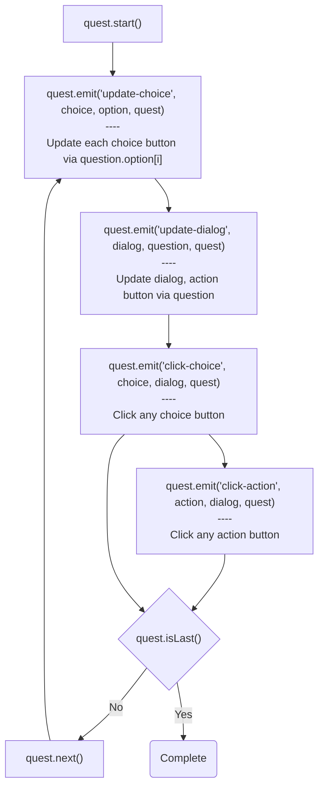

## Introduction

Flow control of [question manager](quest.md) with a [dialog](ui-dialog.md).

- Author: Rex
- Template

## Live demos

- [Branch](https://codepen.io/rexrainbow/pen/wLyvxQ)
- [Shuffle](https://codepen.io/rexrainbow/pen/WqMLoV)

## Usage

[Sample code](https://github.com/rexrainbow/phaser3-rex-notes/tree/master/examples/dialog-quest)

### Install plugin

#### Load minify file

- Load plugin (minify file) in preload stage
    ```javascript
    scene.load.scenePlugin('rexuiplugin', 'https://raw.githubusercontent.com/rexrainbow/phaser3-rex-notes/master/dist/rexuiplugin.min.js', 'rexUI', 'rexUI');    
    scene.load.script('rexdialogquest', 'https://raw.githubusercontent.com/rexrainbow/phaser3-rex-notes/master/dist/rexdialogquest.min.js');
    ```
- Add dialog and quest object
    ```javascript
    var dialog = scene.rexUI.add.dialog(config); 
    var quest = new rexdialogquest({
        dialog: dialog,
        // ...
    });
    ```

#### Import plugin

- Install rex plugins from npm
    ```
    npm i phaser3-rex-plugins
    ```
- Install plugin in [configuration of game](game.md#configuration)
    ```javascript
    import UIPlugin from 'phaser3-rex-plugins/templates/ui/ui-plugin.js';
    import DialogQuest from 'phaser3-rex-plugins/templates/dialog-quest/DialogQuest.js';
    var config = {
        // ...
        plugins: {
            scene: [{
                key: 'rexUI',
                plugin: UIPlugin,
                mapping: 'rexUI'
            },
            // ...
            ]
        }
        // ...
    };
    var game = new Phaser.Game(config);
    ```
- Add dialog and quest object
    ```javascript
    var dialog = scene.rexUI.add.dialog(config); 
    var quest = new DialogQuest({
        dialog: dialog,
        // ...
    });
    ```

#### Import class

- Install rex plugins from npm
    ```
    npm i phaser3-rex-plugins
    ```
- Import class
    ```javascript
    import { Dialog } from 'phaser3-rex-plugins/templates/ui/ui-components.js';
    import DialogQuest from 'phaser3-rex-plugins/templates/dialog-quest/DialogQuest.js';
    ```
- Add dialog object
    ```javascript    
    var dialog = new Dialog(scene, config);
    scene.add.existing(dialog);
    var quest = new DialogQuest({
        dialog: dialog,
        // ...
    });
    ```

### Create dialog-quest object

```javascript
var quest = new DialogQuest({
    dialog: dialog,

    questions: undefined,
    // format: undefined,
    // delimiter: ',',
    // types: {
    //     question: 'q',
    //     option: '',
    // },
    // convert: true,

    quest: true,
    // quest: {
    //     shuffleQuestions: false,
    //     shuffleOptions: false,
    // }
});
```

- `dialog` : A [dialog](ui-dialog.md) game object.
    - **UI plugin does not included in this template**, [install](ui-dialog.md#install-scene-plugin) it before creating a dialog game object.
    - Reuse/update dialog game object for each question.
    - The number of choice buttons should be equal or larger than the maximun number of options. 
- Other parameters : See [quest](quest.md#create-question-manager-instance)

### Flow chart



### Events

- Update dialog events
    - Update each choice button via question.option[i]
        ```javascript
        quest.on('update-choice', function(choice, option, quest){
        }, scope);
        ```
        - `choice` : Choice button game object.
            - Unused choice button game object will be hideen.
        - `option` : Option object.
        - `quest` : Quest object.
    - Update dialog, action buttos via question
        ```javascript
        quest.on('update-dialog', function(dialog, question, quest){
        }, scope);
        ```
        - `dialog` : Dialog game object.
            - Call `dialog.layout()` if needs.
        - `question` : Question object.
        - `quest` : Quest object.
- Button clicking events
    - Click choice button
        ```javascript
        quest.on('click-choice', function(choice, dialog, quest) {

        }, scope);
        ```
        - `choice` : Clicked choice button game object.
        - `dialog` : Dialog game object.
        - `quest` : Quest object.
    - Click choice button
        ```javascript
        quest.on('click-action', function(action, dialog, quest) {

        }, scope);
        ```
        - `choice` : Clicked action button game object.
        - `dialog` : Dialog game object.
        - `quest` : Quest object.

### Quest methods

- Start quest
    ```javascript
    quest.start();
    ```
- Next quest
    ```javascript
    quest.next();
    ```
    or
    ```javascript
    quest.next(key);
    ```
- Is last question
    ```javascript
    var isLast = quest.isLast();
    ```

### Private data methods

- Get data
    ```javascript
    var value = quest.getData(key, defaultValue);
    ```
- Get all data
    ```javascript
    var data = quest.getData();
    ```
- Set value
    ```javascript
    quest.setData(key, value);
    ```
- Increase value
    ```javascript
    quest.incData(key, inc, defaultValue);
    ```
- Multiple value
    ```javascript
    quest.mulData(key, mul, defaultValue);
    ```
- Clear all data
    ```javascript
    quest.clearData();
    ```