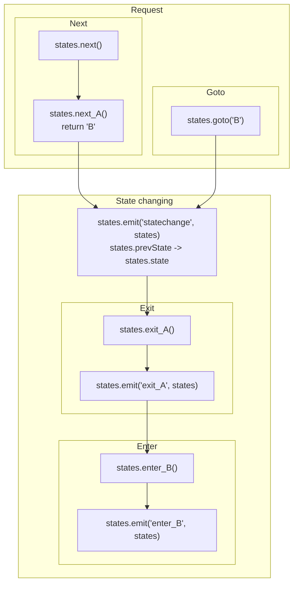

## Introduction

[Finite state machine](https://en.wikipedia.org/wiki/Finite-state_machine).

- Author: Rex
- Object

## Usage

[Sample code](https://github.com/rexrainbow/phaser3-rex-notes/tree/master/examples/fsm)

### Install plugin

#### Load minify file

- Load plugin (minify file) in preload stage
    ```javascript
    scene.load.plugin('rexfsmplugin', 'https://raw.githubusercontent.com/rexrainbow/phaser3-rex-notes/master/dist/rexfsmplugin.min.js', true);
    ```
- Add FSM object
    ```javascript
    var states = scene.plugins.get('rexfsmplugin').add(config);
    ```

#### Import plugin

- Install rex plugins from npm
    ```
    npm i phaser3-rex-plugins
    ```
- Install plugin in [configuration of game](game.md#configuration)
    ```javascript
    import FSMPlugin from 'phaser3-rex-plugins/plugins/fsm-plugin.js';
    var config = {
        // ...
        plugins: {
            global: [{
                key: 'rexFSM',
                plugin: FSMPlugin,
                start: true
            },
            // ...
            ]
        }
        // ...
    };
    var game = new Phaser.Game(config);
    ```
- Add FSM object
    ```javascript
    var states = scene.plugins.get('rexFSM').add(config);
    ```

#### Import class

- Install rex plugins from npm
    ```
    npm i phaser3-rex-plugins
    ```
- Import class
    ```javascript
    import FSM from 'phaser3-rex-plugins/plugins/fsm.js';
    ```
- Add FSM object
    ```javascript
    var states = new FSM(config);
    ```

### Create instance

#### Create by config

```javascript
var states = scene.plugins.get('rexFSM').add({
    start: 'A',   // default: undefined
    states: {
        A: {
            next: 'B',  // function() { return 'B'; }
            enter: function() {},
            exit: function() {}
        },
        // ...
    },
    init: function() {},
    extend: {
        i: 0,
        name: 'abc'
        // ...
    },
    enable: true,
    eventEmitter: undefined
});
```

- `start`: Initial state.
- `states`: Define states.
    - stateName
        - `next`: String of next state, or a callback to get next state.
        - `enter`: Callback when enter state.
        - `exit`: Callback when exit state.
- `init`: Initial callback when creating instance.
- `extend`: Inject key-value pairs into instance.
- `enable`: Set `false` to block any state changing.
- `eventEmitter`
    - `undefined` : Create a private event emitter, default value.
    - `false` : Don't add any event emitter, i.e. no event will be fired.
    - [Event emitter object](eventemitter3.md) : Fire event through this event emitter.

#### Inheritance

1. Create new class
    ```javascript
    class State extends FSM {
        constructor() {
            super();
        }
    
        next_A() { return 'B' }
    
        enter_A() { /* ... */ }
    
        exit_A() { /* ... */ }
    }
    ```
    Members:
        - `next_` + stateName: Callback to get next state.
        - `enter_` + stateName: Callback when enter state.
        - `exit_` + stateName: Callback when exit state.
1. Create instance
    ```javascript
    var states = new State();
    ```

### Read state

- Current state
    ```javascript
    var curState = states.state;
    ```
- Previous state
    ```javascript
    var preState = states.prevState;
    ```

### Start at state

Set new state without triggering any [state-changing](fsm.md#state-changing) callbacks or events.

```javascript
states.start(newState);
```

### Next state



#### Request

- Get next state by callback
    ```javascript
    states.next();    // nextState = states.next_A()    
    ```
- Goto state
    ```javascript
    states.goto(nextState);
    // states.state = nextState;
    ```

#### State-changing

These callbacks or events will be triggered if state is changing.

For example, state is changing from 'A' to 'B'.

1. event `statechange`
    ```javascript
    states.on('statechange', function(states) {
        console.log( states.prevState + '->' + states.state );
    });
    ```
1. callback `states.exit_A`
1. event `exit_A`
    ```javascript
    states.on('exit_A', function(states) {
        /*...*/
    });
    ```
1. callback `states.enter_B`
1. event `enter_B`
    ```javascript
    states.on('enter_B', function(states) {
        /*...*/
    });
    ```

### Enable

```javascript
states.setEnable();
// states.setEnable(false); // disable
```

or

```javascript
states.toggleEnable();
```

`states.next()` and `states.goto()` will be ignored if disabled.

### Add new state

```javascript
states.addState(name, {
    next: 'B',  // function() { return 'B'; }
    enter: function() {},
    exit: function() {}
})
```
```javascript
states.addState({
    name: 'A',
    next: 'B',  // function() { return 'B'; }
    enter: function() {},
    exit: function() {}
})
```

or

```javascript
states.addStates({
    'A' : {
        next: 'B',  // function() { return 'B'; }
        enter: function() {},
        exit: function() {}
    },
    // ...
})
```
```javascript
states.addStates([
    {
        name: 'A',
        next: 'B',  // function() { return 'B'; }
        enter: function() {},
        exit: function() {}
    },
    // ...
]);
```