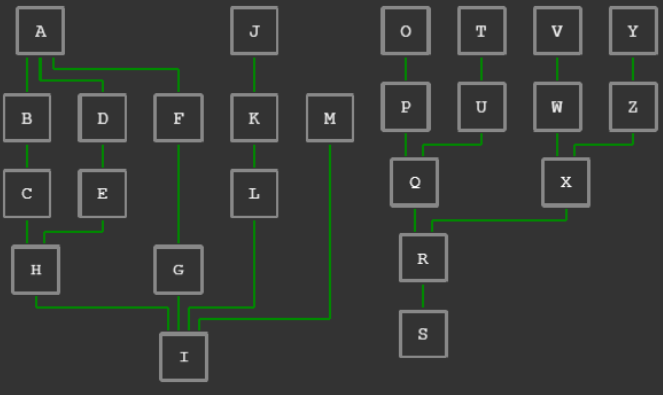
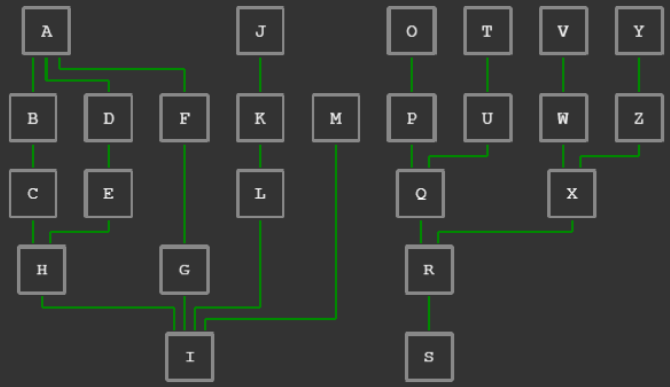

## Introduction

Layout nodes and edges of graph by [ELK library](https://github.com/kieler/elkjs).

- Author: Rex
- Method

## Live demos

- [Graph in container](https://codepen.io/rexrainbow/pen/pvgbjGz)
- [Graph in scrollablepanel](https://codepen.io/rexrainbow/pen/emJBxKG)

## Usage

[Sample code](https://github.com/rexrainbow/phaser3-rex-notes/tree/master/examples/graph-layout)

### Install plugin

#### Load minify file

- Load plugin (minify file) in preload stage
    ```javascript
    scene.load.scenePlugin('rexgraphplugin', 'https://raw.githubusercontent.com/rexrainbow/phaser3-rex-notes/master/dist/rexgraphplugin.min.js', 'rexGraph', 'rexGraph');
    ```
- Add graph object
    ```javascript
    var graph = scene.rexGraph.add.graph(config);
    ```
- Create node and edge game objects from code or [text](graph-build-from-text.md)
    ```javascript
    graph.addNode(...);
    graph.addEdge(...);
    ```
    ```javascript
    scene.rexGraph.buildGraphFromText(graph, config);
    ```
    - It is recommended that using [line game object](shape-line2.md) for edge game object
- Layout node and edge game objects
    ```javascript
    await scene.rexGraph.ELKLayout(graph, config);
    ```

#### Import plugin

- Install rex plugins from npm
    ```
    npm i phaser3-rex-plugins
    ```
- Install plugin in [configuration of game](game.md#configuration)
    ```javascript
    import GraphPlugin from 'phaser3-rex-plugins/plugins/graph-plugin.js';
    var config = {
        // ...
        plugins: {
            scene: [{
                key: 'rexGraph',
                plugin: GraphPlugin,
                mapping: 'rexGraph'
            },
            // ...
            ]
        }
        // ...
    };
    var game = new Phaser.Game(config);
    ```
- Add graph object
    ```javascript
    var graph = scene.rexGraph.add.graph(config);
    ```
- Create node and edge game objects from code or [text](graph-build-from-text.md)
    ```javascript
    graph.addNode(...);
    graph.addEdge(...);
    ```
    ```javascript
    scene.rexGraph.buildGraphFromText(graph, config);
    ```
    - It is recommended that using [line game object](shape-line2.md) for edge game object
- Layout node and edge game objects
    ```javascript
    await scene.rexGraph.ELKLayout(graph, config);
    ```

#### Import class

- Install rex plugins from npm
    ```
    npm i phaser3-rex-plugins
    ```
- Import class
    ```javascript
    import { Graph, /* BuildGraphFromText */, ELKLayout } from 'phaser3-rex-plugins/plugins/graph-components.js';
    ```
- Add graph object
    ```javascript
    var graph = new Graph(scene, config);
    ```
- Create node and edge game objects from code or [text](graph-build-from-text.md)
    ```javascript
    graph.addNode(...);
    graph.addEdge(...);
    ```
    ```javascript
    BuildGraphFromText(graph, config);
    ```
    - It is recommended that using [line game object](shape-line2.md) for edge game object
- Layout node and edge game objects
    ```javascript
    await ELKLayout(graph, config);
    ```

### Layout node and edge game objects

```javascript
await ELKLayout(graph, {
    onLayoutStart: undefined,
    onLayoutComplete: undefined,

    onLayoutNode: undefined,
    onLayoutEdge: undefined,

    layoutConfig: {
        layoutOptions: {
            // ...
        }
    },

    container: undefined,
    containerPadding: undefined,
    graphOffsetX: 0,
    graphOffsetY: 0,
});
```

- Callbacks:
    - `onLayoutStart` : Callback invoked when starting this ELKLayout method. Default value is `undefined`
        ```javascript
        function(graph) {
    
        }
        ```
    - `onLayoutComplete` : Callback invoked when finishing this ELKLayout method (ELKLayout method is asynchronous). Default value is `undefined`
        ```javascript
        function(graph) {
            
        }
        ```
    - `onLayoutNode` : Callback invoked when setting position of a node game object. Default value is `undefined`
        ```javascript
        function(nodeGameObject) {
    
        }
        ```
    - `onLayoutEdge` : Callback invoked when setting path of a node game object. Default value is
        ```javascript
        function (gameObject, path, sourceGameObject, targetGameObject) {
            if (gameObject.setLine) {
                gameObject.setLine(path);
            }
        
            if (gameObject.setHeadShape) {
                if (!gameObject.hasOwnProperty('headShapeSave')) {
                    gameObject.headShapeSave = gameObject.headShape;
                }
        
                if (sourceGameObject.$dummy) {
                    gameObject.setHeadShape(0);
                } else {
                    gameObject.setHeadShape(gameObject.headShapeSave);
                }
            }
            
            if (gameObject.setTailShape) {
                if (!gameObject.hasOwnProperty('tailShapeSave')) {
                    gameObject.tailShapeSave = gameObject.tailShape;
                }
        
                if (targetGameObject.$dummy) {
                    gameObject.setTailShape(0);
                } else {
                    gameObject.setTailShape(gameObject.tailShapeSave);
                }
            }
        }
        ```
        - `gameObject` : Assume that edge game object is [line game object](shape-line2.md) with `'poly'` line type
        - `path` : Point `{x, y}` array
        - `sourceGameObject`, `targetGameObject` : Node game object of this edge
- Configuration of `elk.layout(...)`
    - `layoutConfig` : Parameters pass to `elk.layout(...)` method, suggestion value for creating top-down, orthogonal edge graph :
        ```javascript
        {
            layoutOptions: {
                'elk.algorithm': 'layered',
                'elk.direction': 'DOWN',
                'elk.edgeRouting': 'ORTHOGONAL',
        
                'elk.layered.considerModelOrder.strategy': 'NODES_AND_EDGES',
                'elk.layered.considerModelOrder.components': 'MODEL_ORDER',
            },
        }
        ```
- Container:
    - `container` : Put all nodes and edge into a [p3-container](container.md), adjust node and edge positions to fit the container and update its size.
    - `containerPadding` : Extend size of container.
- Graph offset if `container` is not assigned
    - `graphOffsetX`, `graphOffsetY` : Graph offset, default is `0, 0`, i.e. align graph to `(0, 0)`

#### Node or edge parameters

##### Node parameters

- `padding` : Space between node and edge
    - Code
        ```javascript
        graph.addNode(nodeGameObject, { padding:3 });
        ```
    - [Build from text](graph-build-from-text.md)
        ```text
        NodeID [padding=3]
        ```

### Layout alignment Assistant

Add [dummy nodes](#dummy-node) and [invisible edges](#invisible-edge) to group multiple components into a single logical component for improved layer alignment.

Example:

**Before alignment** :

```text
A -> B -> C -> H -> I
A -> D -> E -> H -> I
A -> F -> * -> G -> I
J -> K -> L -> * -> I
* *> M -> * -> * -> I
O -> P -> Q -> R -> S
T -> U -> Q
V -> W -> X -> R
Y -> Z -> X
```



**After alignment** :

```text
A -> B -> C -> H -> I
A -> D -> E -> H -> I
A -> F -> * -> G -> I
J -> K -> L -> * -> I
* *> M -> * -> * -> I
O -> P -> Q -> R -> S
T -> U -> Q
V -> W -> X -> R
Y -> Z -> X

/*
For trees alignment, 
connect to dummy node with invisible edge
*/
I *> *1
S *> *1
```




#### Dummy node

```javascript
graph.addNode(graph.createDummyNode());
```

See also [dummy node](graph-build-from-text.md#dummy-nodes)

#### Invisible edge

```javascript
graph.addEdge(graph.createInvisibleEdge());
```

See also [invisible edge](graph-build-from-text.md#invisible-edges)
