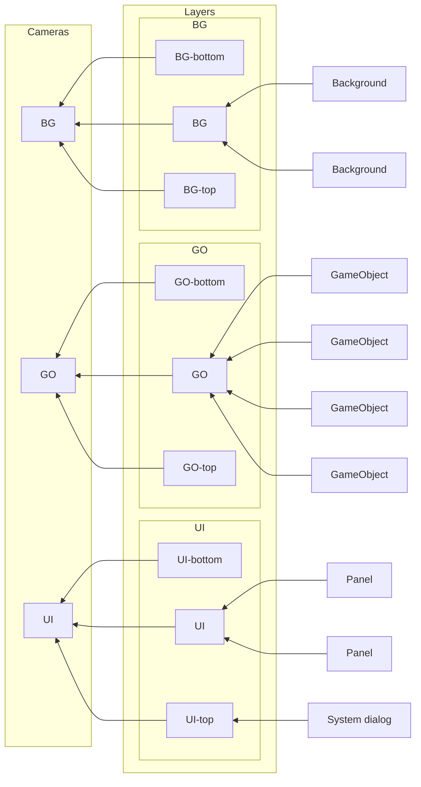

## Introduction

A dictionary to store [Layer game objects](layer.md). Each layer can have a dedicate camera.

- Author: Rex
- Container of game objects



## Usage

[Sample code](https://github.com/rexrainbow/phaser3-rex-notes/tree/master/examples/layermanager)

### Install plugin

#### Load minify file

- Load plugin (minify file) in preload stage
    ```javascript
    scene.load.plugin('rexlayermanagerplugin', 'https://raw.githubusercontent.com/rexrainbow/phaser3-rex-notes/master/dist/rexlayermanagerplugin.min.js', true);
    ```
- Add layer manager
    ```javascript
    var layerManager = scene.plugins.get('rexlayermanagerplugin').add(scene, config);
    ```

#### Import plugin

- Install rex plugins from npm
    ```
    npm i phaser3-rex-plugins
    ```
- Install plugin in [configuration of game](game.md#configuration)
    ```javascript
    import LayerManagerPlugin from 'phaser3-rex-plugins/plugins/layermanager-plugin.js';
    var config = {
        // ...
        plugins: {
            global: [{
                key: 'rexLayerManager',
                plugin: LayerManagerPlugin,
                start: true
            },
            // ...
            ]
        }
        // ...
    };
    var game = new Phaser.Game(config);
    ```
- Add layer manager
    ```javascript
    var layerManager = scene.plugins.get('rexLayerManager').add(scene, config);
    ```

#### Import class

- Install rex plugins from npm
    ```
    npm i phaser3-rex-plugins
    ```
- Import class
    ```javascript
    import LayerManager from 'phaser3-rex-plugins/plugins/layermanager.js';
    ```
- Add move-to behavior
    ```javascript
    var layerManager = new LayerManager(scene, config);
    ```

### Create instance

```javascript
var layerManager = scene.plugins.get('rexLayerManager').add(scene, {
    // layers: ['layer0', 'layer1', ...]
    // layers: [{name, cameraName}, ...]

    // depth: undefined,
    // rootLayer: undefined,
});
```

or

```javascript
var layerManager = scene.plugins.get('rexLayerManager').add(scene, 
    ['layer0', 'layer1', ...]
    // [{name, cameraName}, ...]
);
```

- `layers` : Add some initial [layers](layer.md)
    - A string array : Add layers by string name
    - A array of plain object `{ name, cameraName }`
        1. Add layer by string name
        1. Bind this layer to dedicate camera (indexed by `cameraName`), ignore other cameras
           Add a new camera if this target camera is not existing
- `depth` : Set `depth` to each [layer](layer.md) game object.
    - `undefined` : Keep default `depth` value (`0`)
- `rootLayer` : Add all layer game objects created by this layer-manager into this root layer.

### Destroy

```javascript
layerManager.destroy()
```

Also destroy all layers in this layer manager.

### Add layer

```javascript
layerManager.add(name);
// layerManager.add(name, depth);
```

### Add game object to layer

```javascript
layerManager.addToLayer(name, gameObject);
```

- `name` : Name of layer
- `gameObject` : Any kind of game object, include [containerLite](containerlite.md) and related game objects.

!!! note
    Print a warn message if specific layer is not existed.

### Get layer

- Get layer by name
    ```javascript
    var layer = layerManager.getLayer(name);
    ```
- Get all layers in this layer manager
    ```javascript
    var layers = layerManager.getLayers();
    // var out = layerManager.getLayers(out);
    ```    

### Has layer

```javascript
var hasLayer = layerManager.has(name);
// var hasLayer = layerManager.exists(name);
```

### Clear layer

- Destroy all children at layer
    ```javascript
    layerManager.clearLayer(name);
    ```
- Move all children from layer to scene's display list
    ```javascript
    layerManager.clearLayer(name, false);
    ```

### Change depth

- Bring a layer (`layerName`) to top of displayList
    ```javascript
    layerManager.bringLayerToTop(layerName);
    ```
- Send a layer (`layerName`) to bottom of displayList
    ```javascript
    layerManager.sendLayerToBack(layerName);
    ```
- Move a layer (`layerName`) above another layer (`baseLayerName`)
    ```javascript
    layerManager.moveLayerAbove(layerName, baseLayerName)
    ```
- Move a layer (`layerName`) below another layer (`baseLayerName`)
    ```javascript
    layerManager.moveLayerBelow(layerName, baseLayerName)
    ```

### Bind camera

```javascript
layerManager.setDedicatedCamera(layerName, cameraName);
```

Bind this layer to dedicate camera (indexed by `cameraName`), ignore other cameras
Add a new camera if this target camera is not existing
