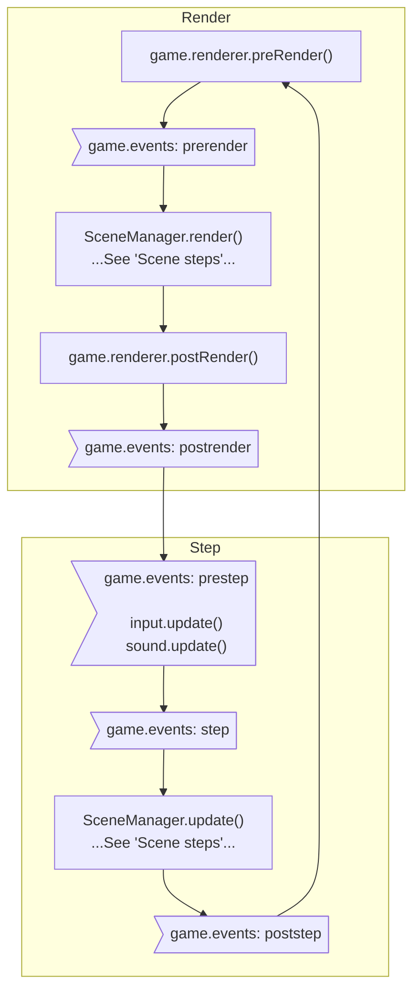
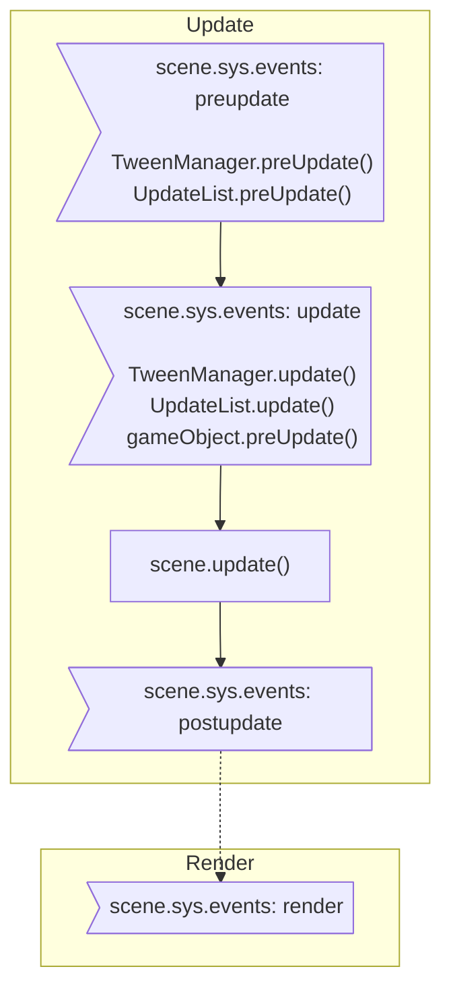

1.  game.events `prestep` event
    1.  trigger `game.input.update()`
    1.  trigger `game.sound.update()`
1.  game.events `step` event
1.  SceneManager.update, for each active scene
    1.  scene.sys.events `preupdate` event
        -  TweenManager.preUpdate() to arrange active targets
        -  UpdateList.preUpdate(), to arrange game objects in UpdateList
    1.  scene.sys.events `update` event
        -  TweenManager.update(), to run active tweens
        -  UpdateList.update
            - gameObject.preUpdate
    1.  scene.update()
    1.  scene.sys.events `postupdate` event
1.  game.events `poststep` event
1.  game.renderer.preRender()
1.  game.events `prerender` event
1.  SceneManager.render()
    1. Sort display list
    1. Render cameras
    1. scene.sys.events `render` event
1.  game.renderer.postRender()
1.  game.events `postrender` event

!!! note
    Each scene is a standalone system.

## Flow chart

### Game loop

### Scene steps

