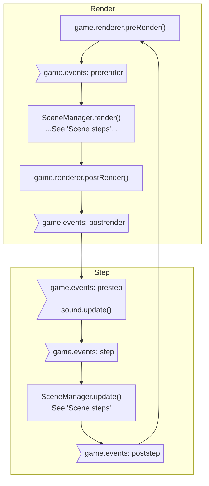
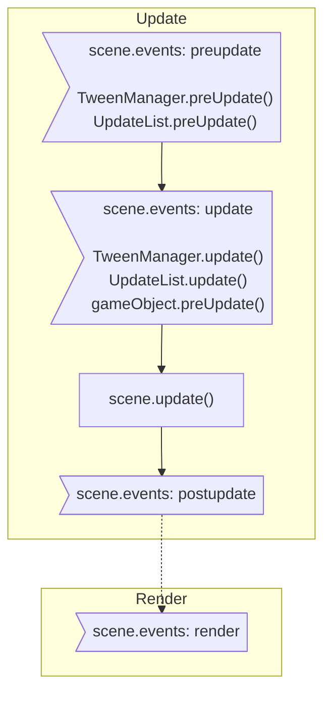

1.  game.events `prestep` event. Global Managers like Input and Sound update.
    1.  trigger `game.sound.update()`
1.  game.events `step` event. User-land code and plugins
    - Register event
        ```javascript
        scene.game.events.on('step', function(time, delta){
            //
        }, scope);
        ```
1.  Update the Scene Manager and all active Scenes
    1.  scene.events `preupdate` event
        - Register event
            ```javascript
            scene.events.on('preupdate', function(time, delta){
                //
            }, scope);
            ```
        - TweenManager.preUpdate() to arrange active targets
        - UpdateList.preUpdate(), to arrange game objects in UpdateList
    1.  scene.events `update` event
        - Register event
            ```javascript
            scene.events.on('update', function(time, delta){
                //
            }, scope);
            ```
        - TweenManager.update(), to run active tweens
        - UpdateList.update
            - gameObject.preUpdate
    1. scene.update()
    1. scene.events `postupdate` event
        - Register event
            ```javascript
            scene.events.on('postupdate', function(time, delta){
                //
            }, scope);
            ```
1. game.events `poststep` event. Final event before rendering starts.
    - Register event
        ```javascript
        scene.game.events.on('poststep', function(time, delta){
            //
        }, scope);
        ```
1. game.renderer.preRender()
1. game.events `prerender` event
    - Register event
        ```javascript
        scene.game.events.on('prerender', function(renderer, time, delta){
            //
        }, scope);
        ```
1. SceneManager.render()
    1. Sort display list
    1. Render cameras
    1. scene.events `render` event
        - Register event
            ```javascript
            scene.game.events.on('render', function(renderer){
                //
            }, scope);
            ```
1. game.renderer.postRender()
1. game.events `postrender` event. Final event before the step repeats.
    - Register event
        ```javascript
        scene.game.events.on('postrender', function(renderer, time, delta){
            //
        }, scope);
        ```

!!! note
    Each scene is a standalone system.

## Flow chart

### Game loop



### Scene steps


