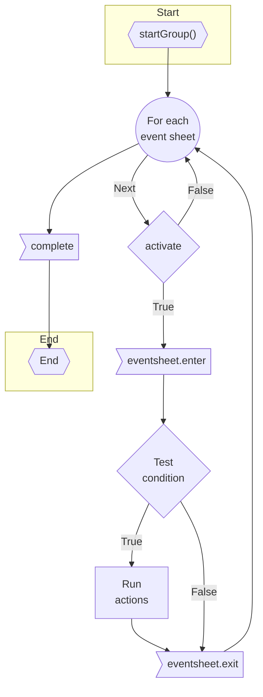

## Introduction

Event sheets contains main condition(s) and actions, in simple markdown format (headings, code block).

- Author: Rex
- Member of scene

## Live demos

- [Command executor](https://codepen.io/rexrainbow/pen/eYPLVmM)

## Usage

- [Sample code](https://github.com/rexrainbow/phaser3-rex-notes/tree/master/examples/markedeventheets)
- [Event sheets](https://github.com/rexrainbow/phaser3-rex-notes/tree/master/assets/markedeventsheet)

### Install plugin

#### Load minify file

- Load plugin (minify file) in preload stage
    ```javascript
    scene.load.plugin('rexmarkedeventsheetsplugin', 'https://raw.githubusercontent.com/rexrainbow/phaser3-rex-notes/master/dist/rexmarkedeventsheetsplugin.min.js', true);
    ```
- Add event-sheet-manager object
    ```javascript
    var eventSheetManager = scene.plugins.get('rexmarkedeventsheetsplugin').add(config);
    ```

#### Import plugin

- Install rex plugins from npm
    ```
    npm i phaser3-rex-plugins
    ```
- Install plugin in [configuration of game](game.md#configuration)
    ```javascript
    import MarkedEventSheetsPlugin from 'phaser3-rex-plugins/plugins/markedeventsheets-plugin.js';
    var config = {
        // ...
        plugins: {
            global: [{
                key: 'rexMarkedEventSheets',
                plugin: MarkedEventSheetsPlugin,
                start: true
            },
            // ...
            ]
        }
        // ...
    };
    var game = new Phaser.Game(config);
    ```
- Add event-sheet-manager object
    ```javascript
    var eventSheetManager = scene.plugins.get('rexMarkedEventSheets').add(config);
    ```

#### Import class

- Install rex plugins from npm
    ```
    npm i phaser3-rex-plugins
    ```
- Import class
    ```javascript
    import MarkedEventSheets from 'phaser3-rex-plugins/plugins/markedeventsheets.js';
    ```
- Add event-sheet-manager object
    ```javascript
    var eventSheetManager = new MarkedEventSheets(config);
    ```

### Create instance

```javascript
var eventSheetManager = scene.plugins.get('rexMarkedEventSheets').add({
    commandExecutor: Object,
    parallel: false
});
```

- `commandExecutor` : Command executor of [actions](markedeventsheet.md#custom-command).
    - This plugin provides a built-in [command executor](markedeventsheet.md#command-executor).
- `parallel` :
    - `false` : Test condition then execute event sheet one by one. Default behavior.
    - `true` : Test all condition of event sheets then execute event sheets one by one.


### Add event sheet

Each event sheet belong a group.

```javascript
eventSheetManager.addEventSheet(content, {
    commentLineStart: '\/\/',
    lineBreak: '\\',
    parallel: undefined,
    active: true,
    once: false
})
```

or

```javascript
eventSheetManager.addEventSheet(content, groupName, {
    commentLineStart: '\/\/',
    lineBreak: '\\',
    parallel: undefined,
    active: true,
    once: false
})
```

- `content` : See [structure of event sheet](markedeventsheet.md#structure-of-event-sheet)
- `commentLineStart` : Content line start by this symobl (default value is `//`) will be ignored as a comment line.
- `lineBreak` : Markdown will use `\` as line break. So the last character `\` will be discarded.
- `parallel` : 
    - `undefined` : Use default `parallel` property.
- `active` : 
    - `true` : Eval condition of this event sheet every round. Default behavior.
    - `false` : Skip this event sheet.
- `once` :
    - `true` : Set `active` of this event sheet to `false` when exection of this event sheet is complete.
    - `false` : Do nothing when exection of this event sheet is complete. Default behavior.
- `groupName` : Each event sheet belong a group. Ignore this parameter to use default group.
    - `'_'` : Default group name.

### Remove event sheet

- Remove an event sheet in default group
    ```javascript
    eventSheetManager.removeEventSheet(title);
    ```
- Remove an event sheet in a specific group
    ```javascript
    eventSheetManager.removeEventSheet(title, groupName);
    ```
- Remove all event sheets in default group
    ```javascript
    eventSheetManager.removeAllEventSheets();
    ```
- Remove all event sheets in a specific group
    ```javascript
    eventSheetManager.removeAllEventSheets(groupName);
    ```

### Start running

Starting command will be ignored if group is running.

#### Start running a group of event sheets

- Start running default group
    ```javascript
    eventSheetManager.startGroup();
    ```
- Start running a specific group of event sheets
    ```javascript
    eventSheetManager.startGroup(groupName);
    ```

Procedure of running a group of event sheets



#### Start running a event sheet in a group

- Start running default group
    ```javascript
    eventSheetManager.start();
    ```
- Start running an event sheet (indexed by `title`) without condition testing, in default group.
    ```javascript
    eventSheetManager.start(title);
    ```
- Start running an event sheet (indexed by `title`) without condition testing, in a specific group.
    ```javascript
    eventSheetManager.start(title, groupName);
    ```
- Start running an event sheet (indexed by `title`) with condition testing, in default group.
    ```javascript
    eventSheetManager.start(title, false);
    ```
- Start running an event sheet (indexed by `title`) with condition testing, in a specific group.
    ```javascript
    eventSheetManager.start(title, groupName, false);
    ```

#### Start running a group by event

```javascript
eventSheetManager.startGroup(eventName, groupName);
// eventSheetManager.startGroup(eventName, groupName, once);
```

or

```javascript
eventSheetManager.startGroup({
    eventName:
    groupName:
    once: false
});
```

### Round counter

Round counter is started from `0`.

- Increase round counter
    ```javascript
    eventSheetManager.updateRoundCounter();
    // eventSheetManager.$roundCounter += 1;
    ```
- Set round counter
    ```javascript
    eventSheetManager.updateRoundCounter(value);
    // eventSheetManager.$roundCounter = value;
    ```
- Get round counter
    ```javascript
    var roundCounter = eventSheetManager.getRoundCounter();
    // var roundCounter = eventSheetManager.$roundCounter;
    ```

### Active

- Activate state of event sheet (indexed by `title`)
    ```javascript
    eventSheetManager.setEventSheetActiveState(title);
    // eventSheetManager.setEventSheetActiveState(title, true);
    ```
- Inactivate state of event sheet (indexed by `title`)
    ```javascript
    eventSheetManager.setEventSheetActiveState(title, false);
    ```
- Get active state of event sheet (indexed by `title`)
    ```javascript
    var active = eventSheetManager.getEventSheetActiveState(title);
    ```

!!! note
    Event sheet which has `once` property will set `active` property to `false`
    when exection of this event sheet is complete. 


### Stop running

- Stop running default group
    ```javascript
    eventSheetManager.stop();
    ```
- Stop running a specific group of event sheets
    ```javascript
    eventSheetManager.stop(groupName);
    ```

### Local memory

Local memory is shared for all event sheets.

- Set value
    ```javascript
    eventSheetManager.setData(key, value);
    ```
- Toggle value
    ```javascript
    eventSheetManager.toggleData(key, value);
    ```
- Increase value
    ```javascript
    eventSheetManager.incData(key, inc);
    ```
- Get value
    ```javascript
    var value = eventSheetManager.getData(key);
    ```
- Has key
    ```javascript
    var hasData = eventSheetManager.hasData(key);
    ```
- Local memory as a dictionary
    ```javascript
    var data = eventSheetManager.memory;
    ```

### Custom expression

```javascript
eventSheetManager.addExpression(name, callback);
```

- `name` : A string value
- `callback` : A function object retuen a number
    ```javascript
    function(a, b, c, ...) { return x; }
    ```

For example :

```javascript
eventSheetManager.addExpression('randomInt', function (a, b) {
    return Math.floor(a + Math.random() * (b - a + 1));
});
```

Expression will store at [local memory](#local-memory)

### States

- Dump state of event sheets of all groups
    ```javascript
    var states = eventSheetManager.dumpState();
    ```
- Load state of event sheet of all groups
    ```javascript
    eventSheetManager.loadState(states);
    ```

### Events

- A group of event sheets has been executed completed
    ```javascript
    eventSheetManager.on('complete', function(groupName, eventSheetManager){ 

    });
    ```
- Enter an event sheet
    ```javascript
    eventSheetManager.on('eventsheet.enter', function(title, groupName, eventSheetManager){ 

    });
    ```
- Exit an event sheet
    ```javascript
    eventSheetManager.on('eventsheet.exit', function(title, groupName, eventSheetManager){ 

    });
    ```
- Enter a label (any heading) an event sheet
    ```javascript
    eventSheetManager.on('label.enter', function(headingTitle, eventSheetTitle, groupName, eventSheetManager){ 

    });
    ```
- Exit a label (any heading) of an event sheet
    ```javascript
    eventSheetManager.on('label.exit', function(headingTitle, eventSheetTitle, groupName, eventSheetManager){ 

    });
    ```
- Test condition of an event sheet failed
    ```javascript
    eventSheetManager.on('eventsheet.catch', function(title, groupName, eventSheetManager){ 

    });
    ```

### Structure of event sheet

[Sample](https://github.com/rexrainbow/phaser3-rex-notes/blob/master/assets/markedeventsheet/sample.md?plain=1)

#### Main headings

```
# Title

parallel
active=false
once

## [Condition]

coin > 5

## Script

## [Catch]

```

- H1 heading : Title of this event sheet
- Content under Title (H1 heading) : Setting of this event sheet, optional.
    - `parallel` : Set `parallel` property of this event sheet to `true`.
    - `active=false` : Set `active` property of this event sheet to `false`.
    - `once` : Set `once` property of this event sheet to `true`.
- H2 heading with `[Condition]` : Main condition.
    - Each line under `[Condition]` is a boolean equation, composed of `AND` logic.
    - Can have many `[Condition]` heading, each `[Condition]` heading will be composed of `OR` logic.
    - Read data from [local memory](markedeventsheet.md#local-memory)
- H2/H3/... headings between `[Condition]` and `[Catch]` : Actions when main condition is `true`.
    - [Flow control instructions of headings](markedeventsheet.md#flow-control-instructions)
    - Actions : [Custom command](markedeventsheet.md#custom-command)
- H2 heading with `[Catch]` : Actions when main condition is `false`.

#### Flow control instructions

##### If, Else if, Else

```
### [If coin > 10]

actions...

### [Else If (coin > 5) && (coin <10)]

actions...

### [Else]

actions...
```

- H2/H3/... heading with `[If expression]`, or `[Else if expression]` : If/Else If condition with expression
    - Read data from [local memory](markedeventsheet.md#local-memory)
    - Boolean expression AND/OR : `&&`.
    - Boolean expression OR : `||`.
    - Actions when expression is `true`.
- H2/H3/... heading with `[Else]` :
    - Actions when previous expressions are all `false`.


```
## [If]

coin > 10

### Label

actions...

## [Else If]

coin > 5
coin < 10

### Label

actions...

## [Else]

### Label

actions...
```

- H2/H3/... heading with `[If]`, or `[Else if]` : If, Else If condition
    - Each line under `[If]`, `[Else If]` is a boolean equation, composed of `AND` logic.
    - Read data from [local memory](markedeventsheet.md#local-memory)
- H3/H4/... heading under `[If]`, `[Else if]` : - Actions when previous expressions are all `false`.


##### Repeat loop

```
## [Repeat 3]

actions...
```

or

```
## [Repeat loopCount]

actions...
```

or

```
## [Repeat 3]

### Label

actions...
```


- H2/H3/... heading with `[Repeat N]`, or `[Repeat var]` : Repeat loop N times


##### While loop

```
## [While loopCount > 0]

actions...
```

- H2/H3/... heading with `[While expression]` : While loop with expression    
    - Read data from [local memory](markedeventsheet.md#local-memory)
    - Actions when expression is `true`.


```
## [While]

loopCount > 0

### Label

actions...
```

- H2/H3/... heading with `[While]` : While loop
    - Each line under `[While]` is a boolean equation, composed of `AND` logic.
    - Read data from [local memory](markedeventsheet.md#local-memory)
- H3/H4/... heading under `[While]` : Actions running when condition is `true`


##### Break

```

[break]

```

- Action line with `[break]` : Ignore remainder actions in current label (heading).


##### Exit

```

[exit]

```

- Action line with `[exit]` : Skip remainder label (heading) and actions.

##### Deactivate

```

[deactivate]

```

or


```

[deactivate title]

```

- Action line with `[deactivate]`, or `[deactivate title]` : Deactivate this event sheet, or deactivate event sheet by title in the same tree group. i.e. Set `active` property of this event shhet to `false`.


##### Activate

```

[activate]

```

or


```

[activate title]

```

- Action line with `[activate]`, or `[activate title]` : Activate this event sheet, or activate event sheet by title in the same tree group. i.e. Set `active` property of this event shhet to `true`.


#### Custom command

```

commandName
  param0=value
  param1=value

```

- Each command is divided by space line. i.e. add space lines above and below command.
- First line is the command name.
    1. Invoke `commandExecutor.commandName` method if this `commandName` method is existed.
        ```javascript
        commandName(config, eventSheetManager) {
            // var resumeCallback = eventSheetManager.pauseEventSheet();
            // ... 
            // resumeCallback()
        }
        ``` 
        - `config` : Parameter and value in a dictionary.
        - `eventSheetManager` : This event mangager.
            - Pause running of current event sheet
                ```javascript
                var resumeCallback = eventSheetManager.pauseEventSheet();  
                //  resumeCallback();  // Resume running of current event sheet      
                ```
            - Pause running of current event sheet until another `eventName` firing from `eventEmitter`
                ```javascript
                eventSheetManager.pauseEventSheetUnitlEvent(eventEmitter, eventName);
                ```
    1. Otherwise, invoke `commandExecutor.defaultHandler`.
        ```javascript
        defaultHandler(commandName, config, eventSheetManager) {
            // var resumeCallback = eventSheetManager.pauseEventSheet();
            // ... 
            // resumeCallback()
        }
        ```
        - `commandName` : Command name.
        - `config` : Parameter and value in a dictionary.
        - `eventSheetManager` : This event mangager.
            - Pause running of current event sheet
                ```javascript
                var resumeCallback = eventSheetManager.pauseEventSheet(); 
                //  resumeCallback();  // Resume running of current event sheet
                ```
            - Pause running of current event sheet until another `eventName` firing from `eventEmitter`
                ```javascript
                eventSheetManager.pauseEventSheetUnitlEvent(eventEmitter, eventName);
                ```
- Remainder lines are parameter composed of parameter name and value, with `=`
    - Space characters at line start will be discarded.
    - Value will be parsed to number, boolean, or string.
        - String value contains `{{`, and `}}` will be interpolation by [mustache](https://mustache.github.io/mustache.5.html) template syntax, return a string value.
        - String value wrapped by `#(` `)` will be treated as expression, return a number value.
- Any line start with `//` will be ignored as comment line.


For multiple lines parameter :

~~~
```commandName,param0=value,param1=value
line0
line1
line2
```
~~~

- Lines in code block will be assigned to `text` parameter.

So it will be equal to

```

commandName
  text=...
  param0=value
  param1=value

```

- `'\n'`

### Command executor

A command executor for phaser3 engine.

#### Create command executor instance

```javascript
var commandExecutor = scene.plugins.get('rexMarkedEventSheets').addCommandExecutor(scene, {
    layers: [],
    // layerDepth: undefined,
    // rootLayer: undefined,

    log: {
        delimiters: '[]'
        enable: true
    }
});

// Add to event sheet manager
// var eventSheetManager = scene.plugins.get('rexMarkedEventSheets').add({
//     commandExecutor: commandExecutor
// });
```

or

```javascript
// import MarkedEventSheets from 'phaser3-rex-plugins/plugins/markedeventsheets.js';
// import CommandExecutor from 'phaser3-rex-plugins/plugins/commandexecutor.js';

var commandExecutor = new CommandExecutor(scene, config);

// var eventSheetManager = new MarkedEventSheets({
//     commandExecutor: commandExecutor
// });
```


- `layers` : Pre-create [layer](layer.md) game object indexed by array of string names.
- `layerDepth` : Set `depth` to each [layer](layer.md) game object.
    - `undefined` : Keep default `depth` value (`0`)
- `rootLayer` : Add all layer game objects created by layer-manager into this root layer.
- `log` : Configuration of BBCodeLog
    - `log.delimiters` : String of left-delimiter and right-delimiter.
        - A single string with 2 characters. Default value is `'[]'`.
        - A array with 2 strings
    - `log.enable` :
        - `true` : Can [print message on console](#bbcode-log). Default behavior.
        - `false` : Don't print any message on console.

#### Local memory of event sheet manager

- Set value by key
    ```
    setData
      key=value
    ```
- Increase value of key
    ```
    incData
      key=value
    ```
    or
    ```
    setData
      key=#(key+value)
    ```
- Toggle value of key
    ```
    toggleData
      key
    ```


See [Local memory](#local-memory)


#### BBCode Log

##### Print message on console

```
log
  text=...
```

or

```
log
  text=...
  // logType='log'
  // showTitle=true
  // title
  // titleColor='green'
```

- `text` : Message with bbcode format.
    - `[color=gold]...[/color]`
    - `[bgcolor=green]...[/bgcolor]`
    - `[b]...[/b]`
    - `[i]...[/i]`
    - `[u]...[/u]`
- `logType` : 
    - `'log'` : `console.log`. Default value.
    - `'warn'`: `console.warn`
- `showTitle`
    - `true` : Show title before text message. Default behavior.
    - `false` : Don't show title.
- `title`
    - `undefined` : Using title of current event sheet. Default behavior.
    - A string, custom string before text message.
- `titleColor` : Background color of title block, default value is `'green'`


##### Disable console message

```
log.disable
```

- Disable console message of current event sheet.

or

```
log.disable
  title=...
```

- `title` : Disable console message of event sheet by title.


##### Enable console message

```
log.enable
```

- Enable console message of current event sheet.

or

```
log.enable
  title=...
```

- `title` : Enable console message of event sheet by title.


##### Dump memory

```
log.memory
```

- Dump all key in memory

or

```
log.memory
  text=...
  keys=a,b,c
```

- `keys` : Dump part of memory by keys.
- `text` : Message with bbcode format.


#### Game object

##### Register custom game object

```javascript
commandExecutor.addGameObjectManager({
    name: GOTYPE,

    viewportCoordinate: false,
    // viewportCoordinate: { viewport: new Phaser.Geom.Rectangle() },
    
    fade: 500,
    // fade: {mode: 'tint', time: 500},
    
    defaultLayer: layerName,

    autoClear: true,
    
    commands: {
        commandName(gameObject, config, commandExecutor, eventSheetManager, eventSheet) {
            // commandExecutor.waitEvent(eventEmitter, eventName);
        }
    }
})
```

- `name` : A string name of game object's type. Will [register command](markedeventsheet.md#add-custom-command) `GOTYPE` to this command executor.
- `createGameObject` : A callback for creating game object
    ```javascript
    function(scene, config) {
        return gameObject;
    }
    ```
    - `config` : Parameters passed from [event sheet](markedeventsheet.md#create-custom-game-object).
        - `id` : Parameter `id` is reserved.
- `viewportCoordinate` : Apply [viewportCoordinate behavior](viewport-coordinate.md) to game object.
    - `true` : Attach `vpx`, `vpy`, `vp` to sprite game object.
        - `vpx`, `vpy` : Number between `0`~`1`. Proportion of viewport.
        - `vp` : Viewport in [rectangle](geom-rectangle.md)
    - `false` : Do nothing, default behavior.
- `fade` :
    - `0` : No fade-in or fade-out when adding or removing a sprite.
    - A number : Duration of fading. Default value is `500`.
    - A plain object contains `mode`, `time`
        - `fade.mode` : Fade mode
            - `'tint'`, or `0` : Fade-in or fade-out via `tint` property.
            - `'alpha'`, or `1` : Fade-in or fade-out via `alpha` property. 
            - `'revealUp'`, or `2` : [Reveal](shader-builtin.md#reveal) up for fade-in.
            - `'revealDown'`, or `3` : [Reveal](shader-builtin.md#reveal) down for fade-in.
            - `'revealLeft'`, or `4` : [Reveal](shader-builtin.md#reveal) left for fade-in.
            - `'revealRight'`, or `5` : [Reveal](shader-builtin.md#reveal) right for fade-in.
        - `fade.time` : Duration of fading. Default value is `500`.
- `defaultLayer` : A layer name defined in `layers` parameter of [`addCommandExecutor` method](markedeventsheet.md#create-command-executor-instance)
- `autoClear` : 
    - `true` : Clear game objects when exiting current event sheet. Default behavior.
    - `false` : Ignore this behavior.
- `commands` : Custom commands, each command is a callback indexed by command name
    ```javascript
    commandName: function(gameObject, config, commandExecutor, eventSheetManager) {
        // commandExecutor.waitEvent(eventEmitter, eventName);
    }
    ```
    - `commandName` : Command name. These command names are reserved : [`to`](markedeventsheet.md#ease-properties-of-custom-game-object), [`yoyo`](markedeventsheet.md#ease-properties-of-custom-game-object), [`destroy`](markedeventsheet.md#destroy-custom-game-object)
    - `gameObject` : Game object instance.
    - `config` : Parameters passed from [event sheet](markedeventsheet.md#invoke-custom-command).
    - `commandExecutor` : This command executor instance. [See also](#methods-used-in-command)
    - `eventSheetManager` : This event sheet manager instance.
        - Store variable into blackboard of eventSheetManager : `eventSheetManager.setData(key, value)`

##### Create custom game object

```

GOTYPE
  id=NAME
  param0=value
  param1=value

```

- Create custom game object `GOTYPE` with config `{param0, param1}`, indexed by `id`


Reserved id : `time`, `click`, `key`, `bgm`, `bgm2`, `se`, `se2`, `camera`.


##### Set properties of custom game object

- Set properties of a game object indexing by `NAME`
    ```
    
    NAME.set
      x=
      vpx=
      y=
      vpy=
      alpha=
    
    ```
    - `vpx`, `vpy` : [viewportCoordinate properties](viewport-coordinate.md) injected if `viewportCoordinate` is `true`.
    - Add empty line above and below this command block.
- Set properties of all game objects belong GOTYPE
    ```
    
    GOTYPE.set
      x=
      vpx=
      y=
      vpy=
      alpha=
    
    ```
- Set properties of all game objects belong GOTYPE excluding `NAME`
    ```
    
    !NAME.set
      x=
      vpx=
      y=
      vpy=
      alpha=
    
    ```

##### Ease properties of custom game object

- Ease properties of a game object indexing by `NAME`
    ```
    
    NAME.to
      x=
      vpx=
      y=
      vpy=
      alpha=
      duration=1000
      ease=Linear
      repeat=0
      wait=
    
    ```
    ```
    
    NAME.yoyo
      x=
      vpx=
      y=
      vpy=
      alpha=
      duration=1000
      ease=Linear
      repeat=0
      wait=
    
    ```
    - These properties are reserved : `id`, `duration`, `ease`, `repeat`, `yoyo`, `wait`
    - `wait` :
        - `false` : Run next command immediately. Default behavior.
        - `true` : Run next command after playing sound complete.
    - Add empty line above and below this command block.
- Ease properties of all game objects belong GOTYPE
    ```
    
    GOTYPE.to
      x=
      vpx=
      y=
      vpy=
      alpha=
      duration=1000
      ease=Linear
      repeat=0
      wait=
    
    ```
    ```
    
    GOTYPE.yoyo
      x=
      vpx=
      y=
      vpy=
      alpha=
      duration=1000
      ease=Linear
      repeat=0
      wait=
    
    ```
- Ease properties of all game objects belong GOTYPE excluding `NAME`
    ```
    
    !NAME.to
      x=
      vpx=
      y=
      vpy=
      alpha=
      duration=1000
      ease=Linear
      repeat=0
      wait=
    
    ```
    ```
    
    !NAME.yoyo
      x=
      vpx=
      y=
      vpy=
      alpha=
      duration=1000
      ease=Linear
      repeat=0
      wait=
    
    ```

##### Invoke custom command 

- Invoke custom command of a game object indexing by `NAME`
    ```
    
    NAME.commandName
      param0=value
      param1=value
    
    ```
    - Invoke custom command `commandName` method with these parameters
        - `gameObject` : Indexed by `NAME`
        - `config` : `{param0, param1}`
    - Add empty line above and below this command block.
    - `value` :
        - For string value, characters `\n` (2 characters) will be replaced by `\n` new line character (1 character)
- Invoke custom command of all game objects belong GOTYPE
    ```
    
    GOTYPE.commandName
      param0=value
      param1=value
    
    ```
- Invoke custom command of all game objects belong GOTYPE excluding `NAME`
    ```
    
    !NAME.commandName
      param0=value
      param1=value
    
    ```


Do nothing if gameObject or commandName is not found.

##### Destroy custom game object

- Destroy game object indexing by `NAME`
    ```
    
    NAME.destroy
    
    ```
- Destroy all game objects belong GOTYPE
    ```
    
    GOTYPE.destroy
    
    ```
- Destroy all game objects belong GOTYPE excluding `NAME`
    ```
    
    !NAME.destroy
    
    ```

##### Methods used in command

- Hold command execution until `eventEmitter` emits `eventName` event.
    ```javascript
    commandExecutor.waitEvent(eventEmitter, eventName);
    ```
- Apply value to property of 
    ```javascript
    commandExecutor.setGOProperty({
        goType, id, 
        property, ... 
    });
    ```
    - `goType` : GameObject type assigned by `commandExecutor.addGameObjectManager({name...})`.
    - `id` : `NAME` of game object, which will store in `gameObject.name`.
        - `gameObject.name` : Apply value to property of this game object.
        - `'!' + gameObject.name` : Apply value to property of all game objects exclude this game object.
        - `undefined` : All game objects.
    - `propertyName: value` : Assign value to property. Can assign one or many properties.
- Ease value of game object(s)' property
    ```javascript
    if (wait) {
        commandExecutor.setWaitEventFlag();
    }
    commandExecutor.easeGOProperty({
        goType, id, 
        duration, ease, repeat, yoyo, 
        wait, 
        property, ... 
    });
    ```
    - `goType` : GameObject type assigned by `commandExecutor.addGameObjectManager({name...})`.
    - `id` : `NAME` of game object, which will store in `gameObject.name`.
        - `gameObject.name` : Apply value to property of this game object.
        - `'!' + gameObject.name` : Apply value to property of all game objects exclude this game object.
        - `undefined` : All game objects.
    - `duration` : Duration of easing task.
    - `ease` : [Ease function](tween.md#ease-equations)
    - `repeat` : Repeat times.
    - `yoyo` : Yoyo flag.
    - `wait` : Wait until easing task complete.
        - Invoke `commandExecutor.setWaitEventFlag()`. 
    - `propertyName: value` : Ease value of property. Can assign one or many properties.


#### Wait

##### Wait click

```

click

```

- Run next command after clicking.

##### Wait any

Run next command after...

```

wait
  click
  key=keyName
  time=
  GONAME.destroy
  GONAME.PROPNAME
  GONAME.DATAKEY
  GONAME.EVTNAME
  event=EVENTNAME

```

- `click` : Run next command after clicking.
- `key` : Run next command after key down
- `time` : Run next command after time-out.
- `GONAME.destroy` : Run next command after [game object](#create-custom-game-object) has destroyed.
- `GONAME.PROPNAME` (ex. `GONAME.x`) : Run next command after [game object](#create-custom-game-object)'s property tween complete
- `GONAME.DATAKEY`, `GONAME.!DATAKEY` (ex. `GONAME.!hp`) : Run next command after [game object](#create-custom-game-object)'s data is `true` (or `> 0`) or `false` (or `<= 0`). Will check PROPNAME first.
- `GONAME.EVTNAME` : Run next command after [game object](#create-custom-game-object)'s `EVTNAME` firing. Will check `PROPNAME` and `DATAKEY` first.
- `event` : Run next command after eventSheetManager firing `EVENTNAME` event.


Emit these events from eventSheetManager

- Wait click or key down
    ```javascript
    eventSheetManager.on('pause.input', function(){ 

    });
    ```
    - Resume (run next command)
        ```javascript
        eventSheetManager.on('resume.input', function(){ 

        });
        ```
- Wait click only
    ```javascript
    eventSheetManager.on('pause.click', function(){ 

    });
    ```
- Wait key down only
    ```javascript
    eventSheetManager.on('pause.key', function(keyName){ 

    });
    ```

#### Sound

This command executor provides 

- 2 background music tracks : `bgm`, `bgm2`
- 2 sound effects : `se`, `se2`.

##### Sound properties

```

bgm.set
  volume
  mute
  unmute
```

- Command name : `bgm`, `bgm2`, `se`, `se2`

##### Play sound

```
bgm.play
  key=
  // volume
  // detune
  // rate
  fadeIn=0
  // loop
  wait=false
```

- Command name : `bgm.play`, `bgm2.play`, `se.play`, `se2.play`
- `wait` :
    - `false` : Run next command immediately. Default behavior.
    - `true` : Run next command after playing sound complete.

##### Cross fade in sound

```

bgm.cross
  key=
  duration=500
  wait=false

```

- Command name : `bgm.cross`, `bgm2.cross`
- `wait` :
    - `false` : Run next command immediately. Default behavior.
    - `true` : Run next command after playing sound complete.

##### Stop sound

```
bgm.stop
```

- Command name : `bgm.stop`, `bgm2.stop`, `se.stop`, `se2.stop`

##### Fade out sound

```

bgm.fadeOut
  duration=500
  stop=true
  wait=false

```

- Command name : `bgm.fadeOut`, `bgm2.fadeOut`, `se.fadeOut`, `se2.fadeOut`
- `wait` :
    - `false` : Run next command immediately. Default behavior.
    - `true` : Run next command after playing sound complete.

##### Fade in sound

```

bgm.fadeIn
  duration=500

```

- Command name : `bgm.fadeIn`, `bgm2.fadeIn`

##### Pause sound

```

bgm.pause

```

- Command name : `bgm.pause`, `bgm2.pause`

##### Resume sound

```

bgm.resume

```

- Command name : `bgm.resume`, `bgm2.resume`

##### Mute sound

```

bgm.mute

```

- Command name : `bgm.mute`, `bgm2.mute`, `se.mute`, `se2.mute`

##### Unmute sound

```

bgm.unmute

```

- Command name : `bgm.unmute`, `bgm2.unmute`, `se.unmute`, `se2.unmute`

#### Camera

##### Camera properties

```

camera.set
  x=
  y=
  rotate=
  zoom=

```

- `x`, `y` : Scroll
- `rotate` : Rotate in degree
- `zoom` : Zoom

Run next command immediately.

##### Fade in

```

camera.fadeIn
  duration=1000
  red
  green
  blue
  wait=false

```

- `duration`, `red`, `green`, `blue` : See [fade effect](camera-effects.md/#fade)
- `wait` :
    - `false` : Run next command immediately. Default behavior.
    - `true` : Run next command after effect complete.

##### Fade out

```

camera.fadeOut
  duration=1000
  red
  green
  blue
  wait=false

```

- `duration`, `red`, `green`, `blue` : See [fade effect](camera-effects.md/#fade)
- `wait` :
    - `false` : Run next command immediately. Default behavior.
    - `true` : Run next command after effect complete.

##### Flash

```

camera.flash
  duration=1000
  red
  green
  blue
  wait=false

```

- `duration`, `red`, `green`, `blue` : See [flash effect](camera-effects.md/#flash)
- `wait` :
    - `false` : Run next command immediately. Default behavior.
    - `true` : Run next command after effect complete.

##### Shake

```

camera.shake
  duration=1000
  intensity
  wait=false

```

- `duration`, `intensity` : See [shake effect](camera-effects.md/#shake)
- `wait` :
    - `false` : Run next command immediately. Default behavior.
    - `true` : Run next command after effect complete.

##### Zoom

```
camera.zoomTo
  duration=1000
  zoom
  wait=false
```

- `duration`, `zoom` : See [zoom effect](camera-effects.md/#zoom)
- `wait` :
    - `false` : Run next command immediately. Default behavior.
    - `true` : Run next command after effect complete.

##### Rotate to

```

camera.rotateTo
  duration=1000
  rotate
  ease
  wait=false

```

- `duration`, `rotate`, `ease` : See [rotateTo effect](camera-effects.md/#rotate-to)
- `wait` :
    - `false` : Run next command immediately. Default behavior.
    - `true` : Run next command after effect complete.

##### Scroll to

```

camera.scrollTo
  duration=1000
  x
  y
  ease
  wait=false

```

- `duration`, `x`, `y`, `ease` : Scroll to position.
- `wait` :
    - `false` : Run next command immediately. Default behavior.
    - `true` : Run next command after effect complete.

#### Add custom command

```javascript
commandExecutor.addCommand(commandName, function(config, eventSheetManager){
    // var resumeCallback = eventSheetManager.pauseEventSheet();
    // ... 
    // resumeCallback()
}, scope);
```

- `config` : Parameters passed from [event sheet](markedeventsheet.md#custom-command).
- `eventSheetManager` : This event mangager.
    - Pause running of current event sheet
        ```javascript
        var resumeCallback = eventSheetManager.pauseEventSheet();
        //  resumeCallback();  // Resume running of current event sheet
        ```
    - Pause running of current event sheet until another `eventName` firing from `eventEmitter`
        ```javascript
        eventSheetManager.pauseEventSheetUnitlEvent(eventEmitter, eventName);
        ```