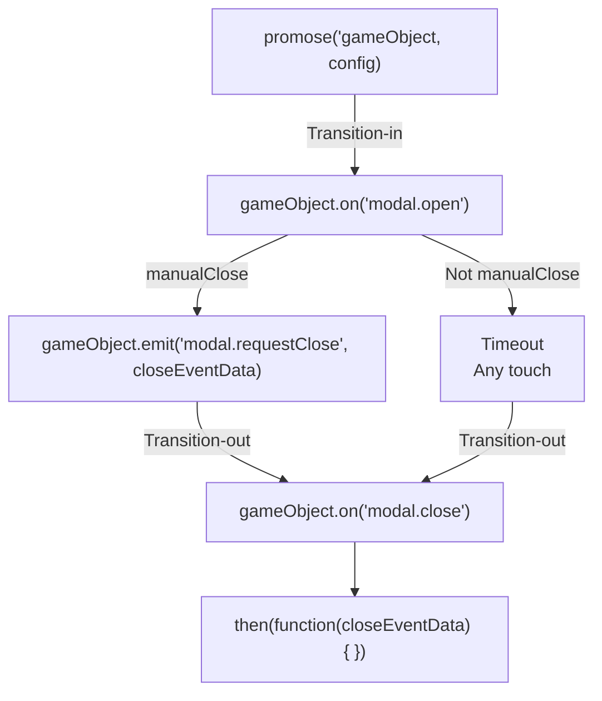

## Introduction

[Modal behavior](modal.md) wrapped into promise.

- Author: Rex
- Promise

## Live demos

- [Manual](https://codepen.io/rexrainbow/pen/bGrWKrJ)
- [Timeout](https://codepen.io/rexrainbow/pen/ExvmRwW)
- [Modal dialog](https://codepen.io/rexrainbow/pen/VwzbqEP)

## Usage

[Sample code](https://github.com/rexrainbow/phaser3-rex-notes/tree/master/examples/modal)

### Install plugin

#### Load minify file

- Load plugin (minify file) in preload stage
    ```javascript
    scene.load.plugin('rexmodalplugin', 'https://raw.githubusercontent.com/rexrainbow/phaser3-rex-notes/master/dist/rexmodalplugin.min.js', true);
    ```
- Add modal behavior
    ```javascript
    scene.plugins.get('rexmodalplugin').promise(gameObject, config)
        .then(function(closeEventData) {
        })
    ```

#### Import plugin

- Install rex plugins from npm
    ```
    npm i phaser3-rex-plugins
    ```
- Add modal behavior
    ```javascript
    scene.plugins.get('rexModal').promise(gameObject, config)
        .then(function(closeEventData) {
        })
    ```

#### Import class

- Install rex plugins from npm
    ```
    npm i phaser3-rex-plugins
    ```
- Import class
    ```javascript
    import { ModalPromise } from 'phaser3-rex-plugins/plugins/modal.js';
    ```
- Add modal behavior
    ```javascript
    ModalPromise(gameObject, config)
        .then(function(closeEventData) {
        })
    ```

### Promise

```javascript
scene.plugins.get('rexModal').promise(gameObject, config)
    .then(function(closeEventData) {
    })
```

- `config` : See [Modal behavior](modal.md#create-instance)

### Close

```javascript
scene.plugins.get('rexModal').close(gameObject);
// scene.plugins.get('rexModal').close(gameObject, closeEventData);
```
or
```javascript
gameObject.emit('modal.requestClose');
// gameObject.emit('modal.requestClose', closeEventData);
```

- Fire `'modal.requestClose'` event on game object, which will invoke `modal.requestClose()` method. After closing dialog, `resolve` part of promise will be triggered.



### Events

- To invoke `modal.requestClose()` method
    ```javascript
    gameObject.emit('modal.requestClose', closeEventData);
    ```
- On opened dialog
    ```javascript
    gameObject.on('modal.open', function(modalBehavior) {
    })
    ```
- On closed dialog
    ```javascript
    gameObject.on('modal.close', function(closeEventData, modalBehavior) {
    })
    ```
