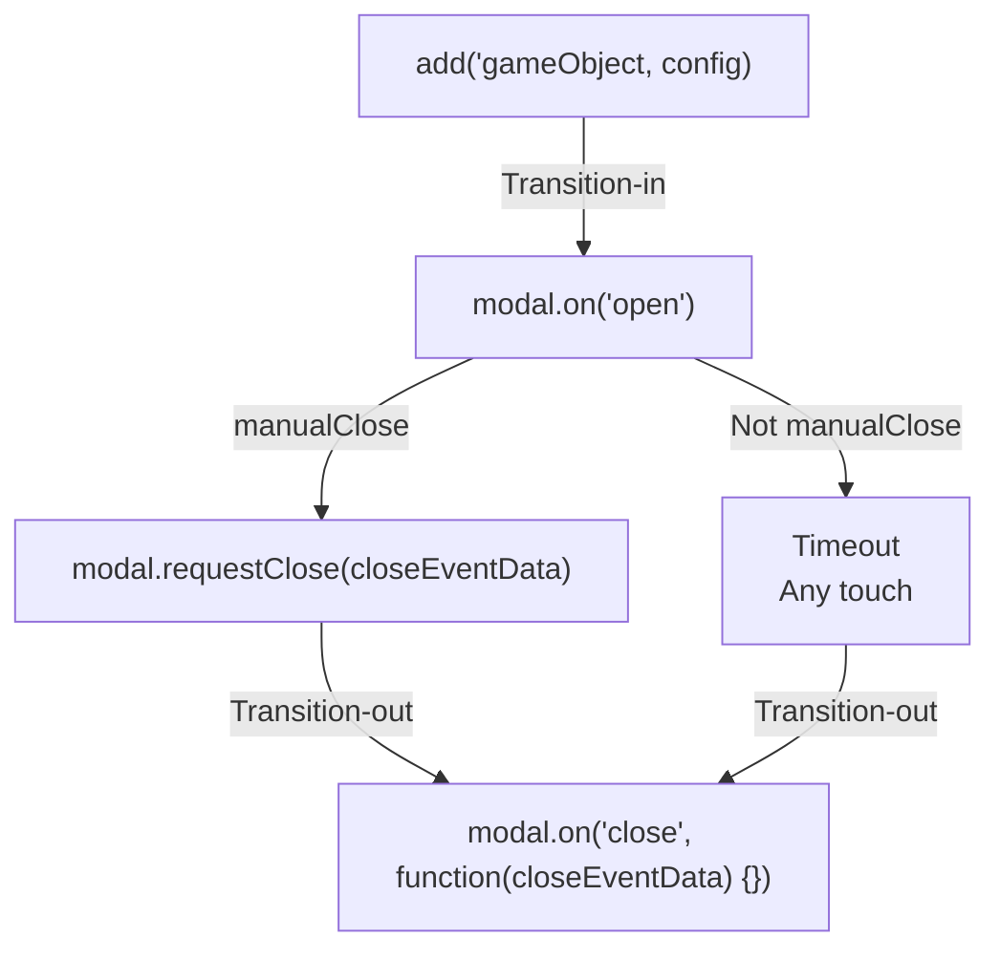

## Introduction

Pop-up modal dialog, then scale-down this dialog.

- Author: Rex
- Behavior of game object

## Live demos

- [Manual](https://codepen.io/rexrainbow/pen/KKvmzod)
- [Timeout](https://codepen.io/rexrainbow/pen/xxLdEbv)

## Usage

[Sample code](https://github.com/rexrainbow/phaser3-rex-notes/tree/master/examples/modal)

### Install plugin

#### Load minify file

- Load plugin (minify file) in preload stage
    ```javascript
    scene.load.plugin('rexmodalplugin', 'https://raw.githubusercontent.com/rexrainbow/phaser3-rex-notes/master/dist/rexmodalplugin.min.js', true);
    ```
- Add modal behavior
    ```javascript
    var modal = scene.plugins.get('rexmodalplugin').add(gameObject, config);
    ```

#### Import plugin

- Install rex plugins from npm
    ```
    npm i phaser3-rex-plugins
    ```
- Add modal behavior
    ```javascript
    var modal = scene.plugins.get('rexModal').add(gameObject, config);
    ```

#### Import class

- Install rex plugins from npm
    ```
    npm i phaser3-rex-plugins
    ```
- Import class
    ```javascript
    import { ModalBehavoir } from 'phaser3-rex-plugins/plugins/modal.js';
    ```
- Add modal behavior
    ```javascript
    var modal = new ModalBehavoir(gameObject, config);
    ```

### Create instance

```javascript
var modal = scene.plugins.get('rexModal').add(gameObject, {
    // cover: {
    //     color: 0x0,
    //     alpha: 0.8
    // },
    // cover: false, 

    // manualClose: true,
    // anyTouchClose: true,

    // duration: {
    //     in: 200,
    //     hold: 2000,
    //     out: 200
    // }

    // transitIn: 0,
    // transitOut: 0,

    // destroy: true
});
```

- `cover` : Configuration of [Cover](shape-cover.md#create-cover-object) -- A [rectangle shape covered full window](shape-fullwindowrectangle.md), and [block all touch events](toucheventstop.md).
    - `false` : Don't create cover game object.
- `manualClose` :
    - `true` : Close modal dialog via `modal.requestClose()` method. Default behavior.
    - `false` : Close modal dialog when timeout (`duration.hold`), or any-touch (if set `anyTouchClose` to `true`)
- `anyTouchClose` :
    - `true` : When `manualClose` set to `false`, close modal dialog when timeout, or any-touch.
    - `false` : Disable any-touch feature.
- `duration` : Duration of transition-in, hold, trantion-out.
    - `duration.in` : Duration of transition-in (open dialog).
    - `duration.out` : Duration of transition-out (close dialog).
    - `duration.hold` : Duration of hold. Used in `manualClose` is set to `false`.
- `transitIn` : Tween behavior of opening dialog.
    - `0`, `'popUp'` : Pop up dialog
    - `1`, `'fadeIn'` : Fade in dialog
- `transitOut` : Tween behavior of closing dialog.
    - `0`, `'scaleDown'` : Scale down dialog
    - `1`, `'fadeOut'` : Fade out dialog
- `destroy`
    - `true` : Destroy dialog when closing completed. Default behavior.
    - `fasle` : Don't destroy dialog.

### Close

```javascript
modal.requestClose();
// modal.requestClose(closeEventData);
```

-  `closeEventData` : Emit `'close'` event when closed dialog complete, pass `closeEventData` to callback of this event.
    ```javascript
    modal.on('close', function(closeEventData) {
    })
    ```



### Events

- On opened dialog
    ```javascript
    modal.on('open', function(gameObject, modal) {
    })
    ```
- On closed dialog
    ```javascript
    modal.on('close', function(closeEventData) {
    })
    ```
