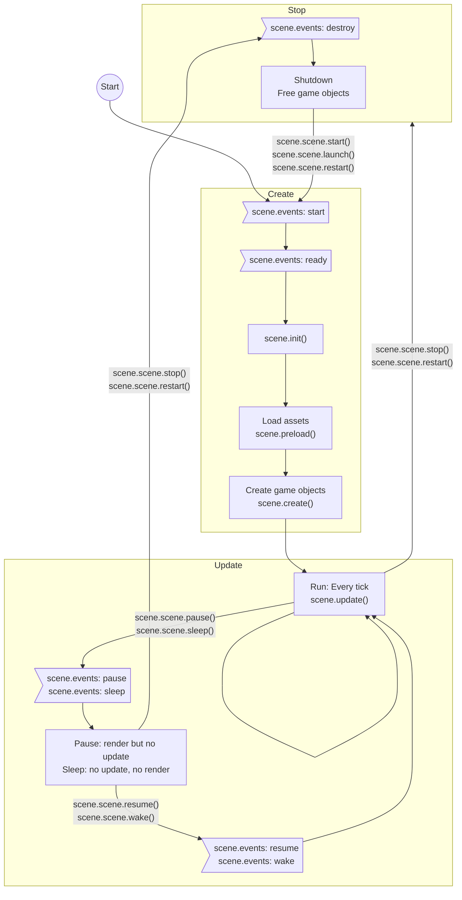

## Define a scene

### Configuration of scene

```javascript
var config = {
  key: "",
  // active: false,
  // visible: true,
  // pack: false,
  // cameras: null,
  // map: {},
  // physics: {},
  // loader: {},
  // plugins: false,
  // input: {}
};
```

- `key` : The unique key of this Scene. Must be unique within the entire Game instance.
- `active` : Does the Scene start as active or not? An active Scene updates each step.
- `visible` : Does the Scene start as visible or not? A visible Scene renders each step.
- `pack` : An optional [Loader Packfile](loader.md#file-pack) to be loaded before the Scene begins.
- `cameras` : An optional [Camera configuration object](camera.md#create-cameras-from-json).
  ```javascript
  {
      name: '',
      x: 0,
      y: 0,
      width: scene.sys.scale.width,
      height: scene.sys.scale.height,
      zoom: 1,
      rotation: 0,
      scrollX: 0,
      scrollY: 0,
      roundPixels: false,
      visible: true,
      backgroundColor: false,
      bounds: null, // {x, y, width, height}
  }
  ```
- `map` : Overwrites the default injection map for a scene.
- `physics` : The physics configuration object for the Scene.
  ```javascript
  {
      default: 'arcade', // 'arcade', or 'matter'
      arcade: {...},
      matter: {...}
  }
  ```
  - `arcade` : [Arcade Physics configuration](arcade-world.md#configuration).
  - `matter` : [Matter Physics configuration](matterjs-world.md#configuration).
- `loader` : The loader configuration object for the Scene.
  ```javascript
  {
      baseURL: '',
      path: '',
      enableParallel: true,
      maxParallelDownloads: 4,
      crossOrigin: undefined,
      responseType: '',
      async: true,
      user: '',
      password: '',
      timeout: 0
  }
  ```
- `plugins` : The plugin configuration object for the Scene.
  ```javascript
  {
      global: [
          //{key, plugin, start}
      ],
      scene: [
          // ...
      ]
  }
  ```
- `input` : The input configuration object for the Scene.
  ```javascript
  {
      keyboard: {
          target: window
      },
      mouse: {
          target: null,
          capture: true
      },
      activePointers: 1,
      touch: {
          target: null,
          capture: true
      },
      smoothFactor: 0,
      gamepad: false,
      windowEvents: true,
  }
  ```

### ES6 class

```javascript
class MyScene extends Phaser.Scene {
  constructor(config) {
    super(config);
  }

  init(data) {}
  preload() {}
  create(data) {}
  update(time, delta) {}
}
```

- `data` : Parameters passed from [adding new scene](scenemanager.md#add-new-scene), or [starting scene](scenemanager.md#start-scene)

### Class

```javascript
var MyScene = new Phaser.Class({
  Extends: Phaser.Scene,

  initialize: function MyScene(config) {
    Phaser.Scene.call(this, config);
  },

  init: function (data) {},
  preload: function () {},
  create: function (data) {},
  update: function (time, delta) {},
});
```

- `data` : Parameters passed from [adding new scene](scenemanager.md#add-new-scene), or [starting scene](scenemanager.md#start-scene)

```javascript
var MyGame = {};

MyGame.Boot = function () {};

MyGame.Boot.prototype.constructor = MyGame.Boot;

MyGame.Boot.prototype = {
  init: function (data) {},
  preload: function () {},
  create: function (data) {},
  update: function (time, delta) {},
};
```

- `data` : Parameters passed from [adding new scene](scenemanager.md#add-new-scene), or [starting scene](scenemanager.md#start-scene)

### Override

```javascript
var demo = new Phaser.Scene("Demo");

demo.init = function (data) {};
demo.preload = function () {};
demo.create = function (data) {};
demo.update = function (time, delta) {};
```

- `data` : Parameters passed from [adding new scene](scenemanager.md#add-new-scene), or [starting scene](scenemanager.md#start-scene)

## Flow chart



- `Run` : Update and render
- `Pause` : Render but no update
- `Sleep` : No update, no render
- `Stop` : Shutdown

See also

- [Pause/resume](scenemanager.md#pauseresume-scene)
- [Stop](scenemanager.md#stop-scene)
- [Main loop](mainloop.md)

### Start

1. Invoke `scene.preload()`
1. Invoke `scene.create()`

`scene.scene.restart()` is equal to

```javascript
scene.scene.stop();
scene.scene.start();
```

### Stop

- All game objects will be destroyed.
  - Registered events on game objects will also be clear, too.
- Touch, keyboard and GamePad events will be clear.
- Cameras will be destroyed.
- Loader will be stopped.
  - Assets will be stored in global cache.
- Events registered on scene plugin (`scene.events.on`) **won't be clear**.

## Members

- `plugins`
- `load` : [Loader](loader.md)
- `events` : Local [events](eventemitter3.md)
- `input` : [Touch](touchevents.md), [keyboard](keyboardevents.md)
- `tweens` : [Tween tasks](tween.md)
- `time` : [Timer](timer.md)
- `cameras` : [Camera](camera.md)
- `scene` : [scenePlugin](scenemanager.md)
- `anims`
- `physics` : [ArcadePhysics](arcade-world.md)
- `matter` :　 MatterPhysics
- `registry` : Global [data manager](datamanager.md)
- `data` : Local [data manager](datamanager.md)
- `sys`
- `game`
- `render`
- `cache`
- `sound`
- `textures`
- `add`
- `make`
- `children` : [DisplayList](structs-list.md)
  ```javascript
  scene.children.bringToTop(child);
  scene.children.sendToBack(child);
  scene.children.moveUp(child);
  scene.children.moveDown(child);
  scene.children.moveUp(child);
  scene.children.moveTo(child, index);
  scene.children.moveAbove(child1, child2); // Move child1 above child2
  scene.children.moveBelow(child1, child2); // Move child1 below child2
  scene.children.swap(child1, child2);
  ```
- `lights`

Preserve word in a scene.

## Events

- Start (Before `scene.init()`)
  ```javascript
  scene.events.on("start", function () {});
  ```
- Ready (After `start`)
  ```javascript
  scene.events.on("ready", function () {});
  ```
- Every tick
    - Preupdate
        ```javascript
        scene.events.on("preupdate", function (time, delta) {});
        ```
    - Update
        ```javascript
        scene.events.on("update", function (time, delta) {});
        ```
    - Postupdate
        ```javascript
        scene.events.on("postupdate", function (time, delta) {});
        ```
    - Render
        ```javascript
        scene.events.on("render", function () {});
        ```
- State changed
    - Pause (from `scene.scene.pause()`)
        ```javascript
        scene.events.on("pause", function () {});
        ```
    - Resume (from `scene.scene.resume()`)
        ```javascript
        scene.events.on("resume", function () {});
        ```
    - Sleep (from `scene.scene.sleep()`)
        ```javascript
        scene.events.on("sleep", function () {});
        ```
    - Wake (from `scene.scene.wake()`)
        ```javascript
        scene.events.on("wake", function () {});
        ```
    - Stop/shutdown (from `scene.scene.stop()`)
        ```javascript
        scene.events.on("shutdown", function () {});
        ```
        - **Free-up any resources that may be in use by this scene**
- Destroy (from `scene.scene.remove()`)
    ```javascript
    scene.events.on("destroy", function () {});
    ```
- Resize
    ```javascript
    scene.events.on("resize", function () {});
    ```
- Boot
    ```javascript
    scene.events.on("boot", function () {});
    ```
- Game object added to scene
    - Add
        ```javascript
        scene.events.on("addedtoscene", function (gameObject, scene) {});
        ```
    - Remove
        ```javascript
        scene.events.on("removedfromscene", function (gameObject, scene) {});
        ```
