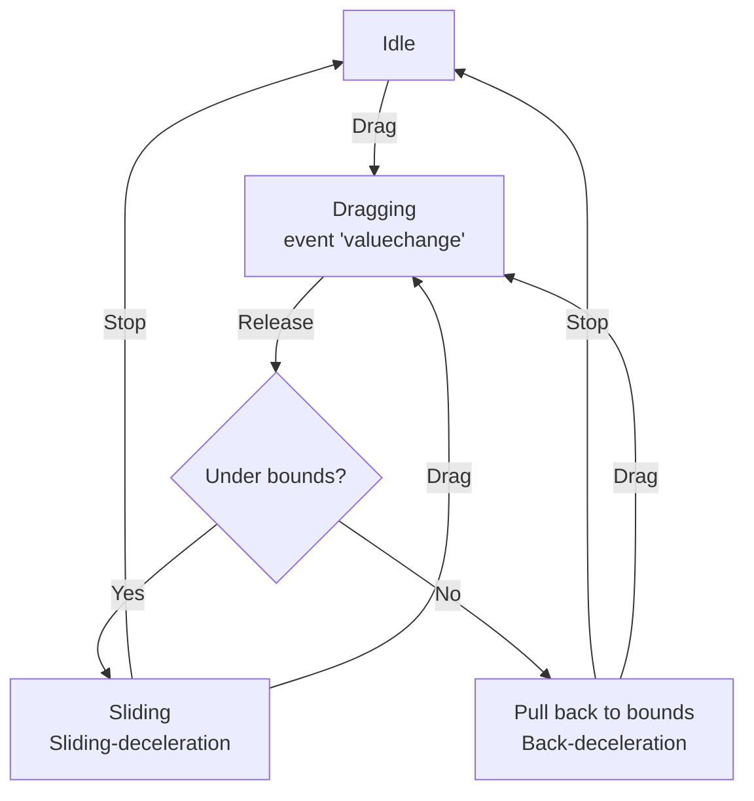

## Introduction

Drag content. Slow down when dragging released, pull back when out of bounds.

- Author: Rex
- Behavior of game object

## Live demos

- [Scroller](https://codepen.io/rexrainbow/pen/Kxzgre)

## Usage

[Sample code](https://github.com/rexrainbow/phaser3-rex-notes/tree/master/examples/scroller)

### Install plugin

#### Load minify file

- Load plugin (minify file) in preload stage
    ```javascript
    scene.load.plugin('rexscrollerplugin', 'https://raw.githubusercontent.com/rexrainbow/phaser3-rex-notes/master/dist/rexscrollerplugin.min.js', true);
    ```
- Add scroller behavior
    ```javascript
    var scroller = scene.plugins.get('rexscrollerplugin').add(gameObject, config);
    ```

#### Import plugin

- Install rex plugins from npm
    ```
    npm i phaser3-rex-plugins
    ```
- Install plugin in [configuration of game](game.md#configuration)
    ```javascript
    import ScrollerPlugin from 'phaser3-rex-plugins/plugins/scroller-plugin.js';
    var config = {
        // ...
        plugins: {
            global: [{
                key: 'rexScroller',
                plugin: ScrollerPlugin,
                start: true
            },
            // ...
            ]
        }
        // ...
    };
    var game = new Phaser.Game(config);
    ```
- Add scroller behavior
    ```javascript
    var scroller = scene.plugins.get('rexScroller').add(gameObject, config);
    ```

#### Import class

- Install rex plugins from npm
    ```
    npm i phaser3-rex-plugins
    ```
- Import class
    ```javascript
    import Scroller from 'phaser3-rex-plugins/plugins/scroller.js';
    ```
- Add scroller behavior
    ```javascript
    var scroller = new Scroller(gameObject, config);
    ```

### Create instance

```javascript
var scroller = scene.plugins.get('rexScroller').add(gameObject, {
    bounds: [
        bottomBound,
        topBound
    ],
    value: topBound,
    // threshold: 10,
    // slidingDeceleration: 5000,
    // backDeceleration: 2000,
    // enable: true,
    // orientation: 'vertical',
    // pointerOutRelease: true,

    // valuechangeCallback: null,
    // valuechangeCallbackScope: null,

    // overmaxCallback: null,
    // overmaxCallbackScope: null,

    // overminCallback: null,
    // overminCallbackScope: null,
});
```

- `bounds` : An array of 2 values [bound0, bound1]
- `value` : Initial value between bound0 and bound1
    - Map this value to position of content under [event 'valuechange'](scroller.md#events)
- `threshold` : Minimal movement to scroll. Set `0` to scroll immediately.
- `slidingDeceleration` : Deceleration of slow down when dragging released.
    - Set `false` to disable it.
- `backDeceleration` : Deceleration of pull back when out of bounds.
    - Set `false` to disable it.
- `enable` : Set true to get dragging events.
- `orientation` :
    - `'vertical'`,`'v'`, `'y'`, or `0` : dragging on vertical/y axis.
    - `'horizontal'`,`'h'`, `'x'`, or `1` : dragging on horizontal/x axis.
- `pointerOutRelease` : Set to `true` to release input control when pointer out of gameObject. Default value is `true`.
- `valuechangeCallback` , `valuechangeCallbackScope` : Bind this callback to [`valuechange` event](scroller.md#events)
- `overminCallback` , `overmaxCallbackScope` : Bind this callback to [`overmax` event](scroller.md#events)
- `overminCallback` , `overminCallbackScope` : Bind this callback to [`overmin` event](scroller.md#events)

### Set bounds

```javascript
this.setBounds(bounds);  // bounds: [bound0, bound1]
// this.setBounds(bound0, bound1);
```

### Set deceleration

- Deceleration of slow down when dragging released
    ```javascript
    scroller.setSlidingDeceleration(dec);
    ```
    - Disable
        ```javascript
        scroller.setSlidingDeceleration(false);
        ```
- Deceleration of pull back when out of bounds
    ```javascript
    scroller.setBackDeceleration(dec);
    ```
    - Disable
        ```javascript
        scroller.setBackDeceleration(false);
        ```

### Get value

```javascript
var value = scroller.value;
```

### Set value

- Set value
    ```javascript
    scroller.value = newValue;
    // scroller.setValue(newValue);
    ```
- Set value, clamp between minValue and maxValue
    ```javascript
    scroller.setValue(newValue, true);
    ```
- Add value
    ```javascript
    scroller.value += inc;
    // scroller.addValue(inc);
    ```
- Add value, clamp between minValue and maxValue
    ```javascript
    scroller.addValue(inc, true);
    ```

Fires `valuechange` event if new value is not equal to current value.

### Events

- Value changed
    ```javascript
    scroller.on('valuechange', function(newValue, prevValue){ /* ... */ });
    ```
    - Set position of content under this event
- Value out of max/min bound
    ```javascript
    scroller.on('overmax', function(newValue, prevValue){ /* ... */ });
    ```
    ```javascript
    scroller.on('overmin', function(newValue, prevValue){ /* ... */ });
    ```

### Drag

#### Drag enable

- Get
    ```javascript
    var enable = scroller.enable;
    ```
- Set
    ```javascript
    scroller.setEnable();
    // scroller.setEnable(enable);  // enable: true, or false
    ```
    or
    ```javascript
    scroller.enable = enable; // enable: true, or false
    ```
- Toggle
    ```javascript
    scroller.toggleEnable();
    ```

#### Is dragging

```javascript
var isDragging = scroller.isDragging;
```

### State machine



- Get state
    ```javascript
    var state = scroller.state;
    ```
    - `'IDLE'` : No dragging, no sliding
    - `'DRAG'` : Dragging
    - `'SLIDE'` : Sliding when dragging released
    - `'BACK'` : Sliding back to bound when out of bound