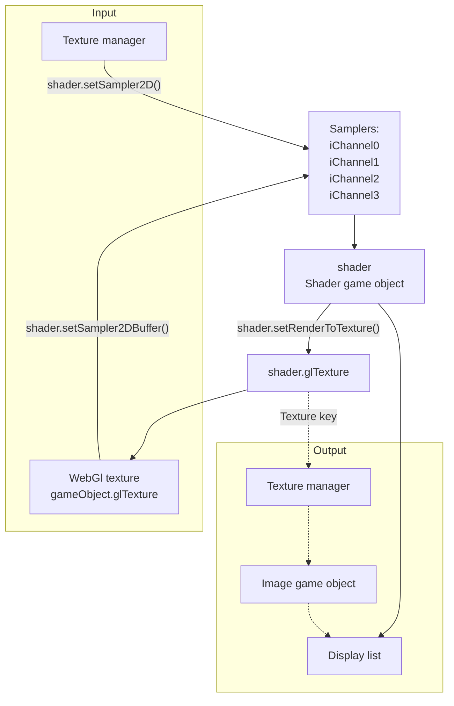

## Introduction

A quad with its own shader, built-in game object of phaser.

- Author: Richard Davey

## Usage

### Load GLSL

```javascript
scene.load.glsl(key, url);
```

Reference: [load glsl](loader.md#glsl)

### Add shader object

```javascript
var shader = scene.add.shader(key, x, y, width, height, textures);
```

- `key` : The key of the shader to use from the *shader cache*, or a BaseShader instance.
- `x`, `y` : Position.
- `width`, `height` : Size.
- `textures` : Optional array of texture keys to bind to the iChannel0, iChannel1, iChannel2, iChannel3 uniforms. Lots of shaders expect textures to be **power-of-two sized**.

Add shader object from JSON

```javascript
var shader = scene.make.shader({
    x: 0,
    y: 0,
    key: '',

    // angle: 0,
    // alpha: 1
    // flipX: true,
    // flipY: true,
    // scale : {
    //    x: 1,
    //    y: 1
    //},

    add: true
});
```

- `key` : The key of the shader to use from the shader cache, or a BaseShader instance.
    - A string
    - An array of string to pick one element at random
- `x`, `y`, `scale.x`, `scale.y` :
    - A number
    - A callback to get return value
        ```javascript
        function() { return 0; }
        ```
    - Random integer between min and max
        ```javascript
        { randInt: [min, max] }
        ```
    - Random float between min and max
        ```javascript
        { randFloat: [min, max] }
        ```

### Custom class

- Define class
    ```javascript
    class MyShader extends Phaser.GameObjects.Shader {
        constructor(scene, key, x, y, width, height, textures) {
            super(scene, key, x, y, width, height, textures);
            // ...
            scene.add.existing(this);
        }
        // ...

        // preUpdate(time, delta) {}
    }
    ```
    - `scene.add.existing(gameObject)` : Adds an existing Game Object to this Scene.
        - If the Game Object renders, it will be added to the Display List.
        - If it has a `preUpdate` method, it will be added to the Update List.
- Create instance
    ```javascript
    var shader = new MyShader(scene, key, x, y, width, height, textures);
    ```

### Sampler2D uniform

- Get uniform object
    ```javascript
    var uniform = shader.getUniform(key);
    ```
    - Texture key
        ```javascript
        var textureKey = uniform.textureKey;
        ```
    - Get texture key of `iChannel0`, `iChannel1`, `iChannel2`, `iChannel3` sampler2D uniform.
        ```javascript
        var textureKey = shader.getUniform('iChannel0').textureKey;
        var textureKey = shader.getUniform('iChannel1').textureKey;
        var textureKey = shader.getUniform('iChannel2').textureKey;
        var textureKey = shader.getUniform('iChannel3').textureKey;
        ```
- Sets a sampler2D uniform from texture manager.
    ```javascript
    shader.setChannel0(textureKey);
    shader.setChannel1(textureKey);
    shader.setChannel2(textureKey);
    shader.setChannel3(textureKey);
    // shader.setChannel0(textureKey, textureData);
    // shader.setChannel1(textureKey, textureData);
    // shader.setChannel2(textureKey, textureData);
    // shader.setChannel3(textureKey, textureData);
    ```
    or
    ```javascript
    shader.setSampler2D(uniformKey, textureKey, textureIndex);
    // shader.setSampler2D(uniformKey, textureKey, textureIndex, textureData);
    ```
    - `uniformKey` : `'iChannel0'`, `'iChannel1'`, `'iChannel2'`, or `'iChannel3'`.
    - `textureIndex` : `0`(for iChannel0), `1`(for iChannel1), `2`(for iChannel2), `3`(for iChannel3).
    - `textureData` : Additional texture data.
    - `textureKey`: Key from the Texture Manager cache. It cannot be a single frame from a texture, only the full image. Lots of shaders expect textures to be **power-of-two sized**.
- Sets a sampler2D uniform from a webgl texture.
    ```javascript
    shader.setSampler2DBuffer(uniformKey, texture, width, height, textureIndex);
    // shader.setSampler2DBuffer(uniformKey, texture, width, height, textureIndex, textureData);
    ```
    - `uniformKey` : `'iChannel0'`, `'iChannel1'`, `'iChannel2'`, or `'iChannel3'`.
    - `width`, `height` : The width, height of the texture.
    - `textureIndex` : `0`(for iChannel0), `1`(for iChannel1), `2`(for iChannel2), `3`(for iChannel3).
    - `textureData` : Additional texture data.

### Other uniforms

- `mouse`, a pointer parameter.
    - Get
        ```javascript
        var pointer = shader.pointer;
        ```
    - Set
        ```javascript
        shader.setPointer(pointer);
        ```
        - `pointer` : `{x, y}`
- `time`, the elapsed game time, in *seconds*.
    - Get
        ```javascript
        var time = shader.getUniform('time').value;
        // var time = shader.uniforms.time.value
        ```
    - Set
        ```javascript
        shader.setUniform('time.value', time);
        ```

### Output

- Render to Display list, by default.
- Redirect render result to internal webgl texture.
    ```javascript
    shader.setRenderToTexture();
    var texture = shader.glTexture;
    ```
- Redirect render result to internal webgl texture, and sample2D from buffer.
    ```javascript
    shader.setRenderToTexture(undefined, true);
    var texture = shader.glTexture;
    ```
- Redirect render result to texture manager, for texture-based game object.
    ```javascript
    shader.setRenderToTexture(textureKey);
    // var texture = shader.glTexture;
    ```
- Redirect render result to texture manager, and Sample2D from buffer.
    ```javascript
    shader.setRenderToTexture(textureKey, true);
    // var texture = shader.glTexture;
    ```

### Texture routing



### Other properties

See [game object](gameobject.md)
