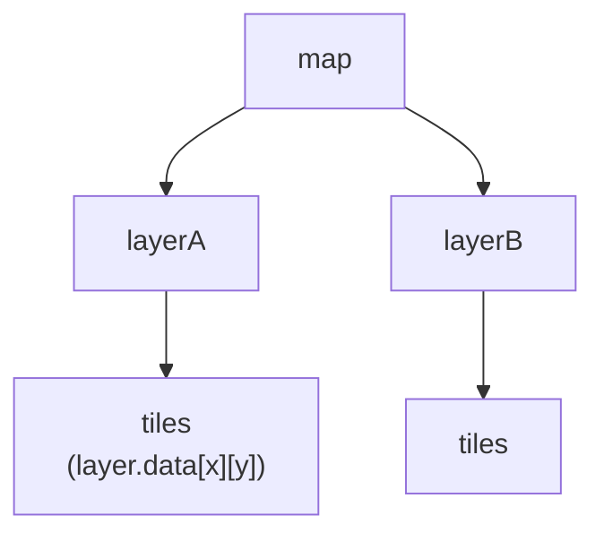

## Introduction

Display of tiles map, built-in game object of phaser.

- Author: Richard Davey

## Usage

### Hierarchy



- [`map`](tilemap.md#map) : A container for Tilemap data.
- [`layer`](tilemap.md#layer) : A [Game Object](gameobject.md) that renders LayerData from a map when used in combination with one or more [tileset](tilemap.md#tileset).
- `tiles` : A 2d array of Tile object
    - [Tile](tilemap.md#tile) : A lightweight data representation, store position information without factoring in scroll, layer scale or layer position.
- [`tileset`](tilemap.md#tileset) : Image and tileData of some kind of tiles.

### Load tile map

```javascript
scene.load.tilemapTiledJSON(key, url);  // JSON
scene.load.tilemapCSV(key, url);          // CSV
```

### Add tile map object

1. Create [`map`](tilemap.md#map)
    - Create map from tiled
        ```javascript
        var map = scene.add.tilemap(key);
        // var map = this.make.tilemap({ key: 'map', tileWidth: 16, tileHeight: 16 });
        ```
    - Create map from 2d array
        ```javascript
        var map = this.make.tilemap({
            // data: tileIdxArray,  // [ [], [], ... ]
            tileWidth: 32,
            tileHeight: 32,
            width: 10,
            height: 10
        });
        ```
    - Create map from csv
        ```javascript
        var map = this.make.tilemap({
            key: 'map',     // csv file
            tileWidth: 32,
            tileHeight: 32
        });
        ```
2. Add [`tileset`](tilemap.md#tileset) image
    ```javascript
    var tileset = map.addTilesetImage(tilesetName, key); // key: texture key
    // var tileset = map.addTilesetImage(tilesetName);  // key = tilesetName
    // var tileset = map.addTilesetImage(tilesetName, key, tileWidth, tileHeight, tileMargin, tileSpacing, gid);
    ```
3. Create [`layer`](tilemap.md#layer)
    - Create existed layer
        ```javascript
        var layer = map.createLayer(layerID, tileset);
        // var layer = map.createLayer(layerID, tileset, x, y);
        ```
        - `tileset` : The tileset, or an array of tilesets.
            - A string, or an array of string.
            - A tileset object, or an array of tileset objects.
        - `x`, `y` : Offset in pixels. Default is `0`/`0`.
    - Create a new and empty layer
        ```javascript
        var layer = map.createBlankLayer(layerID, tileset);
        // var layer = map.createBlankLayer(layerID, tileset, x, y, width, height, tileWidth, tileHeight); // x, y : offset in pixels
        ```
        - `layerID` : The name of this layer. Must be unique within the map.
        - `tileset` : The tileset, or an array of tilesets.
            - A string, or an array of string.
            - A tileset object, or an array of tileset objects.
        - `x`, `y` : Offset in pixels. Default is `0`/`0`.
        - `width`, `height` : The width/height of the layer in tiles. Default is `map.width`/`map.height`.
        - `tileWidth`, `tileHeight` : The width/height of the tiles the layer uses for calculations. Default is map's tileWidth/tileHeight.
4. Create game objects (optional)
    - Create game objects by Object-ID/Object-GID/Object-Name
        ```javascript
        var sprites = map.createFromObjects(layerName, {
            // gid: 26,
            // name: 'bonus',
            // id: 9,
        
            // classType: Sprite,
            // scene,
            // container: null,
            // key: null,
            // frame: null
        });
        ```
        or
        ```javascript
        var sprites = map.createFromObjects(layerName, configArray);
        ```
        - One of filter
            - `gid` : Object GID.
            - `id` : Object ID.
            - `name` : Object Name.
        - `classType` : Class of game object, default is [Sprite](sprite.md).
        - `scene` : A Scene reference, passed to the Game Objects constructors. Default is map's scene.
        - `container` : Optional Container to which the Game Objects are added.
        - `key`, `frame` : Optional key of a Texture to be used.
    - Create game objects by tile
        ```javascript
        var sprites = map.createFromTiles(indexes, replacements, spriteConfig);
        // var sprites = map.createFromTiles(indexes, replacements, spriteConfig, scene, camera, layer);
        ```
        - `indexes` : The tile index, or array of indexes
        - `replacements` :
            - `null` : Leave the tiles unchanged
            - Array of indexes : One-to-one mapping `indexes` to `replacements`.
        - `spriteConfig` : The config object to pass into the Sprite creator (i.e. `scene.make.sprite`).
        - `scene` : The Scene to create the Sprites within.
        - `camera` : The Camera to use when determining the world XY.
        - `layer` : The Tilemap Layer to act upon.

### Map

### Map size

```javascript
var mapWidth = map.width;
var mapHeight = map.height;
```

#### Tile size

- Set
    ```javascript
    map.setBaseTileSize(tileWidth, tileHeight);
    ```
- Get
    ```javascript
    var tileWidth = map.tileWidth;
    var tileHeight = map.tileHeight;
    ```

#### Tile/world position

- World position -> Tile position
    ```javascript
    var tileXY = map.worldToTileXY(worldX, worldY);
    // var out = map.worldToTileXY(worldX, worldY, snapToFloor, out, camera, layer);
    ```
- Tile position -> World position
    ```javascript
    var worldXY = map.tileToWorldXY(tileX, tileY);
    // var out = map.tileToWorldXY(tileX, tileY, out, camera, layer);
    ```

#### Tile at world XY

```javascript
var hasTile = map.hasTileAtWorldXY(worldX, worldY);
```

or

```javascript
var hasTile = map.hasTileAtWorldXY(worldX, worldY, camera, layer);
```

#### Draw on graphics

```javascript
map.renderDebug(graphics);
```

or

```javascript
map.renderDebug(graphics, {
    tileColor: new Phaser.Display.Color(105, 210, 231, 150),         // null
    collidingTileColor: new Phaser.Display.Color(243, 134, 48, 200), // null
    faceColor: new Phaser.Display.Color(40, 39, 37, 150)             // null
});
```

or

```javascript
map.renderDebug(graphics, styleConfig, layer);
```

- `graphics` : [Graphics game object](graphics.md).

### Layer

A [Game Object](gameobject.md) that renders LayerData from a map when used in combination with one or more [tileset](tilemap.md#tileset).

#### Get layer

- Get layer instance
    ```javascript
    var layer = map.getLayer(name);
    ```
- Set current layer of map
    ```javascript
    map.setLayer(layer);  // layer name, layer index
    ```
    or
    ```javascript
    map.layer = layer;
    ```

#### Render pipeline

```javascript
layer.setPipeline(pipelineName);
```

```javascript
layer.setPostPipeline(pipelineName);
```

See [Render pipeline section](gameobject.md#render-pipeline) of Game object.

#### Render order

```javascript
layer.setRenderOrder(renderOrder);
```

- `renderOrder`
    - `0`, or `'right-down'`
    - `1`, or `'left-down'`
    - `2`, or `'right-up'`
    - `3`, or `'left-up'`

#### Fill tiles

- Fill current layer
    ```javascript
    map.fill(index);  // Fill all grids
    ```
    or
    ```javascript
    map.fill(index, tileX, tileY, width, height);
    ```    
- Fill layer
    ```javascript
    layer.fill(index);  // Fill all grids
    ```
    or
    ```javascript
    layer.fill(index, tileX, tileY, width, height);
    ```

#### Randomize

- Randomize current layer
    ```javascript
    map.randomize(); // Randomize all grids
    ```
    or
    ```javascript
    map.randomize(tileX, tileY, width, height, indexes);
    ```
    - `indexes` An array of tile indexes.
        - `-1` : Empty tile.
- Weight randomize current layer
    ```javascript
    map.weightedRandomize(
        {
            { index: 0, weight: 4 },
            { index: [0, 1], weight: 4 }
        },
        tileX, tileY, width, height);
    ```
- Randomize layer
    ```javascript
    layer.randomize();  // Randomize all grids
    ```
    or
    ```javascript
    layer.randomize(tileX, tileY, width, height, indexes);
    ```
    - `indexes` An array of tile indexes.
- Weight randomize layer
    ```javascript
    layer.weightedRandomize(
        {
            { index: 0, weight: 4 },
            { index: [0, 1], weight: 4 }
        },
        tileX, tileY, width, height);
    ```

#### Copy tiles

- Copy current layer
    ```javascript
    map.copy(srcTileX, srcTileY, width, height, destTileX, destTileY);
    ```
- Copy layer
    ```javascript
    map.copy(srcTileX, srcTileY, width, height, destTileX, destTileY, recalculateFaces, layer);
    ```
    or
    ```javascript
    layer.copy(srcTileX, srcTileY, width, height, destTileX, destTileY, recalculateFaces);
    ```

#### Put tile at

- Put on current layer
    ```javascript
    map.putTileAt(tile, tileX, tileY);
    ```
    - `tile` :
        - Tile index
        - Tile object : 
            ```javascript
            var tile = map.getTileAt(tileX, tileY);
            ```
            or
            ```javascript
            var tile = map.getTileAtWorldXY(worldX, worldY);
            ```
- Put on layer
    ```javascript
    map.putTileAt(tile, tileX, tileY, recalculateFaces, layer);
    ```
    or
    ```javascript
    layer.putTileAt(tile, tileX, tileY, recalculateFaces);
    ```
    - `tile` : Tile index, or tile object.

#### Put tiles at

- Put on current layer
    ```javascript
    map.putTilesAt(tilesArray, tileX, tileY);  // tilesArray: 1d/2d array of Tile object or tile index
    ```
    - `tilesArray` : 1d/2d array of tile objects or tile indexes
- Put on layer
    ```javascript
    map.putTilesAt(tilesArray, tileX, tileY, recalculateFaces, layer);
    ```
    or
    ```javascript
    layer.putTilesAt(tilesArray, tileX, tileY, recalculateFaces);
    ```
    - `tilesArray` : 1d/2d array of tile objects or tile indexes

#### Replace tiles

- Replace on current layer
   ```javascript
   map.replaceByIndex(findIndex, newIndex); // Search on all grids
   ```
   or
   ```javascript
   map.replaceByIndex(findIndex, newIndex, tileX, tileY, width, height);
   ```
- Replace on layer
   ```javascript
   map.replaceByIndex(findIndex, newIndex, tileX, tileY, width, height, layer);
   ```
   or
   ```javascript
   layer.replaceByIndex(findIndex, newIndex, tileX, tileY, width, height);
   ```

#### Swap tiles

- Swap on current layer
    ```javascript
    map.swapByIndex(indexA, indexB);
    ```
    or
    ```javascript
    map.swapByIndex(indexA, indexB, tileX, tileY, width, height);
    ```
- Swap on layer
    ```javascript
    map.swapByIndex(indexA, indexB, tileX, tileY, width, height, layer);
    ```
    or
    ```javascript
    layer.swapByIndex(indexA, indexB, tileX, tileY, width, height);
    ```

#### Shuffle tiles

- Shuffle on current layer
    ```javascript
    map.shuffle();
    ```
    or
    ```javascript
    map.shuffle(tileX, tileY, width, height);
    ```
- Shuffle on layer
    ```javascript
    map.shuffle(tileX, tileY, width, height, layer);
    ```
    or
    ```javascript
    layer.shuffle(tileX, tileY, width, height);
    ```

### Tile

#### Get tile

```javascript
var tile = map.getTileAt(tileX, tileY);
// var tile = map.getTileAtWorldXY(worldX, worldY);
```

or

```javascript
var tile = map.getTileAt(tileX, tileY, true, layer);  // Return a Tile object with an index of -1 for empty tile
// var tile = map.getTileAtWorldXY(worldX, worldY, true, camera, layer);
```

- `layer` : The tile layer to use. Default is current layer (`map.setLayer(layer)`)
- `tile` : A tile, or `null` if `layer` is invalid.

#### Get tiles within a rectangle area

```javascript
var tiles = map.getTilesWithin(tileX, tileY, width, height);
```

or

```javascript
var tiles = map.getTilesWithin(tileX, tileY, width, height, {
    // isNotEmpty: false,
    // isColliding: false,
    // hasInterestingFace: false
}, layer);
```

- `tileX` , `tileY` : The left/top most tile index (in tile coordinates) to use as the origin of the area. Default is `0`/`0`.
- `width` , `height` : How many tiles wide/tall from the `tileX`/`tileY` index the area will be. Default is `map.width`/`map.height`.
- `filteringOptions` : Optional filters to apply when getting the tiles.
    - `isNotEmpty` :  If `true`, only return tiles that don't have `-1` for an index.
    - `isColliding` : If `true`, only return tiles that collide on at least one side.
    - `hasInterestingFace` : If `true`, only return tiles that have at least one interesting face.
- `layer` : The tile layer to use. Default is current layer (`map.setLayer(layer)`)
- `tiles` : An array of Tiles, or `null` if `layer` is invalid.

#### Get tiles within world XY

```javascript
var tiles = map.getTilesWithinWorldXY(worldX, worldY, width, height);
```

or

```javascript
var tiles = map.getTilesWithinWorldXY(worldX, worldY, width, height,  {
    // isNotEmpty: false,
    // isColliding: false,
    // hasInterestingFace: false
}, camera, layer);
```

- `worldX` , `worldY` : The world x/y coordinate for the top-left of the area.
- `width` , `height` : The width/height of the area. Default is `map.width`/`map.height`.
- `filteringOptions` : Optional filters to apply when getting the tiles.
    - `isNotEmpty` :  If `true`, only return tiles that don't have `-1` for an index.
    - `isColliding` : If `true`, only return tiles that collide on at least one side.
    - `hasInterestingFace` : If `true`, only return tiles that have at least one interesting face.
- `camera` : The Camera to use when factoring in which tiles to return. Default is main camera.
- `layer` : The tile layer to use. Default is current layer (`map.setLayer(layer)`)
- `tiles` : An array of Tiles, or `null` if `layer` is invalid.

#### Get tiles within shape

```javascript
vat tiles = map.getTilesWithinShape(shape);
```

or

```javascript
vat tiles = map.getTilesWithinShape(shape, {
    // isNotEmpty: false,
    // isColliding: false,
    // hasInterestingFace: false
}, camera, layer);
```

Shape:

- `new Phaser.Geom.Rectangle(x0, y0, width, height)`
- `new Phaser.Geom.Line(x0, y0, x1, y1)`
- `new Phaser.Geom.Circle(x, y, radius)`
- `new Phaser.Geom.Triangle(x0, y0, x1, y1, x2, y2)`

#### For each tile in layer

```javascript
map.forEachTile(function(tile, index, tileArray) { /* ... */ }, context);
```

or

```javascript
map.forEachTile(function(tile, index, tileArray) { /* ... */ }, context,
    tileX, tileY, width, height, {
        // isNotEmpty: false,
        // isColliding: false,
        // hasInterestingFace: false
    }, layer);
```

- `tileX` , `tileY` : The left/top most tile index (in tile coordinates) to use as the origin of the area to search.
- `width` , `height` : How many tiles wide/tall from the `tileX`/`tileY` index the area will be. Default is `map.width`/`map.height`.
- `filteringOptions` : Optional filters to apply when getting the tiles.
    - `isNotEmpty` :  If `true`, only return tiles that don't have `-1` for an index.
    - `isColliding` : If `true`, only return tiles that collide on at least one side.
    - `hasInterestingFace` : If `true`, only return tiles that have at least one interesting face.
- `layer` : The tile layer to use. Default is current layer (`map.setLayer(layer)`)

#### Tile index

- Get index
    ```javascript
    var index = tile.index;
    ```
- Copy index
    ```javascript
    tile.index = index;
    ```
- Copy
   ```javascript
   tile.copy(tileSrc);
   ```
   Copies the tile data & properties from the given tile to this tile. This copies everything except for *position* and *interesting faces*.

#### Tile position

```javascript
var x = tile.x;
var y = tile.y;
```

#### Alpha

- Set
    ```javascript
    tile.setAlpha(value);
    ```
    or
    ```javascript
    tile.alpha = value;
    ```
- Get
    ```javascript
    var alpha = tile.alpha;
    ```

#### Visible

- Set
    ```javascript
    tile.setVisible(visible);
    ```
    or
    ```javascript
    tile.visible = visible;
    ```
- Get
    ```javascript
    var visible = visible;
    ```

#### Flip

- Set
    ```javascript
    tile.setFlipX(flipX);
    tile.setFlipY(flipY);
    ```
    or
    ```javascript
    tile.flipX = flipX;
    tile.flipY = flipY;
    ```
- Toggle
    ```javascript
    tile.toggleFlipX();
    tile.toggleFlipY();
    ```
    or
    ```javascript
    tile.flipX = !tile.flipX;
    tile.flipY = !tile.flipY;
    ```
- Reset
    ```javascript
    tile.resetFlip();
    ```
    or
    ```javascript
    tile.flipX = false;
    tile.flipY = false;
    ```
- Get
    ```javascript
    var flipX = tile.flipX;
    var flipY = tile.flipY;
    ```

#### Bounds

- Bounds [rectangle](geom-rectangle.md)
    ```javascript
    var bounds = tile.getBounds();
    // var out = tile.getBounds(camera, out);
    ```
- Left
    ```javascript
    var left = tile.getLeft();
    // var left = tile.getLeft(camera);
    ```
- Right
    ```javascript
    var right = tile.getRight();
    // var right = tile.getRight(camera);
    ```
- CenterX
    ```javascript
    var centerX = tile.getCenterX();
    // var centerX = tile.getCenterX(camera);
    ```
- Top
    ```javascript
    var top = tile.getTop();
    // var top = tile.getTop(camera);
    ```
- Bottom
    ```javascript
    var bottom = tile.getBottom();
    // var bottom = tile.getBottom(camera);
    ```
- CenterY
    ```javascript
    var centerY = tile.getCenterY();
    // var centerY = tile.getCenterY(camera);
    ```

#### Properties

```javascript
var properties = tile.properties;  // object or null
var value = properties[key];
```

```javascript
tile.properties[key] = value;
```

### Collision

#### Enable collision

- Enable collision by tile index
    ```javascript
    map.setCollision(index);
    // map.setCollision(index, true, recalculateFaces, updateLayer);
    ```
    - `index` : Tile index, or an array of tile indexes.
- Enable collision by tile index in a range
    ```javascript
    map.setCollisionBetween(start, stop);
    // map.setCollisionBetween(start, stop, true, recalculateFaces, layer);
    ```
    - `start` , `stop` :  The first/last index of the tile.
- Enable collision excluded tile indexes
    ```javascript
    map.setCollisionByExclusion(indexes);
    // map.setCollisionByExclusion(indexes, true, recalculateFaces, layer);
    ```
    - `index` : An array of tile indexes.
- Enable collision by properties matching
    - Enable collision if value of tile property 'key' is equal to 'value'
        ```javascript
        map.setCollisionByProperty({key:value});
        // map.setCollisionByProperty({key:value}, true, recalculateFaces, layer);
        ```
    - Enable collision if value of tile property 'key' is equal to 'value0', or 'value1'
        ```javascript
        map.setCollisionByProperty({key:[value0, value1]});
        // map.setCollisionByProperty({key:[value0, value1]}, true, recalculateFaces, layer);
        ```
- Enable collision by [collision group](http://docs.mapeditor.org/en/stable/manual/editing-tilesets/#tile-collision-editor)
    ```javascript
    map.setCollisionFromCollisionGroup();
    // map.setCollisionFromCollisionGroup(true, recalculateFaces, layer);
    ```

#### Disable collision

- Disable collision by tile index
    ```javascript
    map.setCollision(index, false);
    // map.setCollision(index, false, recalculateFaces, layer);
    ```
    - `index` : Tile index, or an array of tile indexes.
- Disable collision by tile index in a range
    ```javascript
    map.setCollisionBetween(start, stop, false);
    // map.setCollisionBetween(start, stop, false, recalculateFaces, layer);
    ```
    - `start` , `stop` :  The first/last index of the tile.
- Disable collision by properties matching
    - Disable collision if value of tile property 'key' is equal to 'value'
        ```javascript
        map.setCollisionByProperty({key:value}, false);
        // map.setCollisionByProperty({key:value}, false, recalculateFaces, layer);
        ```
    - Disable collision if value of tile property 'key' is equal to 'value0', or 'value1'
        ```javascript
        map.setCollisionByProperty({key:[value0, value1]}, false);
        // map.setCollisionByProperty({key:[value0, value1]}, false, recalculateFaces, layer);
        ```
- Disable collision by [collision group](http://docs.mapeditor.org/en/stable/manual/editing-tilesets/#tile-collision-editor)
    ```javascript
    map.setCollisionFromCollisionGroup(false);
    // map.setCollisionFromCollisionGroup(false, recalculateFaces, layer);
    ```

#### Get collision group

```javascript
var collisionGroup = tile.getCollisionGroup();
```

or

```javascript
var collisionGroup = tileset.getTileCollisionGroup(tile.index); // array of collision shapes, or null
```

Types of collision shape (`collisionGroup.objects[i]`)

- `object.rectangle` :
    ```javascript
    {
        rectangle: true,
        x, y,
        width, height
    }
    ```
    - `x`, `y` : Offset position related top-left of tile.
        ```javascript
        var worldX = tile.getLeft() + object.x;
        var worldY = tile.getTop() + object.y;
        ```
    - `width`, `height` : Width/height of rectangle area in pixels.
- `object.ellipse` :
    ```javascript
    {
        ellipse: true,
        x, y,
        width, height
    }
    ```
    - `x`, `y` : Offset position related top-left of tile.
        ```javascript
        var centerX = tile.getLeft() + object.x + (object.width / 2);
        var centerY = tile.getTop() + object.y + (object.height / 2);
        ```
    - `width`, `height` : Width/height of ellipse area in pixels.
- `object.polygon` :
    ```javascript
    {
        x, y,
        polygon: [{x,y}, {x,y}, ...]
    }
    ```
    - Each point :
        ```javascript
        {
            x: tile.getLeft() + object.x + polygon[i].x,
            y: tile.getTop() + object.y + polygon[i].y
        }
        ```
- `object.polyline` :
    ```javascript
    {
        x, y,
        polyline: [{x,y}, {x,y}, ...]
    }
    ```
    - Each point :
        ```javascript
        {
            x: tile.getLeft() + object.x + polyline[i].x,
            y: tile.getTop() + object.y + polyline[i].y
        }
        ```

#### Arcade collision

```javascript
scene.physics.add.collider(arcadeGO, layer);
```

or, in update stage:

```javascript
scene.physics.world.collide(arcadeGO, layer);
```

See [Collision section](arcade-world.md#collision) of Arcade-world.

#### Matter collision

- Any colliding tiles will be given a Matter body.
    ```javascript
    scene.matter.world.convertTilemapLayer(layer);
    ```

### Tileset

#### Get tileset

```javascript
var tileset = map.getTileset(name);
```

#### Change texture of tileset

```javascript
var texture = scene.sys.textures.get(key);
tileset.setImage(texture);
```
