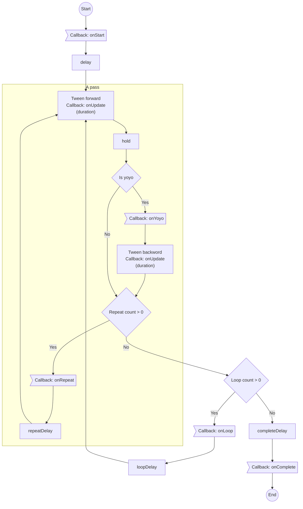

## Introduction

Change properties by tween equations, built-in object of phaser.

- Author: Richard Davey

## Usage

### Create tween task

```javascript
var tween = scene.tweens.add({
    targets: gameObject,
    alpha: { from: 0, to: 1 },
    // alpha: { start: 0, to: 1 },
    // alpha: 1,
    // alpha: '+=1',
    ease: 'Linear',       // 'Cubic', 'Elastic', 'Bounce', 'Back'
    duration: 1000,
    repeat: 0,            // -1: infinity
    yoyo: false
});
```

- `key: { from: value1, to: value2 }` : Set the property to `1` when tween started after delay, then tween to `value2`.
- `key: { start: value0, to: value2 }` : Set the property to `value0` immediately, then tween to `value2`.
- `key: { start: value0, from: value1, to: value2 }` : Set the property to `value0` immediately, then set to `value1` when tween started after delay, then tween to `value2`.
- `key: value2` : Tween to `value2`.
- `key: '+=deltaValue'` : Tween to current value + deltaValue

or

```javascript
var tween = scene.tweens.add({
    targets: gameObject,
    paused: false,
    callbackScope: tween,

    // timming/callback of each state
    onStart: function () {},
    onStartScope: callbackScope,
    onStartParams: [],

    // initial delay
    delay: 0,  // function(target, targetKey, value, targetIndex, totalTargets, tween) { },

    // tween duration
    duration: 1000,  // function(target, targetKey, value, targetIndex, totalTargets, tween) { },
    ease: 'Linear',
    easeParams: null,

    onActive: function () {},
    onUpdate: function () {},
    onUpdateScope: callbackScope,
    onUpdateParams: [],

    // delay between tween and yoyo
    hold: 0,  // function(target, targetKey, value, targetIndex, totalTargets, tween) { },
    yoyo: false,  // true to tween backward
    flipX: false,
    flipY: false,
    onYoyo: function () {},
    onYoyoScope: callbackScope,
    onYoyoParams: [],

    // repeat count (-1: infinite)
    repeat: 0,  // function(target, targetKey, value, targetIndex, totalTargets, tween) { },
    onRepeat: function () {},
    onRepeatScope: callbackScope,
    onRepeatParams: [],
    // delay to next pass
    repeatDelay: 0,  // function(target, targetKey, value, targetIndex, totalTargets, tween) { },

    // loop count (-1: infinite)
    loop: 0,
    onLoop: function () {},
    onLoopScope: callbackScope,
    onLoopParams: [],
    // delay to next loop
    loopDelay: 0,

    // delay to onComplete callback
    completeDelay: 0,
    onComplete: function () {},
    onCompleteScope: callbackScope,
    onCompleteParams: [],
    // timming/callback of each state

    // properties:
    x: '+=600',        // start from current value
    y: 500,
    rotation: ...
    angle: ...
    alpha: ...
    // ...

    // or
    props: {
        x: { value: '+=600', duration: 3000, ease: 'Power2' },
        y: { value: '500', duration: 1500, ease: 'Bounce.easeOut' }
    },

    // or
    props: {
        x: {
            duration: 400,
            yoyo: true,
            repeat: 8,
            ease: 'Sine.easeInOut',
            value: {
                getActive: function (target, key, value, targetIndex, totalTargets, tween)
                {
                    return value;
                },
                getStart: function (target, key, value, targetIndex, totalTargets, tween)
                {
                    return value + 30;
                },
                getEnd: function (target, key, value, targetIndex, totalTargets, tween)
                {
                    destX -= 30;
                    return destX;
                }
            }
        },
        ....
    },

    offset: null,
    useFrames: false
});
```

- `targets` : The targets the tween is updating.
- `delay` : The time the tween will wait before it first starts
    - A number, for all targets
    - A callback function : `function(target, targetKey, value, targetIndex, totalTargets, tween) { }`
    - A callback function, built via stagger builder :
        - From `0` to `endValue` : 
            - `scene.tweens.stagger(endValue)`
        - From `startValue` to `endValue` : 
            - `scene.tweens.stagger([startValue, endValue])`
        - From `0` to `endValue`, with specific ease function : 
            - `scene.tweens.stagger(endValue, {ease: 'cubic.inout'})`
        - From `startValue` to `endValue`, with specific ease function : 
            - `scene.tweens.stagger([startValue, endValue], {ease: 'cubic.inout'})`
        - From `0` to `endValue`, with specific start index :
            - `scene.tweens.stagger(endValue, {from: 'last'})`
            - `scene.tweens.stagger(endValue, {from: 'center'})`
            - `scene.tweens.stagger(endValue, {from: index})`
        - From `startValue` to `endValue`, , with specific start index :
            - `scene.tweens.stagger([startValue, endValue], {from: 'last'})`
            - `scene.tweens.stagger([startValue, endValue], {from: 'center'})`
            - `scene.tweens.stagger([startValue, endValue], {from: index})`
        - From `0` to `endValue`, with specific ease function, with specific start index : 
            - `scene.tweens.stagger(endValue, {from: 'last', ease: 'cubic.inout'})`
        - From `startValue` to `endValue`, with specific ease function , with specific start index :
            - `scene.tweens.stagger([startValue, endValue], {from: 'last', ease: 'cubic.inout'})`
        - Grid mode. From `0` to `endValue`.
            - `scene.tweens.stagger(endValue, {grid: [gridWidth, gridHeight], })`
            - `scene.tweens.stagger(endValue, {grid: [gridWidth, gridHeight], from: 'center'})`
            - `scene.tweens.stagger(endValue, {grid: [gridWidth, gridHeight], from: 'center', ease: 'cubic.inout'})`
        - Grid mode. From `startValue` to `endValue`.
            - `scene.tweens.stagger([startValue, endValue], {grid: [gridWidth, gridHeight], })`
            - `scene.tweens.stagger([startValue, endValue], {grid: [gridWidth, gridHeight], from: 'center'})`
            - `scene.tweens.stagger([startValue, endValue], {grid: [gridWidth, gridHeight], from: 'center', ease: 'cubic.inout'})`
- `duration` : The duration of the tween
    - A number, for all targets
    - A callback function : `function(target, targetKey, value, targetIndex, totalTargets, tween) { }`
    - A callback function, built via stagger builder
- `ease` : The ease function used by the tween
- `easeParams` : The parameters to go with the ease function (if any)
- `hold` : The time the tween will pause before running a yoyo
    - A number, for all targets
    - A callback function : `function(target, targetKey, value, targetIndex, totalTargets, tween) { }`
    - A callback function, built via stagger builder
- `repeat` : The number of times the tween will repeat itself (a value of 1 means the tween will play twice, as it repeated once)
    - A number, for all targets
    - A callback function : `function(target, targetKey, value, targetIndex, totalTargets, tween) { }`
    - A callback function, built via stagger builder
- `repeatDelay` : The time the tween will pause for before starting a repeat. The tween holds in the start state.
    - A number, for all targets
    - A callback function : `function(target, targetKey, value, targetIndex, totalTargets, tween) { }`
    - A callback function, built via stagger builder
- `yoyo` : boolean - Does the tween reverse itself (yoyo) when it reaches the end?
- `flipX` : flip X the GameObject on tween end
- `flipY` : flip Y the GameObject on tween end
- `offset` : Used when the Tween is part of a [Timeline](tween-timeline.md)
- `completeDelay` : The time the tween will wait before the onComplete event is dispatched once it has     completed
- `loop` : `-1` for an infinite loop
- `loopDelay`
- `paused` : Does the tween start in a paused state, or playing?
- `useFrames` : Use frames or milliseconds?
- `props` : The properties being tweened by the tween
- `onActive` : Tween becomes active within the Tween Manager.
    ```javascript
    function(tween, targets) { }
    ```
- `onStart` : A tween starts.
    ```javascript
    function(tween, targets) { }
    ```
- `onUpdate` : Callback which fired when tween task updated
    ```javascript
    function(tween, targets) { }
    ```
- `onComplete` : Tween completes or is stopped.
    ```javascript
    function(tween, targets) { }
    ```
- `onYoyo` : A tween property yoyos.
    ```javascript
    function(tween, key, targets) { }
    ```
- `onLoop` : A tween loops, after any loop delay expires.
    ```javascript
    function(tween, targets) { }
    ```
- `onRepeat` : A tween property repeats, after any repeat delay expires.
    ```javascript
    function(tween, targets) { }
    ```

#### Ease equations

- `Power0` : Linear
- `Power1` : Quadratic.Out
- `Power2` : Cubic.Out
- `Power3` : Quartic.Out
- `Power4` : Quintic.Out
- `Linear`
- `Quad` : Quadratic.Out
- `Cubic` : Cubic.Out
- `Quart` : Quartic.Out
- `Quint` : Quintic.Out
- `Sine` : Sine.Out
- `Expo` : Expo.Out
- `Circ` : Circular.Out
- `Elastic` : Elastic.Out
- `Back` : Back.Out
- `Bounce` : Bounce.Out
- `Stepped`
- `Quad.easeIn`
- `Cubic.easeIn`
- `Quart.easeIn`
- `Quint.easeIn`
- `Sine.easeIn`
- `Expo.easeIn`
- `Circ.easeIn`
- `Back.easeIn`
- `Bounce.easeIn`
- `Quad.easeOut`
- `Cubic.easeOut`
- `Quart.easeOut`
- `Quint.easeOut`
- `Sine.easeOut`
- `Expo.easeOut`
- `Circ.easeOut`
- `Back.easeOut`
- `Bounce.easeOut`
- `Quad.easeInOut`
- `Cubic.easeInOut`
- `Quart.easeInOut`
- `Quint.easeInOut`
- `Sine.easeInOut`
- `Expo.easeInOut`
- `Circ.easeInOut`
- `Back.easeInOut`
- `Bounce.easeInOut`

### Pause / Resume task

```javascript
tween.pause();
```

```javascript
tween.resume();
```

### Stop task

```javascript
tween.stop();
```

### Play task

```javascript
tween.play();
```

### Restart task

```javascript
tween.restart();
```

### Remove task

```javascript
tween.remove();
```

### Time-scale

```javascript
tween.setTimeScale(v);
// tween.timeScale = timescale;
```

```javascript
var timeScale = tween.getTimeScale();
// var timeScale = tween.timeScale;
```

#### Global time-scale

```javascript
var timeScale = scene.tweens.timeScale;
```

```javascript
scene.tweens.timeScale = timescale;
```

### Events

- Tween becomes active within the Tween Manager.
    ```javascript
    tween.on('active', function(tween, targets){

    }, scope);
    ```
- Tween completes or is stopped.
    ```javascript
    tween.on('complete', function(tween, targets){

    }, scope);
    ```
- A tween loops, after any loop delay expires.
    ```javascript
    tween.on('loop', function(tween, targets){

    }, scope);
    ```
- A tween property repeats, after any repeat delay expires.
    ```javascript
    tween.on('repeat', function(tween, key, targets){

    }, scope);
    ```
- A tween starts.
    ```javascript
    tween.on('start', function(tween, targets){

    }, scope);
    ```
- A tween property updates.
    ```javascript
    tween.on('update', function(tween, key, targets){

    }, scope);
    ```
- A tween property yoyos.
    ```javascript
    tween.on('yoyo', function(tween, key, targets){

    }, scope);
    ```

### State

- Is playing
    ```javascript
    var isPlaying = tween.isPlaying();
    ```
- Is paused
    ```javascript
    var isPaused = tween.isPaused();
    ```
- Is actively and not just in a delayed state
    ```javascript
    var hasStarted = tween.hasStarted;
    ```

### Tween value

1. Create tween task
    ```javascript
    var tween = scene.tweens.addCounter({
        from: 0,
        to: 1,
        ease: 'Linear',       // 'Cubic', 'Elastic', 'Bounce', 'Back'
        duration: 1000,
        repeat: 0,            // -1: infinity
        yoyo: false,
    });
    ```
    or
    ```javascript
    var tween = scene.tweens.addCounter({
        from: 0,
        to: 1,
        // ...
    });
    ```
1. Get value
    ```javascript
    var value = tween.getValue();
    ```

### Custom ease function

```javascript
var tween = scene.tweens.add({
    targets: gameObject,
    // ...
    ease: function (t) {  // t: 0~1
        return value;     // value: 0~1
    },
    // ...
});
```

### Flow chart



### Tween data

- `tween.data` : An array of TweenData objects, each containing a unique property and target being tweened.
    - `tween.data[i].key` : The property of the target to tween.
    - `tween.data[i].start`, `tween.data[i].end`, `tween.data[i].current` : Ease Value Data.