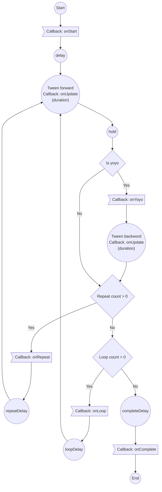

## Introduction

Change properties by tween equations, built-in object of phaser.

- Author: Richard Davey

## Usage

### Create tween task

```javascript
var tween = scene.tweens.add({
    targets: gameObject,
    x: 1,
    // x: '+=1',
    // x: '-=1',
    // x: '*=1',
    // x: '/=1',
    // x: 'random(0.25, 0.75)',
    // x: 'int(10, 100)',
    // x: [100, 300, 200, 600],
    // x: { from: 0, to: 1 },
    // x: { start: 0, to: 1 },  
    // x: { start: value0, from: value1, to: value2 },  
    // x: {
    //      getActive: function (target, key, value, targetIndex, totalTargets, tween) { return newValue; },
    //      getStart: function (target, key, value, targetIndex, totalTargets, tween) { return newValue; },
    //      getEnd: function (target, key, value, targetIndex, totalTargets, tween) { return newValue; }
    // },
    ease: 'Linear',       // 'Cubic', 'Elastic', 'Bounce', 'Back'
    duration: 1000,
    repeat: 0,            // -1: infinity
    yoyo: false,

    // interpolation: null,
});
```

- `key: value2` : Tween to `value2`.
- `key: '+=deltaValue'` : Tween to current value + deltaValue
    - Support these expressions : `key: '+=deltaValue'`, `key: '-=deltaValue'`, `key: '*=deltaValue'`, `key: '/=deltaValue'`
- `key: 'random(10, 100)'` : Tween to a random float value.
- `key: 'int(10, 100)'` : Tween to a random int value.
- `key: [100, 300, 200, 600]` : Use `interpolation` to determine the value.
- `key: { from: value1, to: value2 }` : Set the property to `value11` when tween started after delay, then tween to `value2`.
   - `value1`, `value2` : A number, string, or callback(`function(target, key, value, targetIndex, totalTargets, tween)  { return newValue; }`)   
- `key: { start: value0, to: value2 }` : Set the property to `value0` immediately, then tween to `value2`.
    - `value1`, `value2` : A number, string, or callback(`function(target, key, value, targetIndex, totalTargets, tween)  { return newValue; }`)  
- `key: { start: value0, from: value1, to: value2 }` : Set the property to `value0` immediately, then set to `value1` when tween started after delay, then tween to `value2`.
    - `value0`, `value1`, `value2` : A number, string, or callback(`function(target, key, value, targetIndex, totalTargets, tween)  { return newValue; }`)  
- `key: function(target, key, value, targetIndex, totalTargets, tween)  { return newValue; }`
    - `target` :　The tween target.
    - `key` : The target property.
    - `value` : The current value of the target property.
    - `targetIndex` : The index of the target within the Tween.
    - `totalTargets` : The total number of targets in this Tween.
    - `tween` : The Tween that invoked this callback.
- `key: { getActive:callback, getStart:callback, getEnd:callback}`
    - `callback` : `function(target, key, value, targetIndex, totalTargets, tween)  { return newValue; }`

or

```javascript
var tween = scene.tweens.add({
    targets: gameObject,
    paused: false,
    callbackScope: tween,

    // timming/callback of each state
    onStart: function () {},
    onStartParams: [],

    // initial delay
    delay: 0,  // function(target, targetKey, value, targetIndex, totalTargets, tween) { },

    // tween duration
    duration: 1000,
    ease: 'Linear',
    easeParams: null,

    onActive: function () {},
    onUpdate: function (tween, target, key, current, previous, param) {},
    onUpdateParams: [],

    // delay between tween and yoyo
    hold: 0,
    yoyo: false,  // true to tween backward
    flipX: false,
    flipY: false,
    onYoyo: function (tween, target, key, current, previous, param) {},
    onYoyoParams: [],

    // repeat count (-1: infinite)
    repeat: 0,
    onRepeat: function (tween, target, key, current, previous, param) {},
    onRepeatParams: [],
    // delay to next pass
    repeatDelay: 0,

    // loop count (-1: infinite)
    loop: 0,
    onLoop: function () {},
    onLoopParams: [],
    // delay to next loop
    loopDelay: 0,

    // delay to onComplete callback
    completeDelay: 0,
    onComplete: function () {},
    onCompleteParams: [],
    // timming/callback of each state

    onStop: function () {}, 
    onPause: function () {}, 
    onResume: function () {}, 

    // properties:
    x: '+=600',        // start from current value
    y: 500,
    rotation: ...
    angle: ...
    alpha: ...
    // ...

    // or
    props: {
        x: { value: '+=600', duration: 3000, ease: 'Power2' },
        y: { value: '500', duration: 1500, ease: 'Bounce.easeOut' }
    },

    // or
    props: {
        x: {
            duration: 400,
            yoyo: true,
            repeat: 8,
            ease: 'Sine.easeInOut',
            value: {
                getActive: function (target, key, value, targetIndex, totalTargets, tween)
                {
                    return value;
                },
                getStart: function (target, key, value, targetIndex, totalTargets, tween)
                {
                    return value + 30;
                },
                getEnd: function (target, key, value, targetIndex, totalTargets, tween)
                {
                    destX -= 30;
                    return destX;
                }
            }
        },
        ....
    },

    persist: false,

    interpolation: null,
    interpolationData: null,

});
```

- `targets` : The targets the tween is updating.
- `delay` : The time the tween will wait before it first starts
    - A number, for all targets
    - A callback function, built via stagger builder :
        - From `0` to `endValue` : 
            - `scene.tweens.stagger(endValue)`
        - From `startValue` to `endValue` : 
            - `scene.tweens.stagger([startValue, endValue])`
        - From `0` to `endValue`, with specific ease function : 
            - `scene.tweens.stagger(endValue, {ease: 'cubic.inout'})`
        - From `startValue` to `endValue`, with specific ease function : 
            - `scene.tweens.stagger([startValue, endValue], {ease: 'cubic.inout'})`
        - From `0` to `endValue`, with specific start index :
            - `scene.tweens.stagger(endValue, {from: 'last'})`
            - `scene.tweens.stagger(endValue, {from: 'center'})`
            - `scene.tweens.stagger(endValue, {from: index})`
        - From `startValue` to `endValue`, , with specific start index :
            - `scene.tweens.stagger([startValue, endValue], {from: 'last'})`
            - `scene.tweens.stagger([startValue, endValue], {from: 'center'})`
            - `scene.tweens.stagger([startValue, endValue], {from: index})`
        - From `0` to `endValue`, with specific ease function, with specific start index : 
            - `scene.tweens.stagger(endValue, {from: 'last', ease: 'cubic.inout'})`
        - From `startValue` to `endValue`, with specific ease function , with specific start index :
            - `scene.tweens.stagger([startValue, endValue], {from: 'last', ease: 'cubic.inout'})`
        - Grid mode. From `0` to `endValue`.
            - `scene.tweens.stagger(endValue, {grid: [gridWidth, gridHeight], })`
            - `scene.tweens.stagger(endValue, {grid: [gridWidth, gridHeight], from: 'center'})`
            - `scene.tweens.stagger(endValue, {grid: [gridWidth, gridHeight], from: 'center', ease: 'cubic.inout'})`
        - Grid mode. From `startValue` to `endValue`.
            - `scene.tweens.stagger([startValue, endValue], {grid: [gridWidth, gridHeight], })`
            - `scene.tweens.stagger([startValue, endValue], {grid: [gridWidth, gridHeight], from: 'center'})`
            - `scene.tweens.stagger([startValue, endValue], {grid: [gridWidth, gridHeight], from: 'center', ease: 'cubic.inout'})`
- `duration` : The duration of the tween
- `ease` : The ease function used by the tween
- `easeParams` : The parameters to go with the ease function (if any)
- `hold` : The time the tween will pause before running a yoyo
- `repeat` : The number of times the tween will repeat itself (a value of 1 means the tween will play twice, as it repeated once)
- `repeatDelay` : The time the tween will pause for before starting a repeat. The tween holds in the start state.
- `yoyo` : boolean - Does the tween reverse itself (yoyo) when it reaches the end?
- `flipX` : flip X the GameObject on tween end
- `flipY` : flip Y the GameObject on tween end
- `completeDelay` : The time the tween will wait before the onComplete event is dispatched once it has     completed
- `loop` : `-1` for an infinite loop
- `loopDelay`
- `paused` : Does the tween start in a paused state, or playing?
- `props` : The properties being tweened by the tween
- `onActive` : Tween becomes active within the Tween Manager.
    ```javascript
    function(tween, target) { }
    ```
- `onStart` : A tween starts.
    ```javascript
    function(tween, targets) { }
    ```
- `onUpdate` : Callback which fired when tween task updated
    ```javascript
    function(tween, target, key, current, previous, param) { }
    ```
- `onComplete` : Tween completes or is stopped.
    ```javascript
    function(tween, targets) { }
    ```
- `onYoyo` : A function to call each time the tween yoyos. Called once per property per target.
    ```javascript
    function(tween, target, key, current, previous, param) { }
    ```
- `onLoop` : A function to call each time the tween loops.
    ```javascript
    function(tween, targets) { }
    ```
- `onRepeat` : A function to call each time the tween repeats. Called once per property per target.
    ```javascript
    function(tween, target, key, current, previous, param) { }
    ```
- `onStop` : A function to call when the tween is stopped.
    ```javascript
    function(tween, targets) { }
    ```
- `onPause` : A function to call when the tween is paused.
    ```javascript
    function(tween, targets) { }
    ```
- `onResume` : A function to call when the tween is resumed after being paused.
    ```javascript
    function(tween, targets) { }
    ```
- `persist` : Will the Tween be automatically destroyed on completion, or retained for future playback?
- `interpolation` : The interpolation function to use if the `value` given is an array of numbers.
    - `'linear'`, `'bezier'`, `'catmull'` (or `'catmullrom'`)


!!! note
    Tween task will not manipulate any property that begins with an **underscore**.


#### Ease equations

- `Power0` : Linear
- `Power1` : Quadratic.Out
- `Power2` : Cubic.Out
- `Power3` : Quartic.Out
- `Power4` : Quintic.Out
- `Linear`
- `Quad` : Quadratic.Out
- `Cubic` : Cubic.Out
- `Quart` : Quartic.Out
- `Quint` : Quintic.Out
- `Sine` : Sine.Out
- `Expo` : Expo.Out
- `Circ` : Circular.Out
- `Elastic` : Elastic.Out
- `Back` : Back.Out
- `Bounce` : Bounce.Out
- `Stepped`
- `Quad.easeIn`
- `Cubic.easeIn`
- `Quart.easeIn`
- `Quint.easeIn`
- `Sine.easeIn`
- `Expo.easeIn`
- `Circ.easeIn`
- `Back.easeIn`
- `Bounce.easeIn`
- `Quad.easeOut`
- `Cubic.easeOut`
- `Quart.easeOut`
- `Quint.easeOut`
- `Sine.easeOut`
- `Expo.easeOut`
- `Circ.easeOut`
- `Back.easeOut`
- `Bounce.easeOut`
- `Quad.easeInOut`
- `Cubic.easeInOut`
- `Quart.easeInOut`
- `Quint.easeInOut`
- `Sine.easeInOut`
- `Expo.easeInOut`
- `Circ.easeInOut`
- `Back.easeInOut`
- `Bounce.easeInOut`

[Demo](https://labs.phaser.io/view.html?src=src/tweens/eases/ease%20mixer.js)

### Pause / Resume task

```javascript
tween.pause();
```

```javascript
tween.resume();
```

### Stop task

```javascript
tween.complete();
```


```javascript
tween.stop();
```

Won't invoke `onComplete` callback (`'complete'` event)

### Play task

```javascript
tween.play();
```

### Restart task

```javascript
tween.restart();
```

### Seek

```javascript
tween.seek(amount);
// tween.seek(amount, delta, emit);
```

- `amount` : The number of milliseconds to seek into the Tween from the beginning.
- `delta` : The size of each step when seeking through the Tween. Default value is `16.6` (1000/60)
- `emit` : While seeking, should the Tween emit any of its events or callbacks? The default is `false`.

### Remove task

Removes this Tween from the TweenManager

```javascript
tween.remove();
```

### Destroy task

Free tween task from memory

```javascript
tween.destroy();
```

!!! note
    A Tween that has been destroyed cannot ever be played or used again.

### Get tweens

- Tweens of a target
    ```javascript
    var tweens = scene.tweens.getTweensOf(target);
    // var tweens = scene.tweens.getTweensOf(target, includePending);
    ```
    - `tweens` : Array of tweens, or timelines.
    - `includePending` : Set `true` to search pending tweens.
- All tweens
    ```javascript
    var tweens = scene.tweens.getTweens();
    ```

### Destroy task of a target

```javascript
scene.tweens.killTweensOf(target);
```

- `target` : The target to kill the tweens of. Provide an array to use multiple targets.

### Time-scale

```javascript
tween.setTimeScale(v);
// tween.timeScale = timescale;
```

```javascript
var timeScale = tween.getTimeScale();
// var timeScale = tween.timeScale;
```

#### Global time-scale

```javascript
var timeScale = scene.tweens.timeScale;
```

```javascript
scene.tweens.timeScale = timescale;
```

### Events

- Tween becomes active within the Tween Manager.
    ```javascript
    tween.on('active', function(tween, targets){

    }, scope);
    ```
- Tween completes or is stopped.
    ```javascript
    tween.on('complete', function(tween, targets){

    }, scope);
    ```
- A tween loops, after any loop delay expires.
    ```javascript
    tween.on('loop', function(tween, targets){

    }, scope);
    ```
- A tween property repeats, after any repeat delay expires.
    ```javascript
    tween.on('repeat', function(tween, key, target){

    }, scope);
    ```
- A tween starts.
    ```javascript
    tween.on('start', function(tween, targets){

    }, scope);
    ```
- A tween property updates.
    ```javascript
    tween.on('update', function(tween, key, target, current, previous){

    }, scope);
    ```
    - `tween` : A reference to the Tween instance that emitted the event.
    - `key` : The property that was updated, i.e. `x` or `scale`.
    - `target` : The target object that was updated. Usually a Game Object, but can be of any type.
    - `current` : The current value of the property that was tweened.
    - `previous` : The previous value of the property that was tweened, prior to this update.
- A tween property pause.
    ```javascript
    tween.on('pause', function(tween, key, target){

    }, scope);
    ```
- A tween property resume.
    ```javascript
    tween.on('resume', function(tween, key, target){

    }, scope);
    ```
- A tween property yoyos.
    ```javascript
    tween.on('yoyo', function(tween, key, target){

    }, scope);
    ```
- A tween stopped.
    ```javascript
    tween.on('stop', function(tween, targets){

    }, scope);
    ```

### Set callbacks

```javascript
tween.setCallback(type, callback, param);
```

- `type` : 
    - `'onActive'` : When the Tween is first created it moves to an 'active' state when added to the Tween Manager. 'Active' does not mean 'playing'.
    - `'onStart'` : When the Tween starts playing after a delayed or paused state. This will happen at the same time as `onActive` if the tween has no delay and isn't paused.
    - `'onLoop'` : When a Tween loops, if it has been set to do so. This happens _after_ the `loopDelay` expires, if set.
    - `'onComplete'` : When the Tween finishes playback fully. Never invoked if the Tween is set to repeat infinitely.
    - `'onStop'` : Invoked only if the `Tween.stop` method is called.
    - `'onPause'` : Invoked only if the `Tween.pause` method is called. Not invoked if the Tween Manager is paused.
    - `'onResume'` : Invoked only if the `Tween.resume` method is called. Not invoked if the Tween Manager is resumed.
    - `'onYoyo'` : When a TweenData starts a yoyo. This happens _after_ the `hold` delay expires, if set.
    - `'onRepeat'` : When a TweenData repeats playback. This happens _after_ the `repeatDelay` expires, if set.
    - `'onUpdate'` : When a TweenData updates a property on a source target during playback.
- `callback` :
    - `'onRepeat'`, `'onUpdate'`, `'onYoyo'`
        ```javascript
        function(tween, targets, key, current, previous, param) {
            
        }
        ```
    - `'onActive'`, `'onLoop'`, `'onPause'`, `'onResume'`, `'onComplete'`, `'onStart'`, `'onStop'`, 
        ```javascript
        function(tween, targets, param) {
            
        }
        ```


### State

- Is playing
    ```javascript
    var isPlaying = tween.isPlaying();
    ```
- Is paused
    ```javascript
    var isPaused = tween.isPaused();
    ```
- Is actively and not just in a delayed state
    ```javascript
    var hasStarted = tween.hasStarted;
    ```

### Custom ease function

```javascript
var tween = scene.tweens.add({
    targets: gameObject,
    // ...
    ease: function (t) {  // t: 0~1
        return value;     // value: 0~1
    },
    // ...
});
```

### Has target

```javascript
var hasTarget = tween.hasTarget(gameObject);
```

### Tween value

- Create tween task
    ```javascript
    var tween = scene.tweens.addCounter({
        from: 0,
        to: 1,
        ease: 'Linear',       // 'Cubic', 'Elastic', 'Bounce', 'Back'
        duration: 1000,
        repeat: 0,            // -1: infinity
        yoyo: false,
        onUpdate(tween, targets, key, current, previous, param) {
            // var value = current;
            // var value = tween.getValue();
        }
    });
    ```
    - [More config parameters...](tween.md#create-tween-task)
- Get value
    ```javascript
    var value = tween.getValue();
    ```

### Chain

#### Create chain

```javascript
var chain = scene.tweens.chain({
    targets: null,
    tweens: [
        {
            // targets: gameObject,
            alpha: 1,            
            ease: 'Linear',       // 'Cubic', 'Elastic', 'Bounce', 'Back'
            duration: 1000,
            repeat: 0,            // -1: infinity
            yoyo: false
        },        
        // ...
    ],
    
    delay: 0,
    completeDelay: 0,
    loop: 0,  // repeat: 0,
    repeatDelay: 0,
    paused: false,
    persist: true,
    // callbackScope: this,
})
```

- `targets`, or `tweenConfig.targets`
- `tweens` : Array of [tween config](tween.md#create-tween-task)


#### Pause / Resume chain

```javascript
chain.pause();
```

```javascript
chain.resume();
```

#### Restart chain

```javascript
chain.restart();
```

#### Add tween task

```javascript
chain.add({
    targets: gameObject,
    alpha: 1,
    ease: 'Linear',       // 'Cubic', 'Elastic', 'Bounce', 'Back'
    duration: 1000,
    repeat: 0,            // -1: infinity
    yoyo: false
})
```

or

```javascript
chain.add([tweenConfig0, tweenConfig1, ...]);
```
    
#### Remove tween task

```javascript
chain.remove(tweenTask);
```

#### Has target

```javascript
var hasTarget = chain.hasTarget(gameObject);
```

### Flow chart



### Tween data

- `tween.data` : An array of TweenData objects, each containing a unique property and target being tweened.
    - `tween.data[i].key` : The property of the target to tween.
    - `tween.data[i].start`, `tween.data[i].end`, `tween.data[i].current` : Ease Value Data.