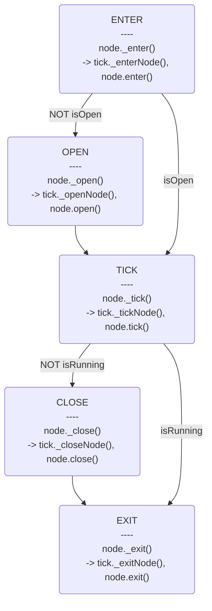

# Behavior3

Reference: https://github.com/behavior3/behavior3js/

## Core Classes

This library include the following core structures...

- BehaviorTree: the structure that represents a Behavior Tree;
- Blackboard: represents a "memory" in an agent and is required to to run a `BehaviorTree`;
- Composite: base class for all composite nodes;
- Decorator: base class for all decorator nodes;
- Action: base class for all action nodes;
- Condition: base class for all condition nodes;
    - **Replaced by Condition Decorator**
- Tick: used as container and tracking object through the tree during the tick signal;
- BaseNode: the base class that provide all common node features;

## Nodes

- Composite Nodes: 
    - Selector : MemSelector
    - Sequence : MemSequence
    - SimpleParallel
- Decorators: [TODO] Abort children
    - [TODO] Condition : From expression
    - Bypass
    - [TODO] MaxTime : Time from expression
    - [TODO] Repeater : Max loop from expression
    - RepeaterUntilFailure
    - RepeaterUntilSuccess
    - Inverter
    - Limiter
- Actions:
    - Succeeder
    - Failer
    - Error
    - Runner
    - Wait

## Logic mapping

### If

```
if ConditionA
    TaskA
else if ConditionB
    TaskB
else
    TaskC
```

Map to

- Selector
    - ConditionA
        - TaskA
    - ConditionB
        - TaskB   
    - Bypass
        - TaskC

### While

```
while ConditionA
    TaskA
```

Map to

- RepeaterUntilFailure
    - ConditionA
        - TaskA

### Tick

#### State machine



- Why create new Tick object in each `tree.tick()`?
- [TODO] Get current time one time in each `tree.tick()`.
- When closing a node, also close children nodes.

### Expression

TODO: math\ExpressionParser