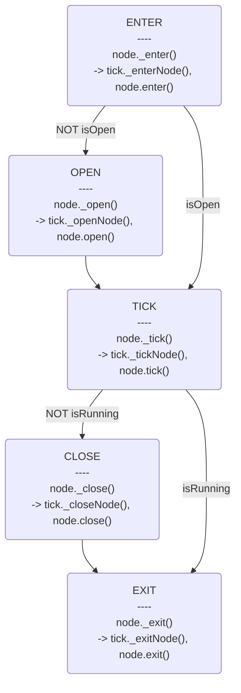

# BehaviorTree

Reference: https://github.com/behavior3/behavior3js/

A behavior-tree implementation. Nodes return status codes and the
tree evaluates them each tick while using a blackboard to store state.


## Node/Tree state

- **IDLE** : Node has not been executed yet.
- **SUCCESS**, **FAILURE** : Return `true`/`false` and continue to the next
  node or child.
- **RUNNING** : Stop ticking; resume this node on the next tick.
- **ABORT** : Node was aborted by its parent or an `Abort` action.
- **ERROR** : Indicates a runtime error, such as a composite or decorator
  without a required child.

## Nodes

- Composite Nodes:
    - Selector : Memory selector that evaluates children until one returns
      `RUNNING`, `SUCCESS`, or `ABORT`.
    - Sequence : Memory sequence that runs each child in order and pauses on
      `RUNNING`.
    - Parallel :
        - First child is treated as the main task.
        - By default returns the main task's status; other modes can wait for
          all children.
    - RandomSelector : Choose a random child each tick.
    - IfSelector
    - SwitchSelector
    - WeightSelector : Randomly pick a child using weights.
    - ShuffleSelector : Shuffle children before running them.
- Decorators:
    - If
    - AbortIf
    - ContinueIf
    - Bypass
    - ForceSuccess
    - ForceFailure
    - TimeLimit
        - Return FAILURE when timeout, else return child status
    - Cooldown
        - Start cooldown when child status is not RUNNING
        - Return FAILURE during cooldown, else return child status
    - Repeat
    - RepeatUntilFailure
    - RepeatUntilSuccess
    - Invert
    - Limiter
- Actions:
    - Succeeder
    - Failer
    - Runner
    - Wait
        - Wait 0 : Wait a tick
    - Error : Always return `ERROR`.
    - Abort : Always return `ABORT`.

## Blackboard

The blackboard stores execution data with global, tree, and node scopes. It can
track a tree's last state, keep per-node memories, and supply a custom current
time shared across ticks.

## Logic mapping

### If

```
if ConditionA
    TaskA
else if ConditionB
    TaskB
else
    TaskC
```

Map to

- Selector
    - if-ConditionA
        - TaskA
    - if-ConditionB
        - TaskB   
    - TaskC

### While

```
while ConditionA
    TaskA
```

Map to

- RepeatUntilFailure
    - if-ConditionA
        - TaskA

### Tick

A `Tick` represents one traversal of the tree. It holds references to the tree,
blackboard, and target object, collects open nodes, and exposes helpers such as
`currentTime` and `evalExpression`.

#### State machine

```javascript
node._execute(tick);
```



- Closing a node also closes its running children.