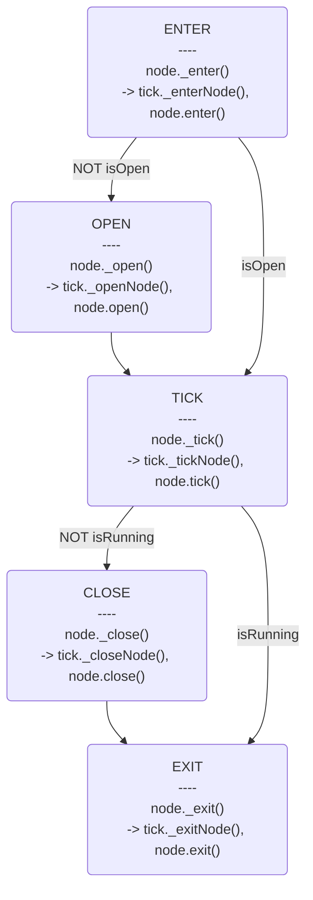

# BehaviorTree

Reference: https://github.com/behavior3/behavior3js/

A behavior-tree implementation. Nodes return status codes and the
tree evaluates them each tick while using a blackboard to store state.


## Node/Tree state

- **IDLE** : Node has not been executed yet.
- **SUCCESS**, **FAILURE** : Return `true`/`false` and continue to the next
  node or child.
- **RUNNING** : Stop ticking; resume this node on the next tick.
- **ABORT** : Node was aborted by its parent or an `Abort` action.
- **ERROR** : Indicates a runtime error, such as a composite or decorator
  without a required child.

## Nodes

- Composite Nodes:
    - Selector : Memory selector that evaluates children until one returns
      `RUNNING`, `SUCCESS`, or `ABORT`.
    - Sequence : Memory sequence that runs each child in order and pauses on
      `RUNNING`.
    - Parallel :
        - First child is treated as the main task.
        - By default returns the main task's status; other modes can wait for
          all children.
    - RandomSelector : Choose a random child each tick.
    - IfSelector
    - SwitchSelector
    - WeightSelector : Randomly pick a child using weights.
    - ShuffleSelector : Shuffle children before running them.
- Decorators:
    - If
    - AbortIf
    - ContinueIf
    - BreakDecorator
        - Responds to a descendant BreakAction by returning SUCCESS and clearing a break flag
    - Bypass
    - ForceSuccess
    - ForceFailure
    - TimeLimit
        - Return FAILURE when timeout, else return child status
    - Cooldown
        - Start cooldown when child status is not RUNNING
        - Return FAILURE during cooldown, else return child status
    - Repeat
    - RepeatUntilFailure
    - RepeatUntilSuccess
    - Invert
    - Limiter
- Actions:
    - Succeeder
    - Failer
    - Runner
    - Wait
        - Wait 0 : Wait a tick
    - Error : Always return `ERROR`.
    - Abort : Always return `ABORT`.
    - BreakAction
        - Search for the nearest BreakDecorator ancestor, set its break flag, and return `ABORT`.

## Custom Action, Service, and Expression

Custom nodes can extend `RexPlugins.BehaviorTree.Action`,
`RexPlugins.BehaviorTree.Service`, or `RexPlugins.BehaviorTree.Expression`.
Use the same constructor shape as built-in nodes:

```javascript
constructor(config = {}, nodePool) {
    if (nodePool) {  // Rebuild node, don't touch config
        super(config, nodePool);

    } else {  // New node
        // Convert user-facing options to the serialized node config.
        super({
            name: 'MyNodeName',
            properties: {
                // Custom values to preserve in dump/load.
            },
        });
    }

    // Copy values from this.properties or config after super().
}
```

The `nodePool` argument is supplied while loading a dumped tree. When
`nodePool` exists, the node is being rebuilt from serialized data, so pass
`config` and `nodePool` unchanged to `super(config, nodePool)`. Do not rewrite
`config` in this branch. The base classes use `nodePool` to resolve child,
service, and expression node ids back to node instances.

When `nodePool` is not supplied, the node is being created directly by user
code. In this branch, convert convenient constructor options into the canonical
node config. Store custom serializable values in `properties`; they will be
included in `dump()` and restored during `load()`.

Separate regular properties from expressions. Regular parameters should be
stored in `properties` and read back from `this.properties.xxx` after `super()`.
Expression parameters should not be stored in `properties`; create the
expression node or constant value, then register it with `this.addExpression()`.
During `dump()`, expressions are written to `spec.expressions`; during `load()`,
read them from `config.expressions`. Built-in nodes such as `AbortIf` follow
this pattern.

```javascript
class MyDecorator extends RexPlugins.BehaviorTree.Decorator {
    constructor(config = {}, nodePool) {
        var condition;

        if (nodePool) {
            super(config, nodePool);

            var expressions = config.expressions || {};
            condition = expressions.condition;

        } else {
            var {
                condition: conditionValue = 'true',
                returnSuccess = true,
                child = null,
                properties = {},
            } = config;

            super({
                child,
                properties: {
                    ...properties,
                    returnSuccess: returnSuccess,
                },
                name: 'MyDecorator',
            }, nodePool);

            condition = conditionValue;
        }

        // In source modules, import CreateNumberExpression from the expressions folder.
        this.condition = CreateNumberExpression(condition, nodePool);
        this.addExpression('condition', this.condition);

        this.returnSuccess = this.properties.returnSuccess;
    }
}
```

Example action:

```javascript
class PrintAction extends RexPlugins.BehaviorTree.Action {
    constructor(config = {}, nodePool) {
        if (nodePool) {
            super(config, nodePool);

        } else {
            var { text = '' } = config;
            super({
                name: 'MyAction',
                properties: { text: text },
            });
        }

        this.text = this.properties.text;
    }

    tick(tick) {
        console.log(this.text);
        return this.SUCCESS;
    }
}
```

Example service:

```javascript
class PrintService extends RexPlugins.BehaviorTree.Service {
    constructor(config = {}, nodePool) {
        if (nodePool) {
            super(config, nodePool);

        } else {
            var { text = '', interval = 70 } = config;
            super({
                name: 'MyPrintService',
                interval: interval,
                properties: { text: text },
            });
        }

        this.text = this.properties.text;
    }

    tick(tick) {
        console.log(this.text);
    }
}
```

Example expression:

```javascript
class Comparator extends RexPlugins.BehaviorTree.Expression {
    constructor(config = {}, nodePool) {
        if (nodePool) {  // Rebuild node, don't touch config
            super(config, nodePool);

        } else {  // New node
            var {
                opA = 'true',
                cmp = '==',
                opB = 'true'
            } = config;
            super(
                {
                    name: 'MyComparator',
                    properties: {
                        opA, cmp, opB,
                    },
                },
            );
        }

        var opA = this.properties.opA;
        var cmp = this.properties.cmp;
        var opB = this.properties.opB;
        this.condition = `(${opA})${cmp}(${opB})`;
    }

    eval(tick) {
        var context = tick.getEvalContext();
        var value = tick.expressionParser.exec(this.condition, context);
        return value;
    }
}
```

Register custom node classes when loading:

```javascript
tree.load(data, {
    MyAction: PrintAction,
    MyPrintService: PrintService,
    MyComparator: Comparator
});
```

## Blackboard

The blackboard stores execution data with global, tree, and node scopes. It can
track a tree's last state, keep per-node memories, and supply a custom current
time shared across ticks.

## Logic mapping

### If

```
if ConditionA
    TaskA
else if ConditionB
    TaskB
else
    TaskC
```

Map to

- Selector
    - If(Decorator)
        - TaskA
    - If(Decorator)
        - TaskB   
    - TaskC

### While loop

```
while ConditionA
    TaskA
```

Map to

- RepeatUntilFailure(Decorator)
    - If(Decorator)
        - TaskA


Support `break` and `continue`

- BreakDecorator(tag='break') + RepeatUntilFailure(Decorator)
  - condition block: If(Decorator)
    - actions block: BreakDecorator(tag='continue') + Sequence


### Repeat loop

```
Repeat 3
  TaskA
```

Map to

- Repeat(Decorator)
  - Sequence


Support `break` and `continue`

- BreakDecorator(tag='break') + Repeat(Decorator)
  - BreakDecorator(tag='continue') + Sequence


### For loop

```
for(init; condition; step)
  TaskA
```

Map to

- Sequence
  - init block: Sequence
  - RepeatUntilFailure(Decorator)
    - condition block: If(Decorator)
      - Sequence
        - actions block: Sequence
        - step block: Sequence


Support `break` and `continue`

- BreakDecorator(tag='break') + Sequence
  - init block: Sequence
  - RepeatUntilFailure(Decorator)
    - condition block: If(Decorator)
      - Sequence
        - actions block: BreakDecorator(tag='continue') + Sequence
        - step block: Sequence


### Tick

A `Tick` represents one traversal of the tree. It holds references to the tree,
blackboard, and target object, collects open nodes, and exposes helpers such as
`currentTime` and `evalExpression`.

#### State machine

```javascript
node._execute(tick);
```


```mermaid
graph TD

ENTER("ENTER<br>----<br>node._enter()<br>-> tick._enterNode(), node.enter()")
OPEN("OPEN<br>----<br>node._open()<br>-> tick._openNode(), node.open()")
TICK("TICK<br>----<br>node._tick()<br>-> tick._tickNode(), node.tick()")
CLOSE("CLOSE<br>----<br>node._close()<br>-> tick._closeNode(), node.close()")
EXIT("EXIT<br>----<br>node._exit()<br>-> tick._exitNode(), node.exit()")

ENTER --> |NOT isOpen| OPEN
OPEN  --> TICK
ENTER --> |isOpen| TICK
TICK  --> |NOT isRunning| CLOSE
CLOSE --> EXIT
TICK  --> |isRunning| EXIT
```

- Closing a node also closes its running children.
