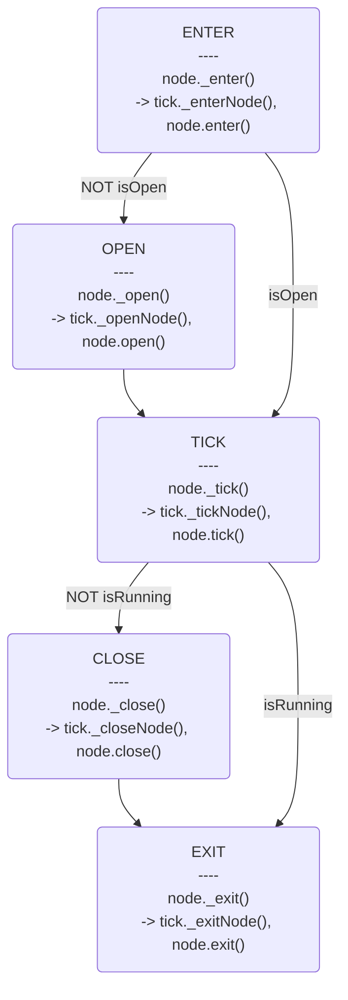

# BehaviorTree

Reference: https://github.com/behavior3/behavior3js/

A behavior-tree implementation. Nodes return status codes and the
tree evaluates them each tick while using a blackboard to store state.


## Node/Tree state

- **IDLE** : Node has not been executed yet.
- **SUCCESS**, **FAILURE** : Return `true`/`false` and continue to the next
  node or child.
- **RUNNING** : Stop ticking; resume this node on the next tick.
- **ABORT** : Node was aborted by its parent or an `Abort` action.
- **ERROR** : Indicates a runtime error, such as a composite or decorator
  without a required child.

## Nodes

- Composite Nodes:
    - Selector : Memory selector that evaluates children until one returns
      `RUNNING`, `SUCCESS`, or `ABORT`.
    - Sequence : Memory sequence that runs each child in order and pauses on
      `RUNNING`.
    - Parallel :
        - First child is treated as the main task.
        - By default returns the main task's status; other modes can wait for
          all children.
    - RandomSelector : Choose a random child each tick.
    - IfSelector
    - SwitchSelector
    - WeightSelector : Randomly pick a child using weights.
    - ShuffleSelector : Shuffle children before running them.
- Decorators:
    - If
    - AbortIf
    - ContinueIf
    - BreakDecorator
        - Responds to a descendant BreakAction by returning SUCCESS and clearing a break flag
    - Bypass
    - ForceSuccess
    - ForceFailure
    - TimeLimit
        - Return FAILURE when timeout, else return child status
    - Cooldown
        - Start cooldown when child status is not RUNNING
        - Return FAILURE during cooldown, else return child status
    - Repeat
    - RepeatUntilFailure
    - RepeatUntilSuccess
    - Invert
    - Limiter
- Actions:
    - Succeeder
    - Failer
    - Runner
    - Wait
        - Wait 0 : Wait a tick
    - Error : Always return `ERROR`.
    - Abort : Always return `ABORT`.
    - BreakAction
        - Search for the nearest BreakDecorator ancestor, set its break flag, and return `ABORT`.

## Blackboard

The blackboard stores execution data with global, tree, and node scopes. It can
track a tree's last state, keep per-node memories, and supply a custom current
time shared across ticks.

## Logic mapping

### If

```
if ConditionA
    TaskA
else if ConditionB
    TaskB
else
    TaskC
```

Map to

- Selector
    - If(Decorator)
        - TaskA
    - If(Decorator)
        - TaskB   
    - TaskC

### While loop

```
while ConditionA
    TaskA
```

Map to

- RepeatUntilFailure(Decorator)
    - If(Decorator)
        - TaskA


Support `break` and `continue`

- BreakDecorator(tag='break') + RepeatUntilFailure(Decorator)
  - condition block: If(Decorator)
    - actions block: BreakDecorator(tag='continue') + Sequence


### Repeat loop

```
Repeat 3
  TaskA
```

Map to

- Repeat(Decorator)
  - Sequence


Support `break` and `continue`

- BreakDecorator(tag='break') + Repeat(Decorator)
  - BreakDecorator(tag='continue') + Sequence


### For loop

```
for(init; condition; step)
  TaskA
```

Map to

- Sequence
  - init block: Sequence
  - RepeatUntilFailure(Decorator)
    - condition block: If(Decorator)
      - Sequence
        - actions block: Sequence
        - step block: Sequence


Support `break` and `continue`

- BreakDecorator(tag='break') + Sequence
  - init block: Sequence
  - RepeatUntilFailure(Decorator)
    - condition block: If(Decorator)
      - Sequence
        - actions block: BreakDecorator(tag='continue') + Sequence
        - step block: Sequence


### Tick

A `Tick` represents one traversal of the tree. It holds references to the tree,
blackboard, and target object, collects open nodes, and exposes helpers such as
`currentTime` and `evalExpression`.

Run a tree with:

```javascript
var state = tree.tick(blackboard, target);
```

The `target` object is available to every node as `tick.target`.

Expression nodes use `tick.evalExpression(expression)`. By default, expression
evaluation receives `blackboard.getGlobalMemory()` as its context, preserving the
original behavior.

```javascript
var state = tree.tick(blackboard, target, {
  getEvalContext(tick) {
    return {
      ...tick.getGlobalMemory(),
      target: tick.target
    };
  }
});
```

When `getEvalContext` is provided, `tick.evalExpression()` passes that returned
object to the expression. Use this to expose a world wrapper, handler registry,
or other per-tick context to expressions without copying domain data into the
blackboard.

#### State machine

```javascript
node._execute(tick);
```


```mermaid
graph TD

ENTER("ENTER<br>----<br>node._enter()<br>-> tick._enterNode(), node.enter()")
OPEN("OPEN<br>----<br>node._open()<br>-> tick._openNode(), node.open()")
TICK("TICK<br>----<br>node._tick()<br>-> tick._tickNode(), node.tick()")
CLOSE("CLOSE<br>----<br>node._close()<br>-> tick._closeNode(), node.close()")
EXIT("EXIT<br>----<br>node._exit()<br>-> tick._exitNode(), node.exit()")

ENTER --> |NOT isOpen| OPEN
OPEN  --> TICK
ENTER --> |isOpen| TICK
TICK  --> |NOT isRunning| CLOSE
CLOSE --> EXIT
TICK  --> |isRunning| EXIT
```

- Closing a node also closes its running children.

## Custom Expression Context

Expressions can be strings, numbers, functions, or plain objects.

- String expressions are compiled by the default expression compiler.
- Number expressions return the numeric value.
- Function expressions are called with the current expression context.
- Plain object expressions are passed to `context.evalExpressionObject()` when
  that function exists. If no object evaluator is provided, the plain object is
  returned as-is.

This allows behavior-tree condition nodes such as `If`, `ContinueIf`, and
`AbortIf` to receive structured condition objects while keeping application
logic outside the behavior-tree core.

```javascript
var condition = {
  conditionType: 'playerCoin',
  parameters: {
    operator: '>',
    value: 100
  }
};

var tree = btAdd.behaviorTree()
  .setRoot(
    btAdd.if({
      expression: condition,
      child: btAdd.successAction()
    })
  );

var world = {
  state: {
    player: {
      coin: 120
    }
  },

  evaluateCondition(condition, context) {
    if (condition.conditionType !== 'playerCoin') {
      return false;
    }

    var coin = this.state.player.coin;
    var value = condition.parameters.value;

    switch (condition.parameters.operator) {
      case '>':
        return coin > value;
      case '>=':
        return coin >= value;
      case '<':
        return coin < value;
      case '<=':
        return coin <= value;
      case '===':
        return coin === value;
      default:
        return false;
    }
  }
};

var target = {
  world: world
};

tree.tick(blackboard, target, {
  getEvalContext(tick) {
    return {
      world: tick.target.world,
      evalExpressionObject(expression) {
        return tick.target.world.evaluateCondition(expression, {
          world: tick.target.world,
          blackboard: tick.blackboard,
          tick: tick
        });
      }
    };
  }
});
```

Recommended flow for application-specific conditions:

1. Keep domain state in a world object or world wrapper.
2. Pass that world through `target`.
3. Provide `getEvalContext` in `tree.tick()`.
4. Implement `evalExpressionObject()` in the returned context.
5. Put structured condition objects in `expression`.

This keeps the blackboard focused on behavior-tree memory while still allowing
nodes to evaluate application-specific state.
