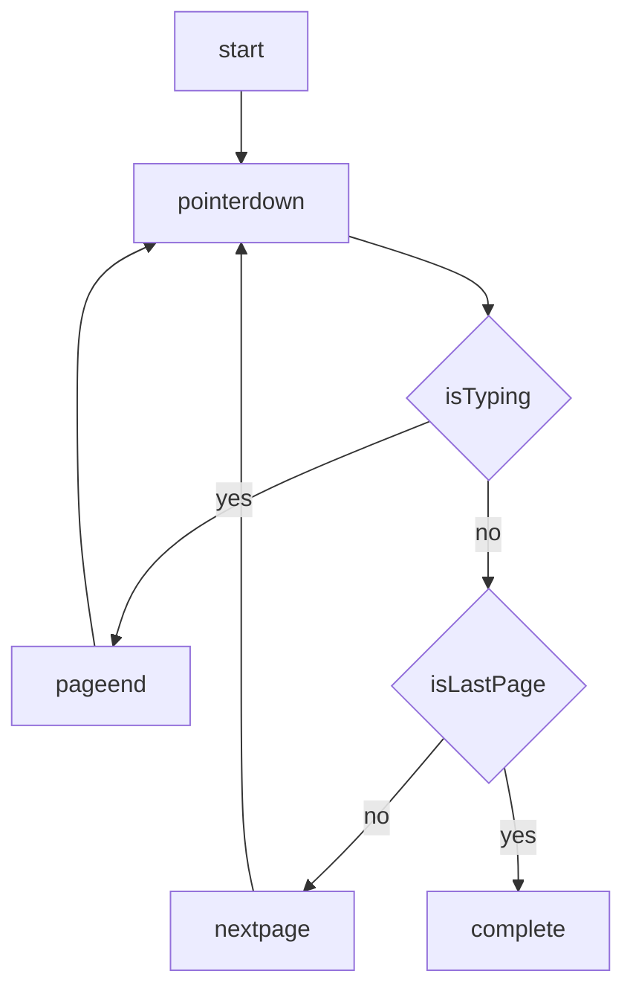

# Typing

## FSM

```mermaid
graph TD

    start --> pointerdown
    pointerdown --> isTyping{isTyping}
    isTyping --> |yes| pageend
    isTyping --> |no| isLastPage{isLastPage}
    isLastPage --> |no| nextpage
    isLastPage --> |yes| complete

    pageend --> pointerdown
    nextpage --> pointerdown
```