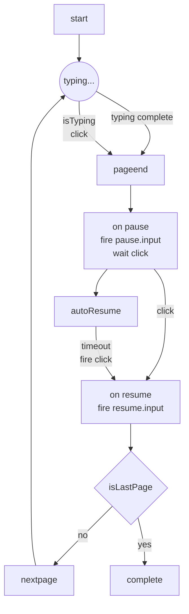

# Typing

## FSM

```mermaid
graph TD

    start --> typing(("typing..."))
    typing --> |"typing complete"| pageend
    typing --> |"isTyping<br>click"|pageend
    pageend --> onPause["on pause<br>fire pause.input<br>wait click"]
    onPause --> |"click"| onResume["on resume<br>fire resume.input"]
    onResume --> isLastPage{"isLastPage"}
    isLastPage --> |no| nextpage
    isLastPage --> |yes| complete
    nextpage --> typing

    onPause --> autoResume
    autoResume --> |"timeout<br>fire click"|onResume
```